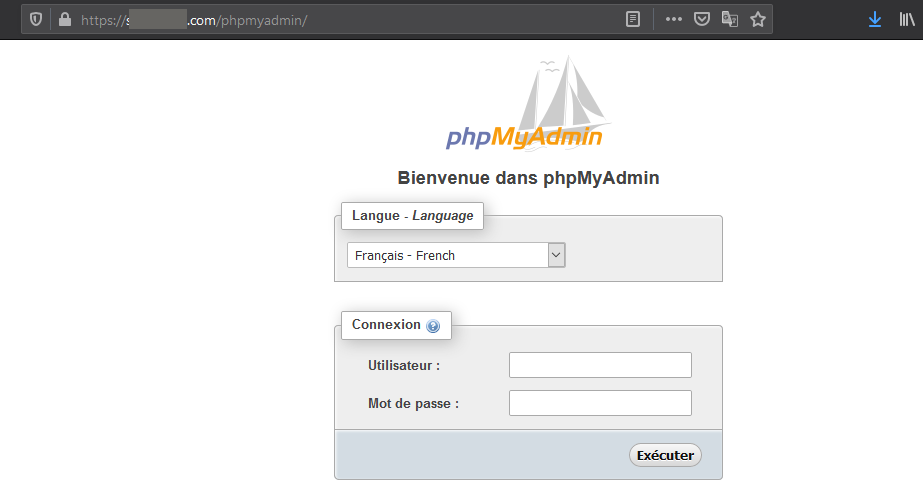
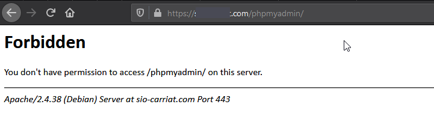

En cherchant à sécuriser mon réseau, j’ai eu une révélation, sur les serveurs web que j’héberge, j’ai un PhpMyAdmin que j’utilise pour pour administrer mes bases de données.

Mais … l’application web est disponible sur Internet.

Personnellement, je l’utilise principalement depuis mon réseau local donc je ne vois pas l’intérêt de le rendre disponible sur Internet (au pire, je me connecte en VPN sur mon réseau avant).

Du coup, je vais vous montrer comment faire, car je pense que c’est une faille de sécurité.

Effectivement, depuis Internet, mon PhpMyAdmin est accessible :



Du coup, j’ai trouvé l’astuce 🙂

Il faut modifier le fichier de configuration de phpmyadmin.conf.

Dans le bloc « Directory », il faut ajouter les lignes suivantes :

```bash
Order Deny,Allow 
Deny from all 
Allow from 127.0.0.1 
Allow from 192.168.1.0/24 #VOTRE RESEAU OU VOTRE IP
```

Un petit rechargement d’apache et le tour est joué.



Le PhpMyAdmin reste toutefois disponible depuis mon LAN.
