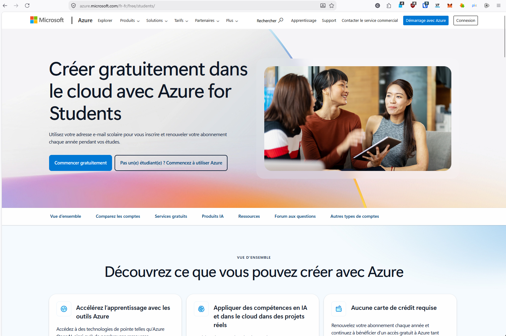
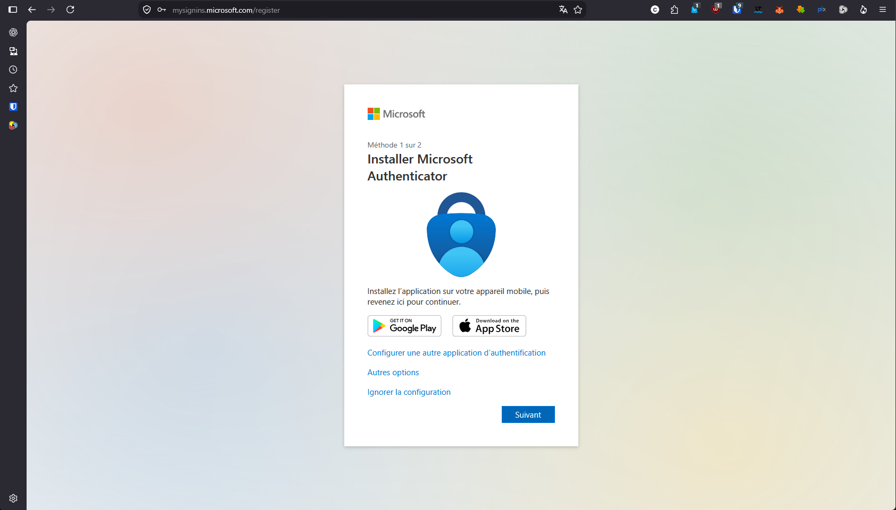
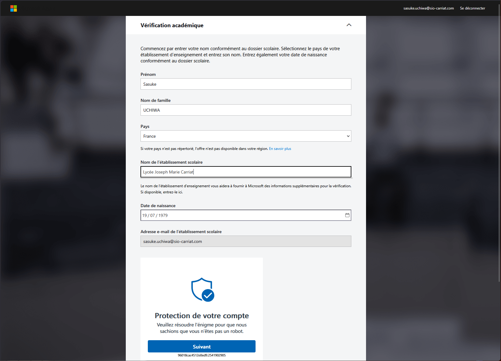
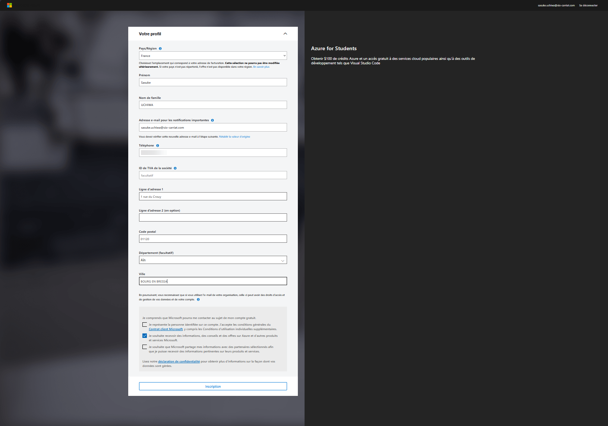
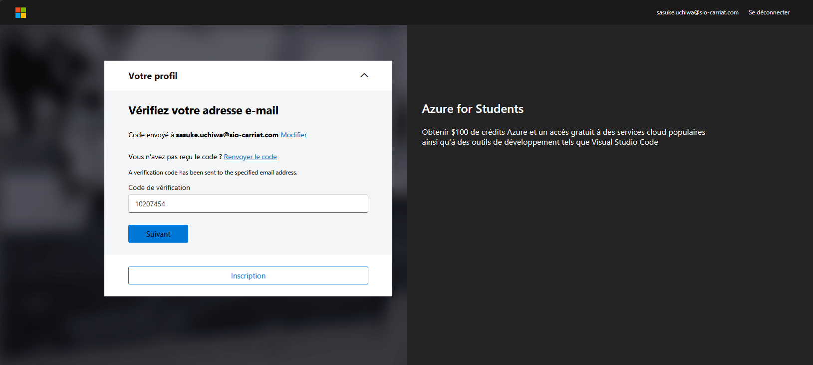
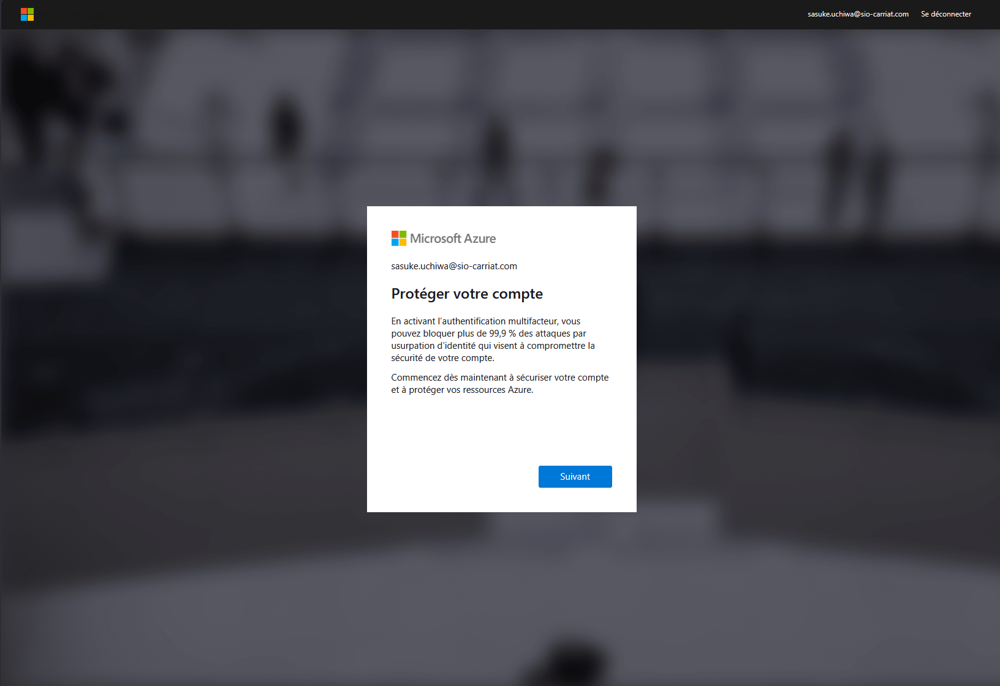
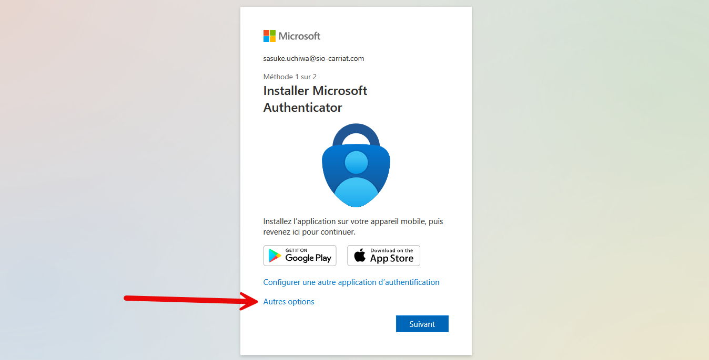
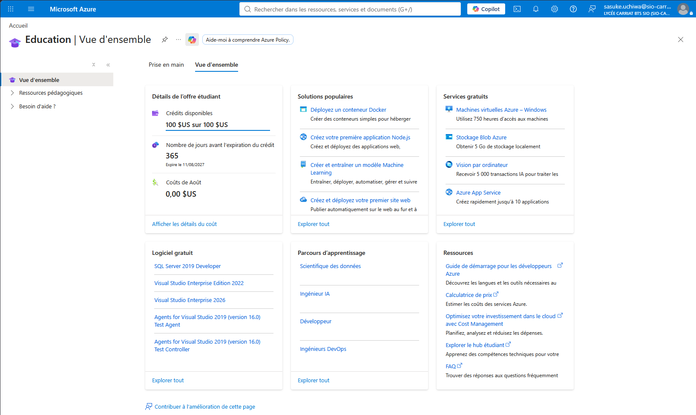

:::note
Testé en août 2026
:::

Votre accès Microsoft Azure for Students vous permet de beneficier de 100$ ainsi que de 25 services cloud gratuits (donc 750h de VM Windows et de VM Linux).

L'objectif est d'utiliser cet accès pour créer un serveur hebergé dans le cloud.

Cliquez sur "Commencez gratuitement"

Se connecter avec votre compte Microsoft 365 du lycée (prenom.nom@sio-carriat.com). 

Si vous avez déjà activé Microsoft Authenticator, vous serez redirigé vers l'application pour valider votre identité. Sinon, vous devrez installer l'application Microsoft Authenticator sur votre smartphone et suivre les instructions pour lier votre compte.

Sinon, vous pouvez `Ignorer la configuration` et continuer avec votre compte Microsoft 365 du lycée.

Il peut vous demander de faire une vérification académique de votre compte :

Après avoir résolu l'enigme, cliquez sur "Verifier le statut académique".

Il faut ensuite valider son profil en acceptant le contrat client.

Un email avec un code de vérification vous sera envoyé. Renseignez le code reçu dans l'email pour valider votre compte.

Microsoft vous demande ensuite de protéger votre compte avec une authentification multifacteur. Vous pouvez utiliser l'application Microsoft Authenticator ou un numéro de téléphone pour recevoir un code de vérification.

Sur l'écran suivant, si vous ne pouvez pas utiliser l'application Microsoft Authenticator, vous pouvez choisir de recevoir un code par SMS ou par appel téléphonique en selectionnant `Autres options`

Le mieux étant de choisir l'application Microsoft Authenticator, vous pouvez la télécharger sur votre smartphone et suivre les instructions pour lier votre compte.

Une fois la validation terminée, on arrive sur le portail Azure.

