:::note
Testé en août 2026
:::

Depuis l'accueil d'Azure, cliquez sur `Services gratuits`puis `Créer` sur la machine virtuelle Windows ou Linux.

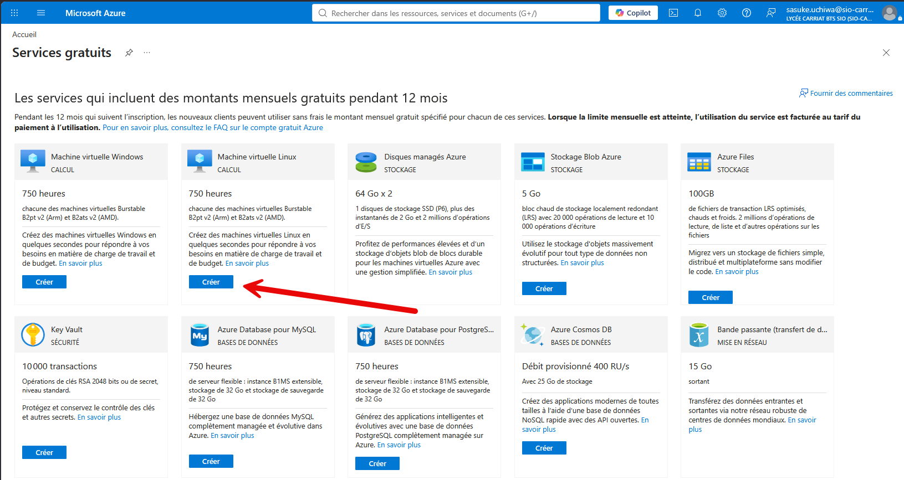

Choisir ensuite :

- L'abonnement Azure for Students
- Créer un groupe de ressources
- Donner un nom au serveur
- l'OS (Debian 11)
- La région (US West US 2)
- Rester sur le modèle Standard_B2ats_v2

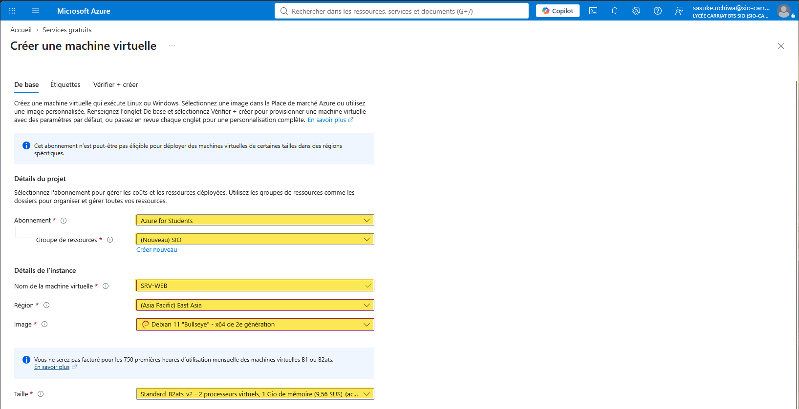

Plus bas, laisser l'authentification par clé publique SSH et autoriser les ports 80 / 443 et 22.

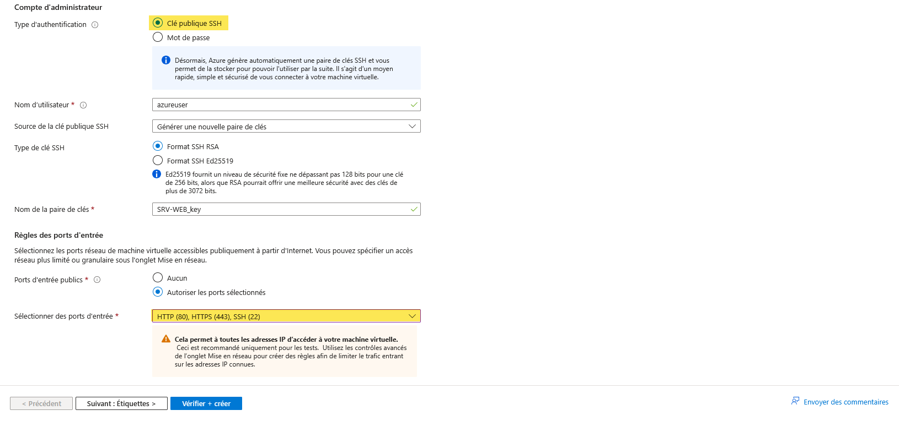

## Problème rencontré

J'ai eu un problème avec la création de la VM, j'ai donc utilisé la commande suivante dans le terminal Azure Cloud Shell pour créer ma VM :

```powershell
az policy assignment show --name sys.regionrestriction --scope "/subscriptions/7a777c59-134a-4d5b-86dc-478251b47fa9" --query parameters -o json
```

Cette commande retourne la liste des régions autorisées pour votre abonnement Azure for Students. Vous pouvez ensuite choisir une région autorisée pour créer votre VM.

```
{ "listOfAllowedLocations": { "value": [ "francecentral", "swedencentral", "germanywestcentral", "spaincentral", "polandcentral" ] } }
```

Ensuite, pour chaque régions autorisée, vous pouvez chercher les VM autorisées avec la commande suivante :

```powershell
az vm list-skus --location francecentral --resource-type virtualMachines --size Standard_B --all -o table
```

J'ai donc lancé la commande suivante pour créer ma VM dans la région `spaincentral` :

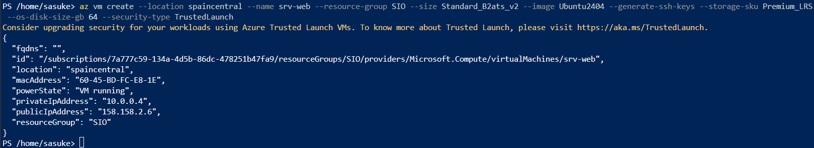

La VM est bien créé

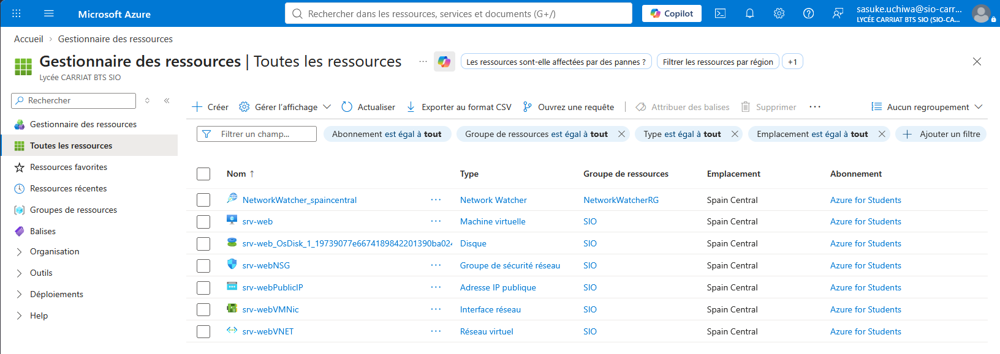

## Trouver l'IP publique de la VM

Aller sur la machine virtuelle et cliquer sur `Vue d'ensemble`. L'IP publique est affichée dans la section `Adresse IP publique`.

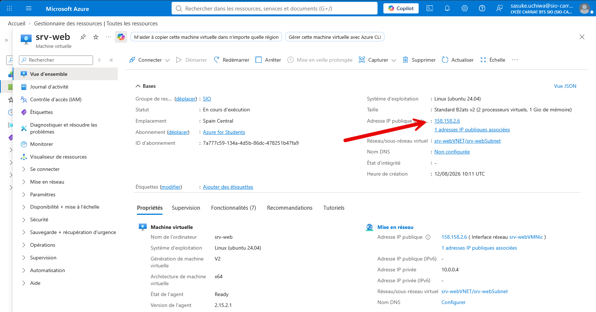

## Ouvrir le port 80 pour accéder à la VM depuis un navigateur

Dans la machine virtuelle, cliquer sur `Mise en réseau` puis `Paramètres réseau`.
Dans règle, `créer une règle de port`

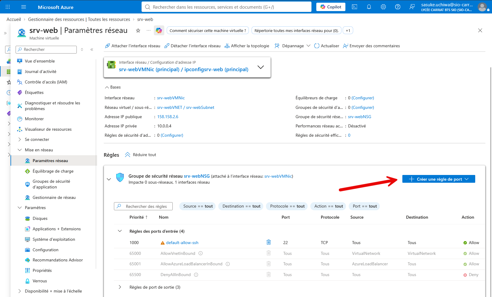

Ajouter ensuite en entrée en personnalisant le port 80 et un nom.
Terminer par `Ajouter`

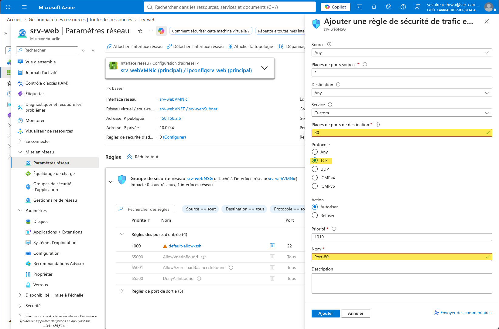

## Connexion SSH à la VM

Aller dans `Se connecter` > `Connexion` > `Modifier les paramètres` > `Réinitialisez votre clé privée SSH`.

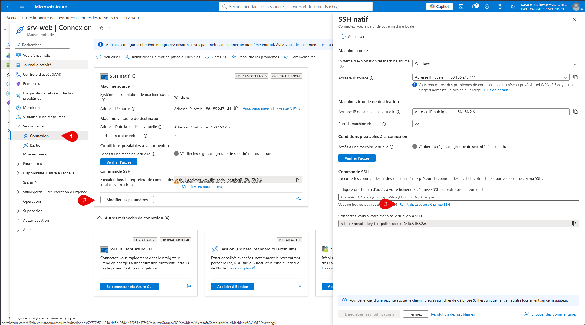

`Nommer la paire de clés` puis `Mettre à jour`.

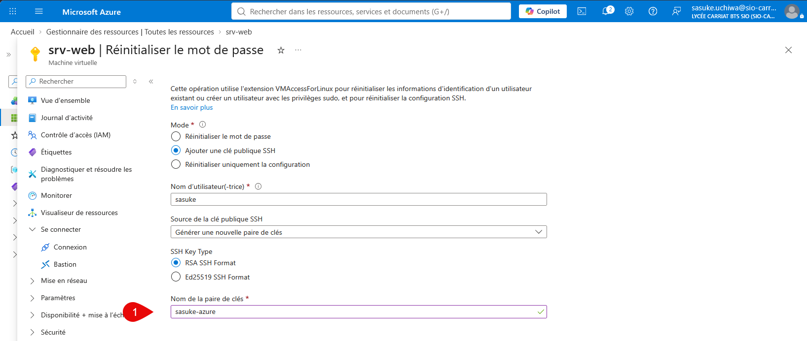

 Télécharger ensuite la clé privée SSH.

 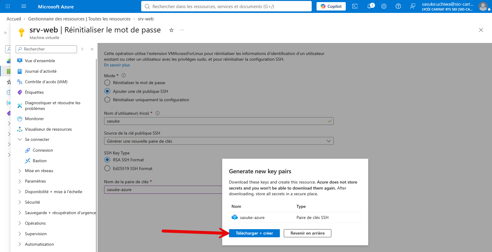

 ## Connexion à la VM depuis un terminal

 Éditer les droits sur votre fichier de clé privée, il faut désactiver l’héritage et laisser uniquement les administrateurs de l’ordinateur dans les autorisations.

 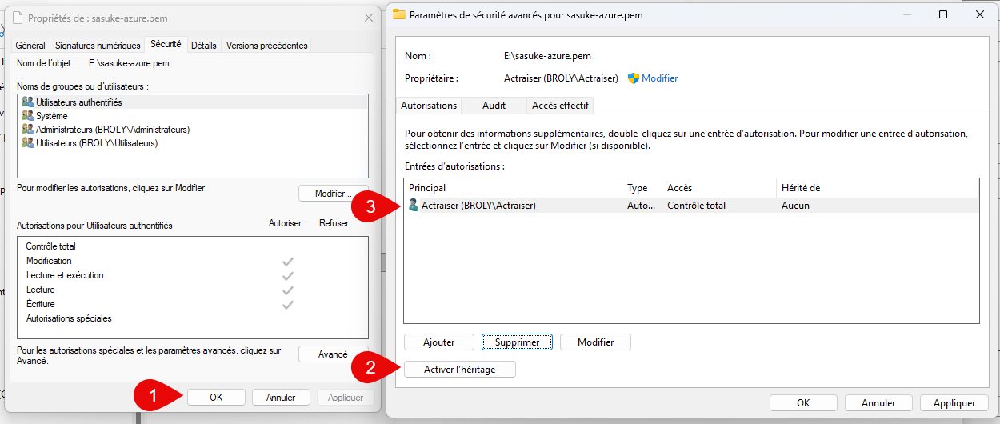

 Lancer ensuite la commande

 ```powershell
 ssh -i [chemin_clé] azureuser@[ip_publique]
 ```

 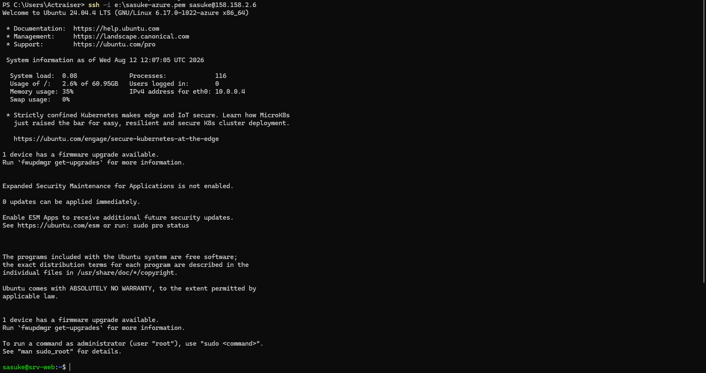