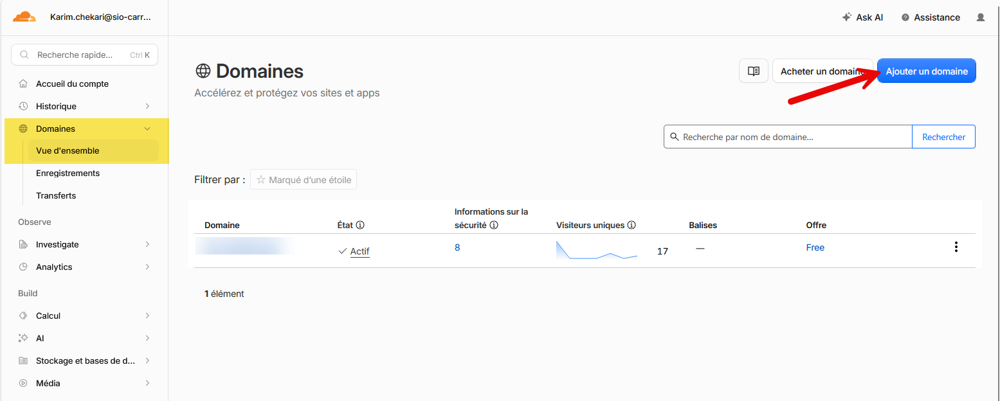
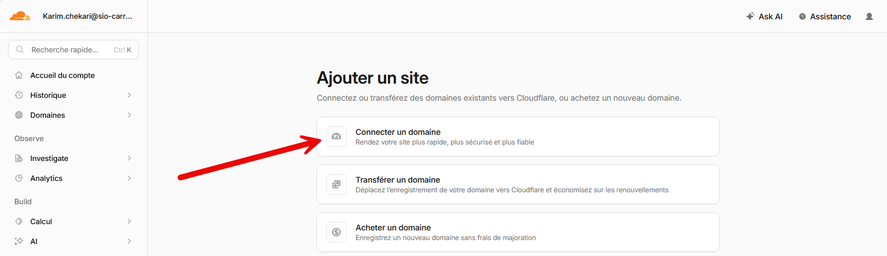
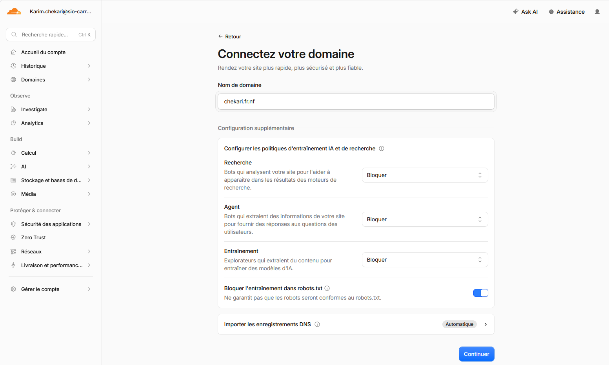

Cloudflare est une plateforme qui permet de gérer un nom de domaine tout en offrant de nombreux services de sécurité et d'optimisation. Son offre gratuite est largement suffisante pour la majorité des projets personnels, scolaires ou associatifs. 
Elle permet de gérer facilement les enregistrements DNS, d'activer automatiquement des certificats SSL/TLS pour sécuriser les échanges en HTTPS, de protéger le site contre certaines attaques (notamment les attaques DDoS) et d'améliorer les performances grâce à son réseau mondial de serveurs (CDN). 
Cloudflare propose également une interface simple pour créer, modifier ou supprimer des enregistrements DNS en quelques clics. En utilisant Cloudflare comme gestionnaire de domaine, il est ainsi possible de bénéficier gratuitement d'une meilleure sécurité, d'une plus grande fiabilité et d'une administration centralisée, sans coût supplémentaire.

## Ajouter un domaine sur Cloudflare

Après avoir crée un compte sur Cloudflare, vous pouvez ajouter un domaine en suivant ces étapes :
1. Connectez-vous à votre compte Cloudflare.
2. Cliquez sur `Domaines` dans le menu principal puis `Vue d'ensemble` et enfin sur le bouton `Ajouter un domaine`.

Nous allons maintenant choisir l'option `Connecter un domaine`.

Saisissez le nom de domaine que vous souhaitez ajouter à Cloudflare et cliquez sur `Continuer`.
J'ai volontairement choisi de bloquer toutes les options d'indexation pour ce domaine afin de ne pas être référencé par les moteurs de recherche. Vous pouvez bien sûr modifier cette option selon vos besoins.

