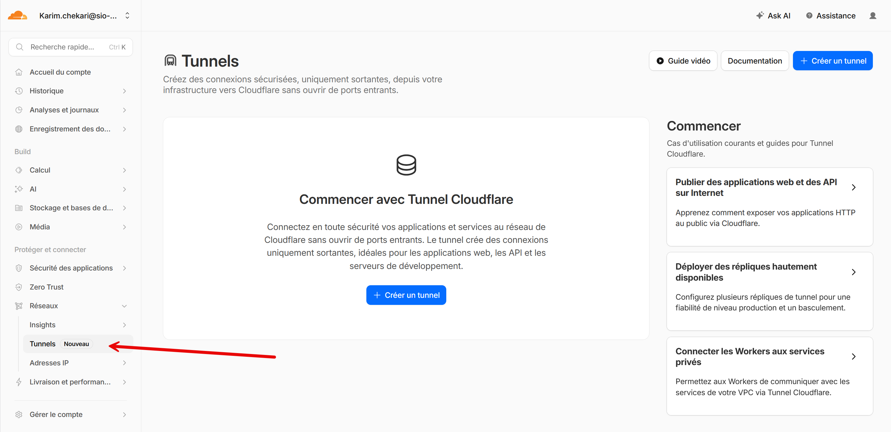
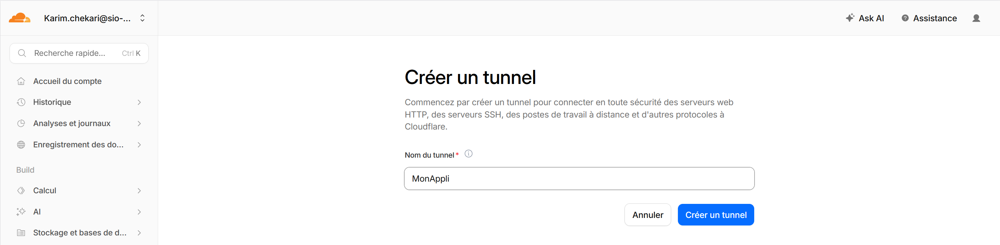
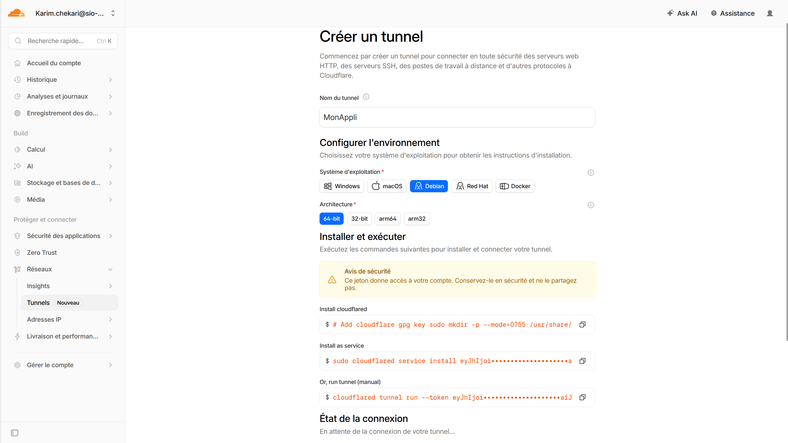
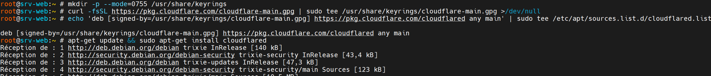
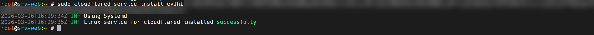
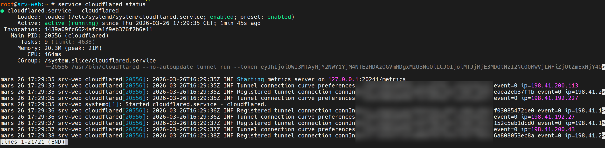
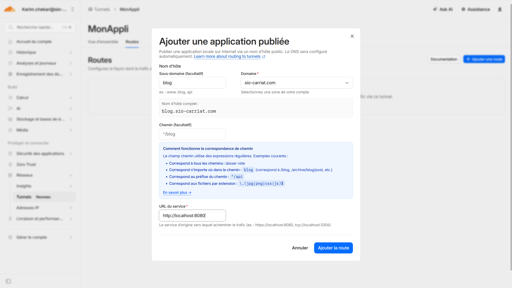
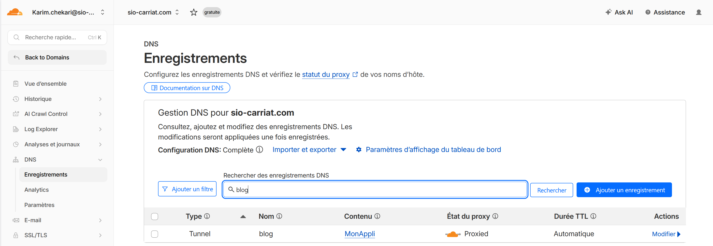

Cloudflare est un service de réseau de distribution de contenu (CDN) et de sécurité Internet qui offre une variété de fonctionnalités pour protéger et accélérer les sites web. L'une de ces fonctionnalités est le Cloudflare Tunnel, qui permet de créer un tunnel sécurisé entre votre serveur local et le réseau de Cloudflare. Cela permet de protéger votre serveur contre les attaques DDoS, d'améliorer les performances et de garantir la disponibilité de votre site web.

La fonctionnalité qui nous interesse dans Cloudflare Tunnel, est la possibilité de mettre à disposition un service local (ex: un serveur web, un serveur de jeu, etc.) sur Internet de manière sécurisée, sans avoir à ouvrir de ports sur votre routeur ou à configurer des règles de pare-feu complexes.



## Configuration du tunnel sur Cloudflare

Pour configurer un tunnel sur Cloudflare, vous devez suivre les étapes suivantes :

1. Connectez-vous à votre compte Cloudflare et accédez à la section "Tunnels" dans le tableau de bord.
2. Cliquez sur "Create a Tunnel" pour commencer la configuration du tunnel.
3. Donnez un nom à votre tunnel et cliquez sur "Next".



4. Choisissez le système d'exploitation de votre serveur local (Linux, Windows, etc.) et votre architecture (x86, x64, etc.) et suivez les instructions pour télécharger et installer le client Cloudflare Tunnel sur votre serveur.



5. Une fois le client installé, vous devrez exécuter une commande pour connecter votre serveur local au tunnel Cloudflare. Cette commande variera en fonction de votre système d'exploitation et de votre architecture, mais elle ressemblera généralement à quelque chose comme ceci :

## Installation du client Cloudflare Tunnel sur Linux

```bash
# Add cloudflare gpg key
sudo mkdir -p --mode=0755 /usr/share/keyrings
curl -fsSL https://pkg.cloudflare.com/cloudflare-main.gpg | sudo tee /usr/share/keyrings/cloudflare-main.gpg >/dev/null

# Add this repo to your apt repositories
echo 'deb [signed-by=/usr/share/keyrings/cloudflare-main.gpg] https://pkg.cloudflare.com/cloudflared any main' | sudo tee /etc/apt/sources.list.d/cloudflared.list

# install cloudflared
sudo apt-get update && sudo apt-get install cloudflared
```



## Installer le tunnel comme un service


```bash
sudo cloudflared service install ####################################################################################
```



## Démarrer le tunnel manuellement

```bash
cloudflared tunnel run --token ####################################################################################
```

Nous pouvons voir le status du service



Et nous le voyons connecté sur Cloudflare


## Ajout d'une route pour exposer un service local




Nous pouvons également voir qu'un enregistrement DNS a été ajouté automatiquement pour le tunnel.

