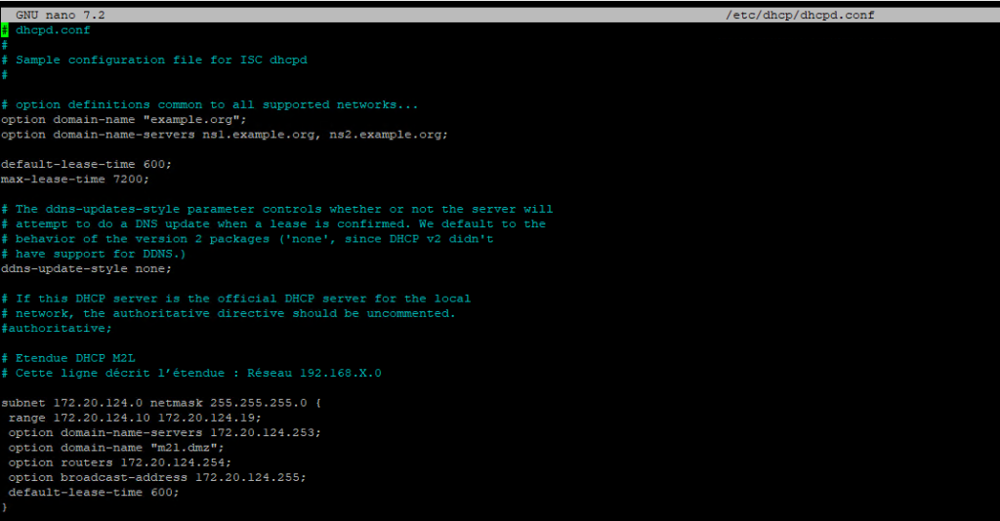
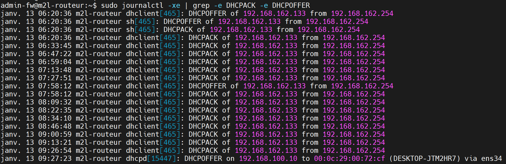
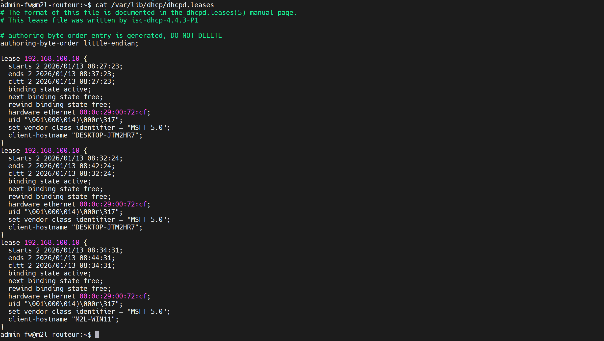

Installer le paquet

```bash
sudo apt install isc-dhcp-server
```

Pour configurer l’interface d’écoute, il faut éditer le fichier /etc/default/isc-dhcp-server

```bash
admin-fw@KCH-M2L-RT:~$ sudo nano /etc/default/isc-dhcp-server
```

La confguration se fait ensuite dans le fichier /etc/dhcp/dhcpd.conf



- subnet correspond au masque de sous réseau
- range représente l’étendue DHCP
- option domain-name-servers distribue un serveur DNS
- option domain-name fournit le nom de domaine du réseau
- option routers fixe une passerelle
- option broadcast-address indique la passerelle
 -default-lease-time gère la durée du bail.

Une fois les modifications apportées, il faut redémarrer le service :

```bash
sudo systemctl restart isc-dhcp-server
```

Pour vérifier le statut du service :

```bash
sudo systemctl status isc-dhcp-server
```

Pour consulter les logs du serveur DHCP :

```bash
sudo journalctl -xe | grep -e DHCPACK -e DHCPOFFER
```



Pour voir la liste des baux DHCP attribués, il faut consulter le fichier /var/lib/dhcp/dhcpd.leases

```bash
cat /var/lib/dhcp/dhcpd.leases
```

