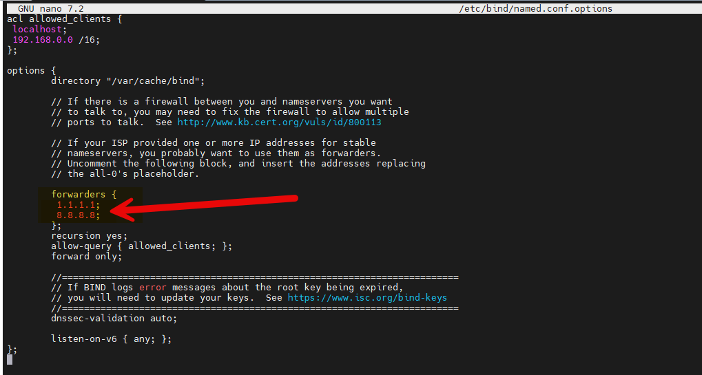

## Qu’est-ce que named ?

**named (Name Daemon)** est le service DNS fourni par **BIND (Berkeley Internet Name Domain)**.

C’est l’un des serveurs DNS les plus utilisés au monde, aussi bien :

- sur Internet (DNS publics, racine, FAI)
- que dans des infrastructures internes (LAN, DMZ, lab, AD-like)

**named** est le processus qui écoute sur le port 53 UDP/TCP et répond aux requêtes DNS.

### Configuration des forwarders
Les **forwarders** sont des serveurs DNS vers lesquels votre serveur DNS va rediriger les requêtes qu’il ne peut pas résoudre lui-même. Cela permet d’améliorer les performances et de réduire la charge sur votre serveur DNS.
Pour configurer les forwarders dans BIND9, vous devez modifier le fichier de configuration principal, généralement situé à `/etc/bind/named.conf.options`.
Voici un exemple de configuration avec des forwarders :



Dans cet exemple, les serveurs DNS de Google et de Cloudflare sont utilisés comme forwarders. Vous pouvez ajouter ou modifier les adresses IP des serveurs DNS selon vos besoins.

Dans le fichier, vous pouvez également configurer les réseaux autorisés à utiliser votre serveur DNS en modifiant la directive `allow-clients`.

Après avoir modifié le fichier de configuration, n’oubliez pas de redémarrer le service BIND9 pour appliquer les changements :

```bash
sudo systemctl restart bind9
```