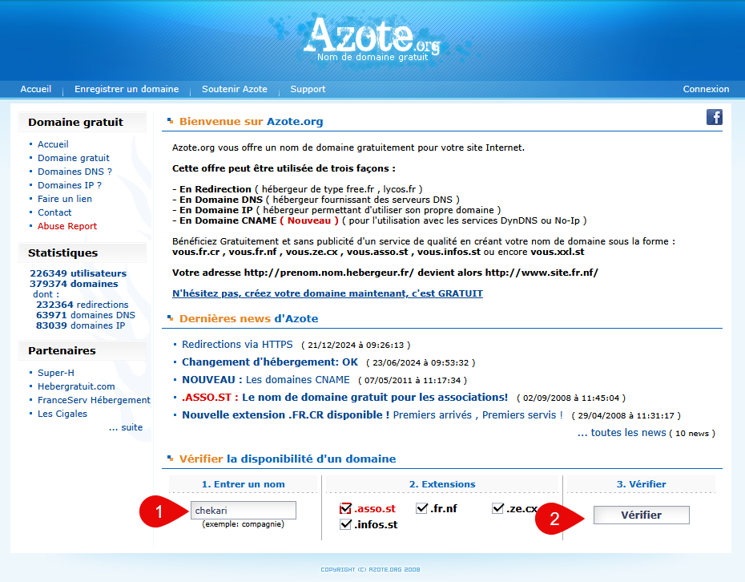
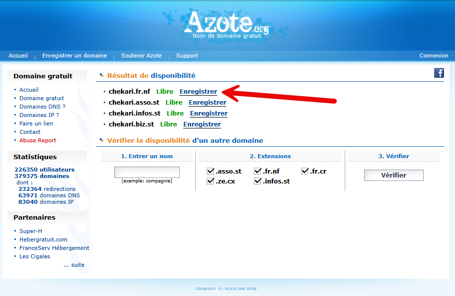
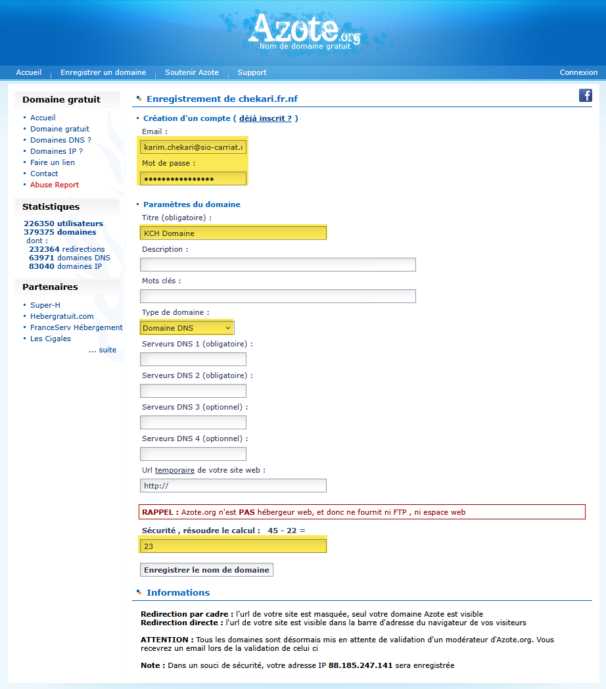
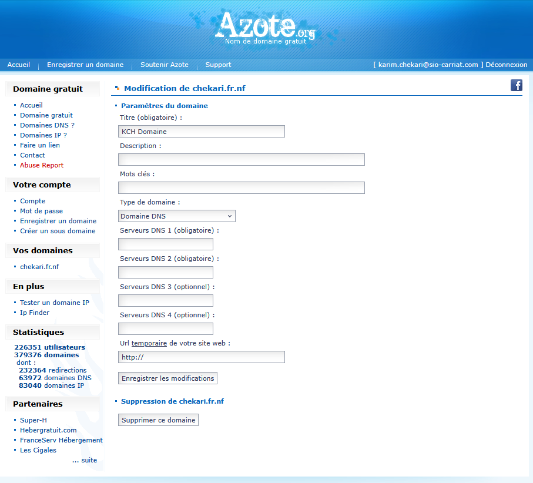

## Introduction

Utiliser un nom de domaine plutôt qu'une adresse IP présente de nombreux avantages. Tout d'abord, un nom de domaine est beaucoup plus simple à retenir et à communiquer qu'une suite de chiffres, ce qui facilite l'accès à un site ou à un service. 

Il permet également de donner une image plus professionnelle et crédible, notamment pour une entreprise ou un établissement scolaire. De plus, si l'adresse IP du serveur change (à la suite d'un changement d'hébergeur ou de fournisseur d'accès par exemple), le nom de domaine reste identique : il suffit de mettre à jour l'enregistrement DNS, sans que les utilisateurs aient besoin de modifier leurs habitudes. 

Enfin, un nom de domaine permet de créer plusieurs sous-domaines (par exemple www.monsite.fr, docs.monsite.fr ou mail.monsite.fr) pour organiser différents services tout en conservant une identité unique et cohérente.

## Obtenir un nom de domaine gratuit avec Azote

Azote.org vous offre un nom de domaine gratuitement pour votre site Internet.

Cette offre peut être utilisée de trois façons :

- En Redirection ( hébergeur de type free.fr , lycos.fr )
- En Domaine DNS ( hébergeur fournissant des serveurs DNS )
- En Domaine IP ( hébergeur permettant d'utiliser son propre domaine )
- En Domaine CNAME ( Nouveau ) ( pour l'utilisation avec les services DynDNS ou No-Ip ) 

Nous allons dans un premier temps vérifier si le nom de domaine que je souhaite est disponible.

Allez sur le site [https://www.azote.org](https://www.azote.org), saisir le nom de domaine que vous souhaitez et cliquer sur "Vérifier".

Lorsqu'un domaine est disponible, vous pouvez choisir de l'enregistrer.

Dans la fenetre suivante, vous devez créer un compte Azote avec une adresse mail valide et mettre un titre pour votre domaine. Très important, choisir le Type de domaine `Domaine DNS` pour pouvoir l'utiliser avec votre hébergeur.

Terminer par répondre à la question de confirmation et cliquer sur "Enregistrer le domaine".

Une fois votre domaine enregistré, vous aurez accès à sa configuration. Vous pourrez alors configurer les enregistrements DNS pour pointer vers votre hébergeur ou votre serveur.

