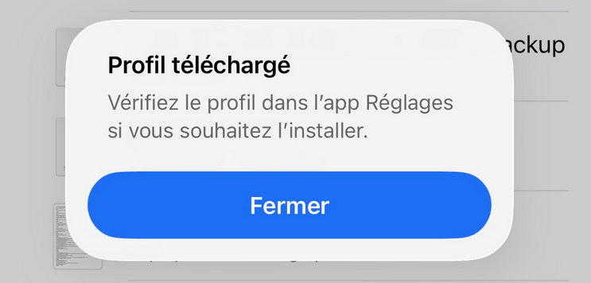
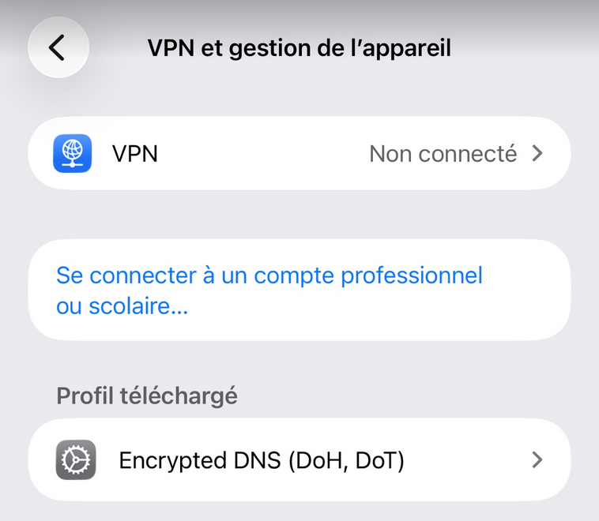
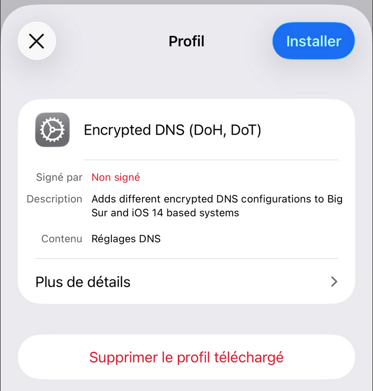
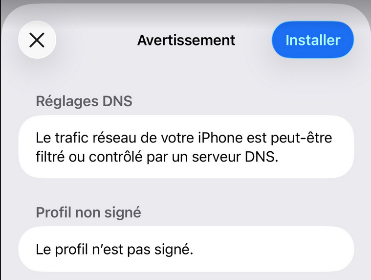
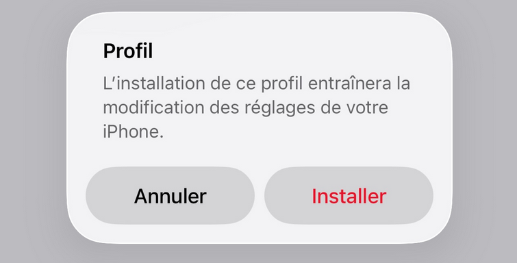
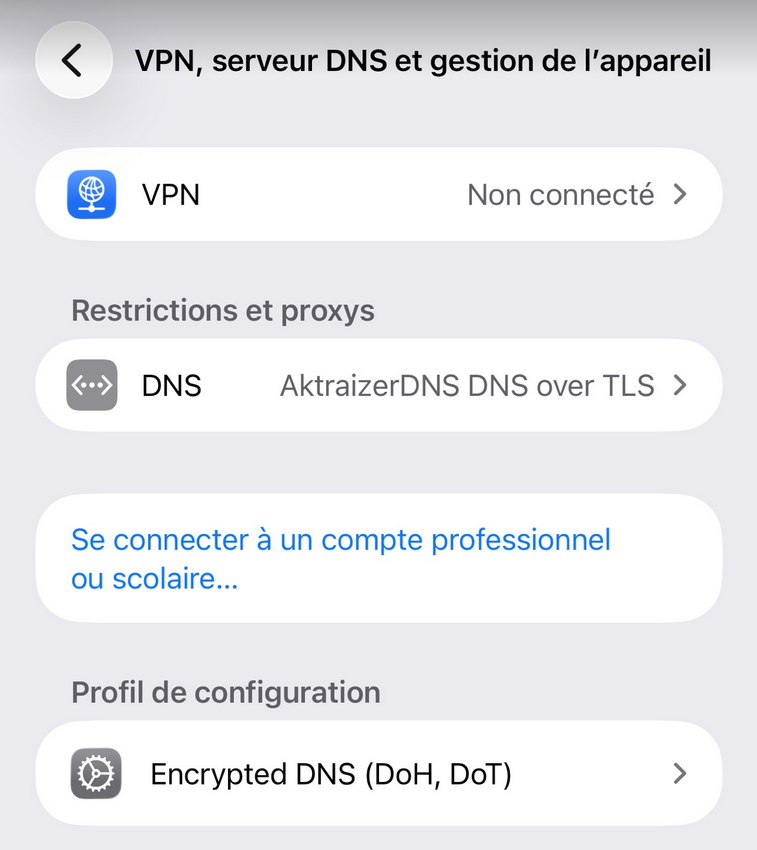

Dans cet article, nous allons explorer comment configurer un DNS privé sur un appareil iOS. Un DNS privé permet de sécuriser vos requêtes DNS en les chiffrant, ce qui empêche les tiers de surveiller votre activité en ligne.

Dans un premier temps, il faut disposé d'un serveur DNS (dans mon cas, AdGuard Home) et avoir un fichier `xxx.mobileconfig` pour configurer le DNS privé sur votre appareil iOS.

## Installation du profil de configuration

Pour installer le profil de configuration, vous devez d'abord transférer le fichier `xxx.mobileconfig` sur votre appareil iOS. Vous pouvez le faire via AirDrop, par e-mail ou en utilisant un service de stockage cloud.

Une fois que vous avez le fichier sur votre appareil, ouvrez-le.

Un message `Profil téléchargé` apparaîtra. Cliquez sur `Fermer`.

Allez dans `Réglages` > `Général` > `VPN et gestion de l'appareil`.
Le profil téléchargé devrait apparaître dans la section `PROFIL Téléchargé`. Cliquez dessus.

Puis cliquez sur `Installer` en haut à droite de l'écran.

Validez l'installation du profil en entrant votre code de verrouillage si nécessaire, puis cliquez à nouveau sur `Installer` pour confirmer.

Puis à nouveau sur `Installer` pour finaliser le processus.

Le profil de configuration est maintenant installé.

A vous un monde sans publicité et sans suivi !