Dans FOG, un snapin est un mécanisme permettant de déployer automatiquement des applications, des scripts ou des configurations sur des postes déjà installés, sans avoir à recréer ou redéployer une image système complète. Les snapins sont généralement utilisés pour installer des logiciels standards, appliquer des mises à jour ou exécuter des scripts de configuration après le déploiement du système d’exploitation. Ils fonctionnent grâce à l’agent FOG installé sur les postes clients, qui communique avec le serveur et exécute les snapins qui lui sont assignés. L’utilisation des snapins permet de gagner en flexibilité, de simplifier la maintenance du parc et de séparer le déploiement du système d’exploitation de celui des applications.

Les snapins seront par défaut stockés dans `/opt/fog/snapins`.

Un snapin sera applicable à une machine en production ou exécutable après déploiement.

## Installation de l'agent FOG

L’agent FOG doit être installé sur les machines clientes pour permettre l’exécution des snapins. Voici comment installer l’agent FOG sur différents systèmes d’exploitation.

### Windows

1. Téléchargez l’installateur de l’agent FOG depuis le serveur FOG ou le site officiel.

Se rendre à l'adresse suivante : `http://<adresse_ip_ou_nom_de_domaine_du_serveur_fog>/fog/management/index.php?node=client`

2. Télécharger le fichier Smart Installer FOG Client.

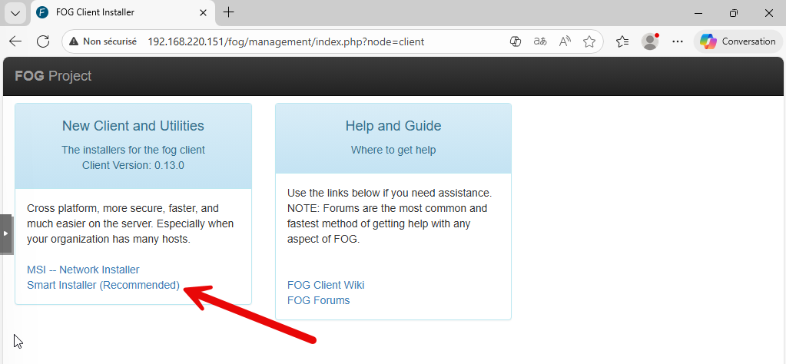

3. Lancer le fichier téléchargé sur la machine cliente.

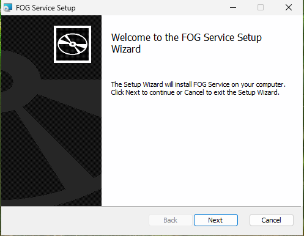

4. Accepter le contrat de licence.

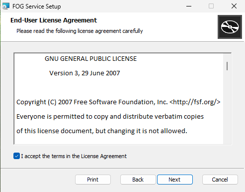

5. Personnaliser l'adresse du serveur FOG.

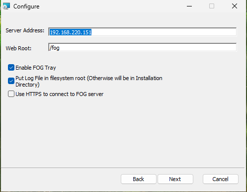

6. Laisser l'emplacement d'installation par défaut.

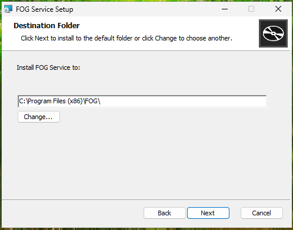

7. Lancer l'installation

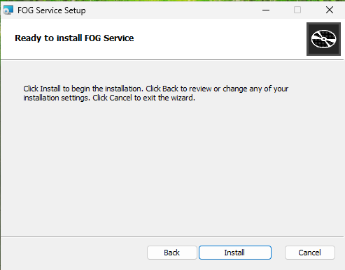

## Création d’un snapin

### Pour Windows

Dans le menu Snapins, ajoutez un nouveau snapin en cliquant sur "Create New Snapin".

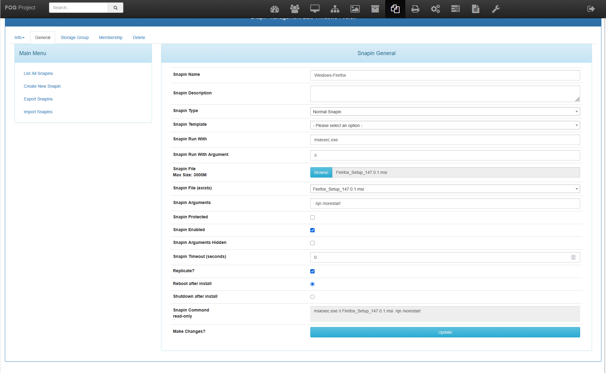

1- Donnez un nom à votre snapin.

2- Sélectionnez le type de snapin (par exemple, "MSI" pour les fichiers .msi ou "PowerShell" pour les scripts).

3- Téléchargez le fichier du snapin (fichier .msi, script PowerShell, etc.).

4- Configurez les options supplémentaires si nécessaire (arguments de ligne de commande, conditions d’exécution, etc.).

5- Cliquez sur "Save" pour enregistrer le snapin.

Le chargement peut prendre un certain temps, selon la taille du fichier.

Dans la ligne Snapin Command, nous pouvons voir la commande qui sera exécutée sur le poste client.

## Assignation d’un snapin à une machine

En éditant un snapin, vous pouvez assigner ce snapin à une machine spécifique.

Le plus pratique est d'aller dans les groupes de machines et d'assigner le snapin à un groupe entier.

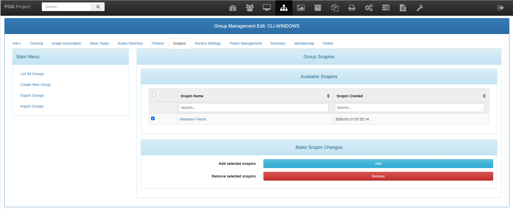

## Exécution d’un snapin

Une fois l’agent FOG installé sur la machine cliente et le snapin assigné, il faut créer une tache de déploiement pour exécuter le snapin.

Dans le groupe de machines ou la machine individuelle, créez une nouvelle tâche avancée et sélectionnez "All Snapins".

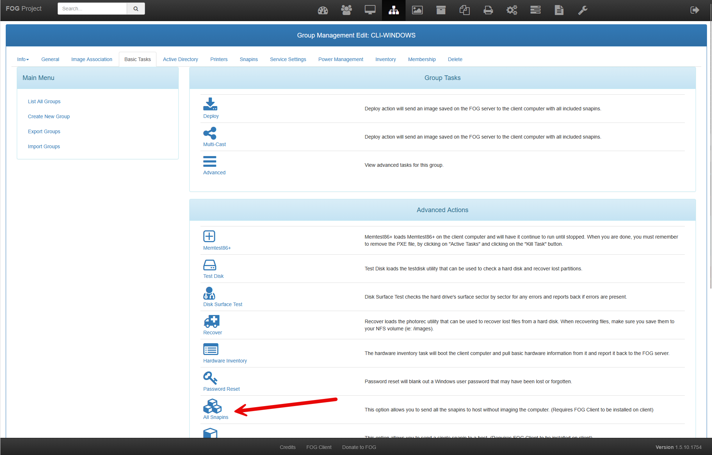

Valider la tâche.

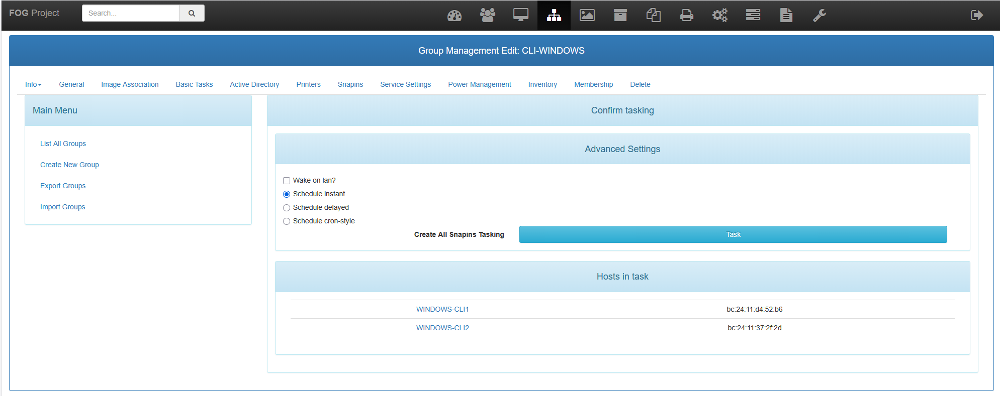

Elles sont visibles dans l'onglet Tâches.

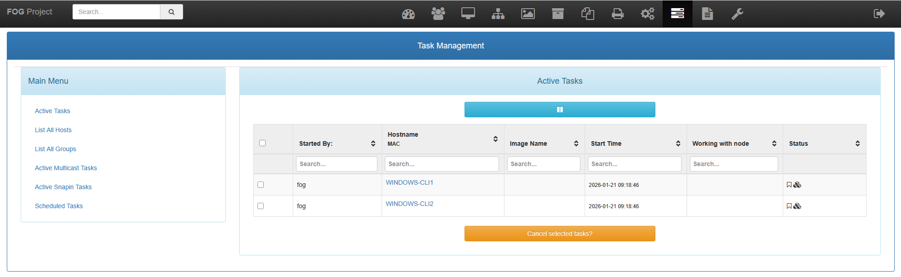

Sur le poste utilisateur, l'agent FOG va détecter la tâche et exécuter le snapin assigné.

Il est possible de voir l'installation dans les logs `c:\fog.log`.

## Vérification de l’exécution du snapin

Vous pouvez vérifier l’état de l’exécution des snapins dans l’interface de gestion FOG. Allez dans la section "Snapins" et consultez les journaux d’exécution pour voir si le snapin a été exécuté avec succès ou s’il y a eu des erreurs.

Il est possible de consulter les logs de l'agent : `C:\fog.log`.

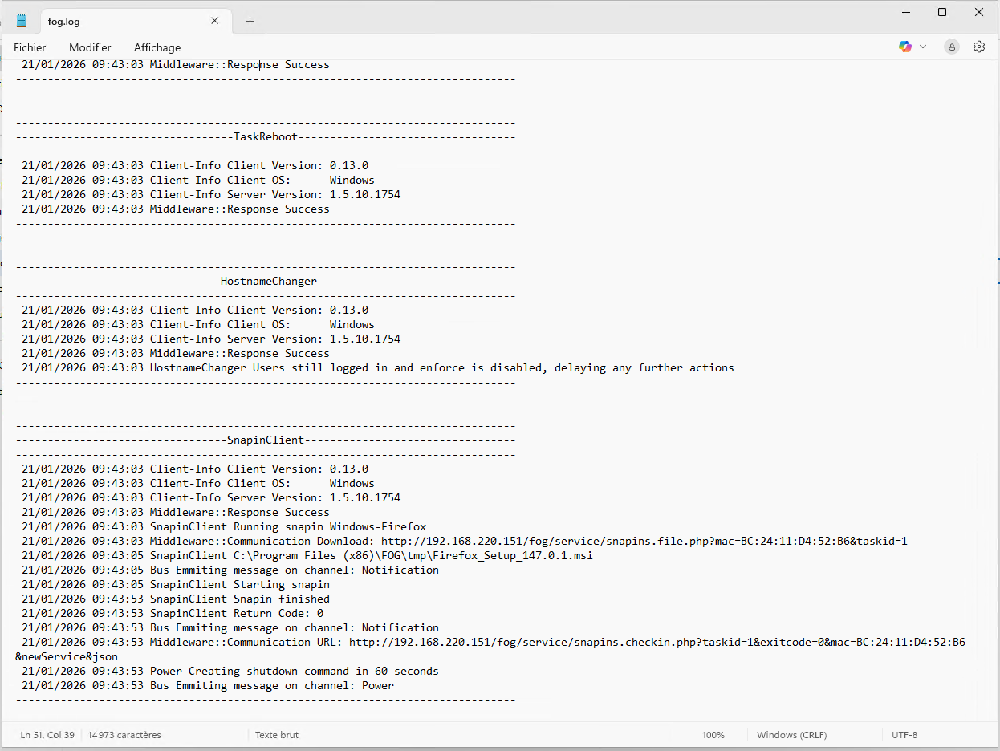

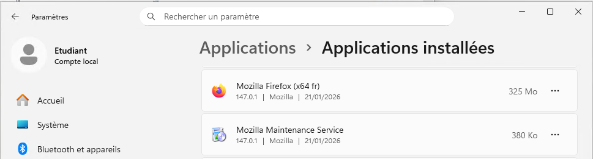