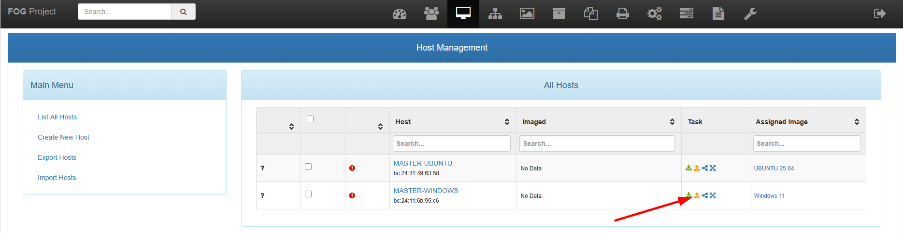
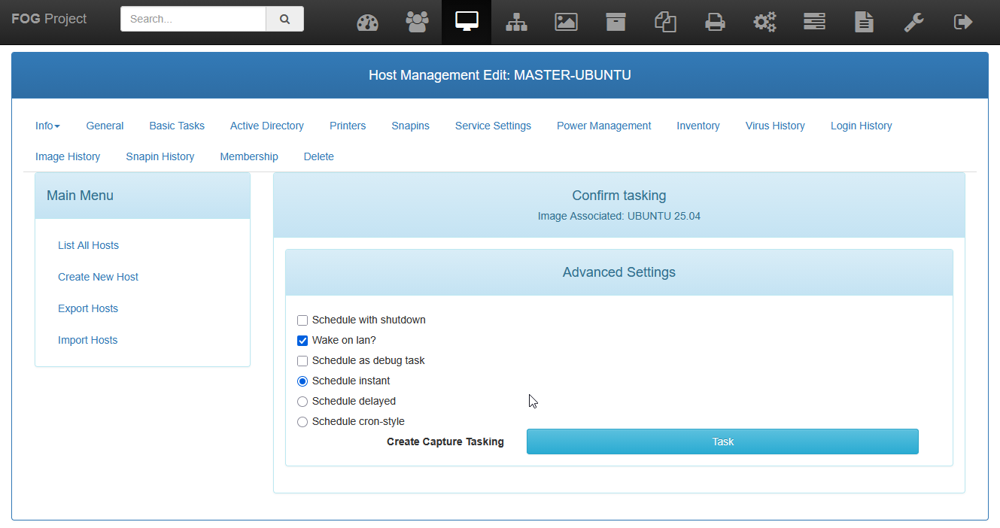
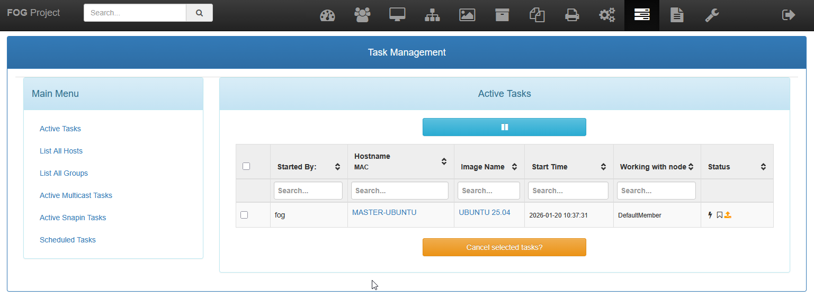
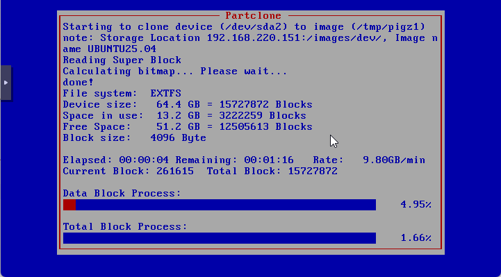
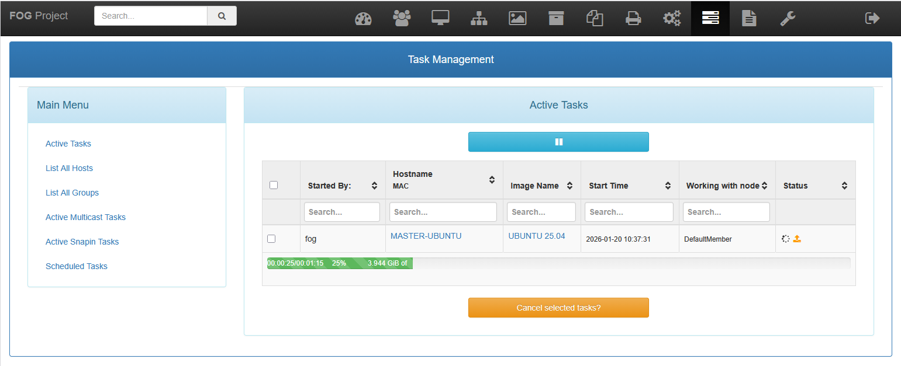
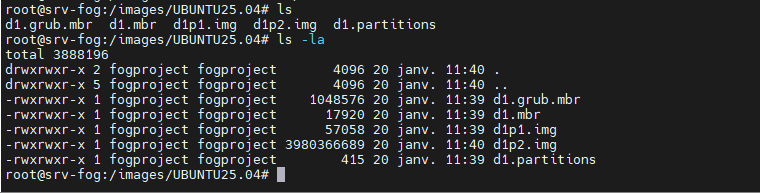

La **capture d’image dans FOG** consiste à sauvegarder le système d’exploitation d’un poste de référence afin de créer une image déployable sur d’autres machines. 

Cette opération est réalisée après avoir préparé le poste (mises à jour, configuration, nettoyage des identités système) et permet de conserver une version stable et standardisée du système. La capture constitue une étape essentielle, car elle sert de base aux déploiements ultérieurs et garantit l’homogénéité du parc informatique tout en réduisant le temps d’installation des postes.

Pour capturer une image, vous pouvez la préparer depuis l'interface web de FOG.

On peut ensuite planifier la capture ou la lancer lorsque le PC va démarrer.

Il est possible de voir et suivez la capture depuis le menu Tasks.

En démarrant le PC, la capture se lance automatiquement.

Et son statut évolue dans FOG

L'image du disque est stocké sur le serveur, dans le dossier `images`

