:::note
Les tests ont été réalisés sur la version 1.5.10 de FOG sous Debian 13.
Dans un environnement de virtualisation Proxmox 9.1 avec des machines clientes Debian 13 et Windows 11.
:::

Dans ce guide, nous allons explorer le processus de déploiement des postes clients à l'aide de FOG.

Le déploiement de postes consiste à restaurer une image système préalablement capturée sur un poste client ("MASTER"). 

FOG offre deux méthodes principales pour le déploiement : le déploiement unicast et le déploiement multicast.

Il faut qu'au préalable, le poste client soit enregistré dans l'interface FOG et qu'une image système ait été capturée et soit affecté au groupe ou au poste client.

## Deploiement unicast

Le déploiement unicast est la méthode la plus simple pour déployer une image sur un poste client. Voici les étapes à suivre :

Dans la machine cliente (CLI-UBUNTU), vérifier qu'une image est bien affectée au poste.

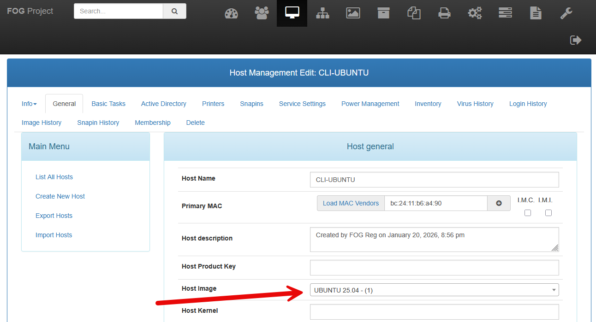

Ajouter une tache de déploiement.

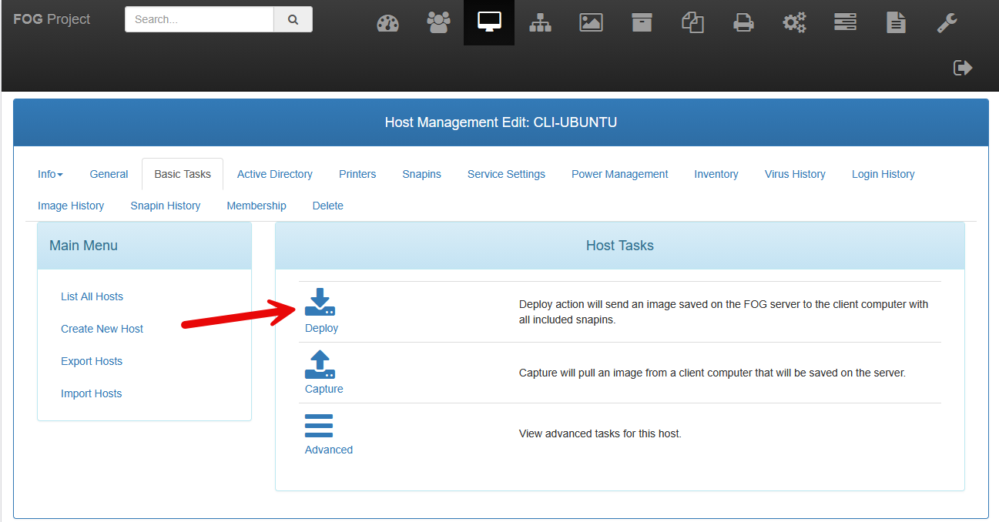

Et la planifier immédiatement.

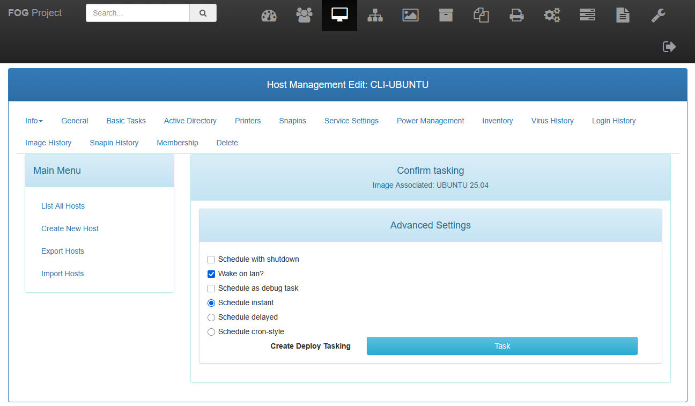

La tache en attente est visible dans l'interface FOG et attend que le poste client démarre pour lancer le déploiement.

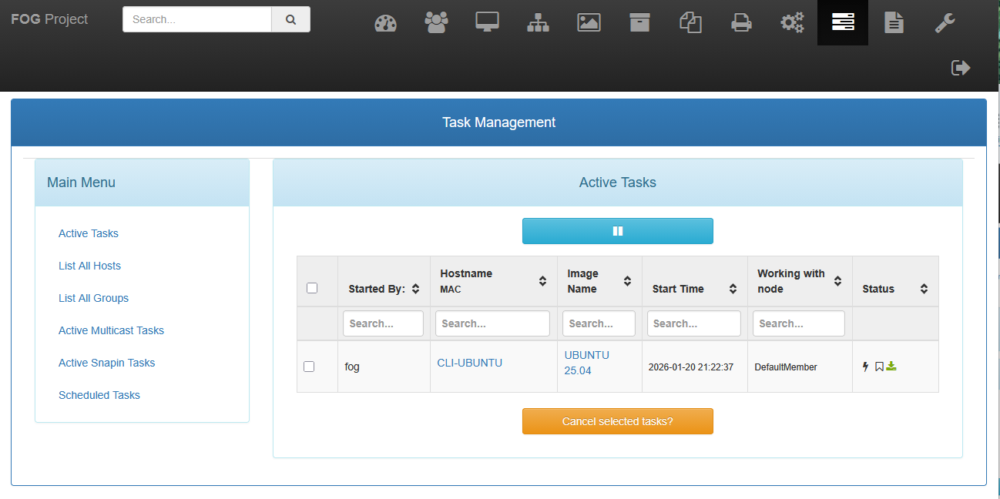

Démarrer le poste client en PXE pour lancer le déploiement automatiquement.

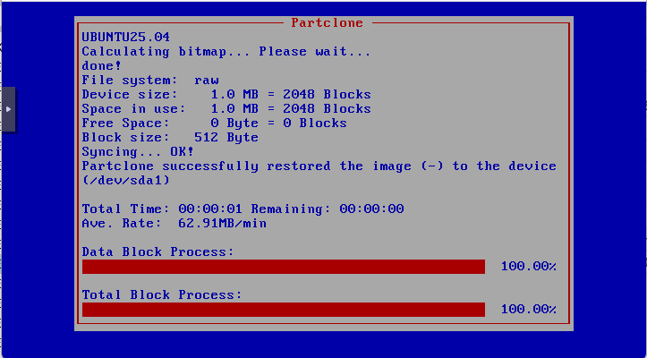

Une fois le déploiement terminé, le poste client redémarre automatiquement et affiche l'écran de connexion.

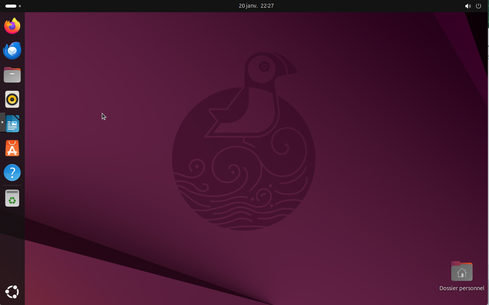

## Déploiement multicast

Le déploiement multicast permet de déployer une image sur plusieurs postes clients simultanément, ce qui est particulièrement utile dans les environnements avec un grand nombre de machines.

L'intérêt du multicast est d'optimiser la bande passante réseau en envoyant une seule copie de l'image à plusieurs postes clients en même temps car les paquets sont envoyés en "broadcast".

Lors du déploiement multicast, FOG attend que toutes les machines clientes soient prêtes avant de commencer le transfert de l'image.

Dans un groupe de postes clients, affecter une image au groupe puis ajouter une tache de déploiement multicast.

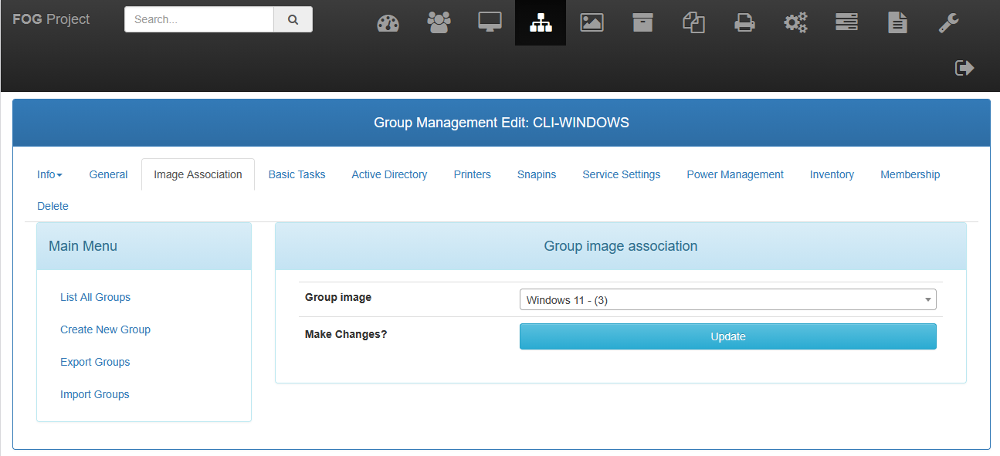

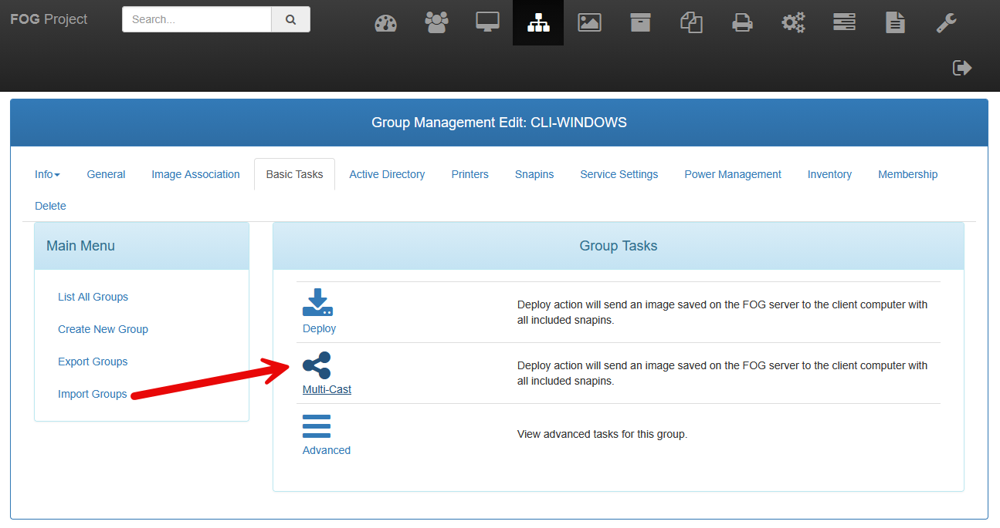

Nous pouvons voir la liste des ordinateurs concernés par le déploiement multicast.

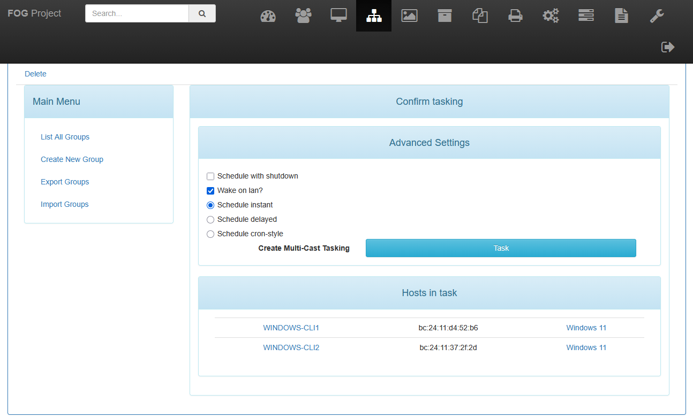

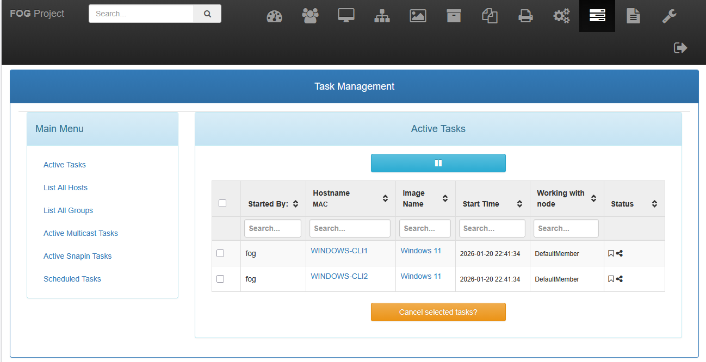

Pour que les déploiements multicast démarrent, il faut que les postes clients démarrent en PXE.

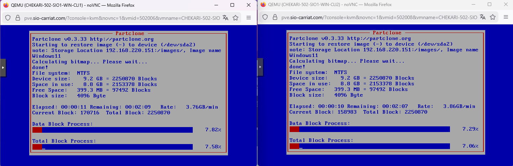

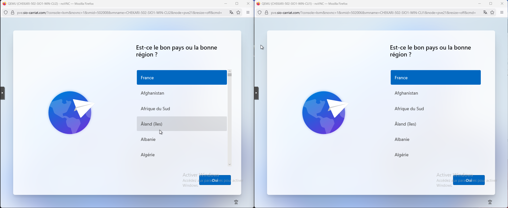

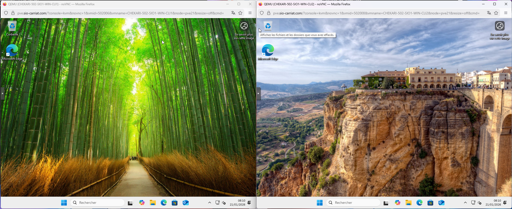