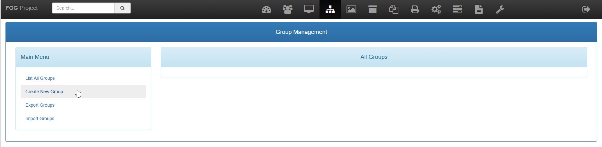
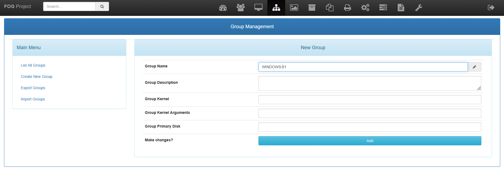
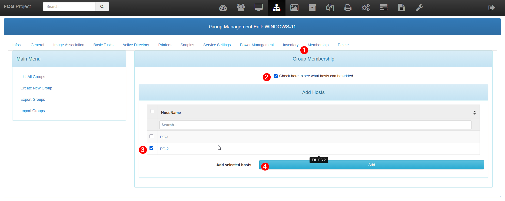

Dans FOG, les groupes d’hôtes permettent de regrouper plusieurs postes ayant des caractéristiques ou des usages communs. Ils facilitent l’administration du parc informatique en permettant d’appliquer des actions de manière centralisée sur plusieurs machines en une seule opération. Grâce aux groupes, il est possible d’associer une image système, de lancer des déploiements unicast ou multicast, d’exécuter des snapins (déploiement de logiciels), ou encore de planifier des tâches de maintenance sur l’ensemble des postes concernés. L’utilisation des groupes améliore la cohérence du parc, réduit le risque d’erreur humaine et permet un gain de temps significatif lors des opérations de déploiement ou de mise à jour à grande échelle.

## Ajout d'un groupe

Aller dans le menu **GROUPS** puis **Create New Group**.

Il faut simplement lui donner un nom

## Ajouter des ordinateurs dans un groupe

Pour ajouter des ordinateurs dans un groupe, il faut aller dans le groupe puis **Membership**.

Nous allons afficher les ordinateurs sans groupe, les sélectionner puis les ajouter.

