FOG Project est une solution open source de déploiement et de gestion de postes informatiques. Elle permet notamment la création, la sauvegarde et le déploiement d’images système via le réseau, facilitant ainsi l’administration et la maintenance d’un parc informatique.

Cette documentation a pour objectif de décrire les étapes nécessaires à l’installation de FOG Project, ainsi que les prérequis techniques indispensables à son bon fonctionnement, afin de garantir une mise en œuvre fiable et optimale de la solution.

Vous pouvez consulter les prérequis officiels sur le site de FOG Project : [FOG Project Requirements](https://docs.fogproject.org/en/latest/installation/server/requirements/).

Fog peut s'installer soit en clonant le dépôt GitHub, soit en téléchargeant l'archive depuis la page des releases. 

Dans ce guide, nous allons utiliser la méthode en utilisant un fichier compressé.

## Téléchargement du fichier Zip

```bash
wget https://github.com/FOGProject/fogproject/archive/stable.zip
```

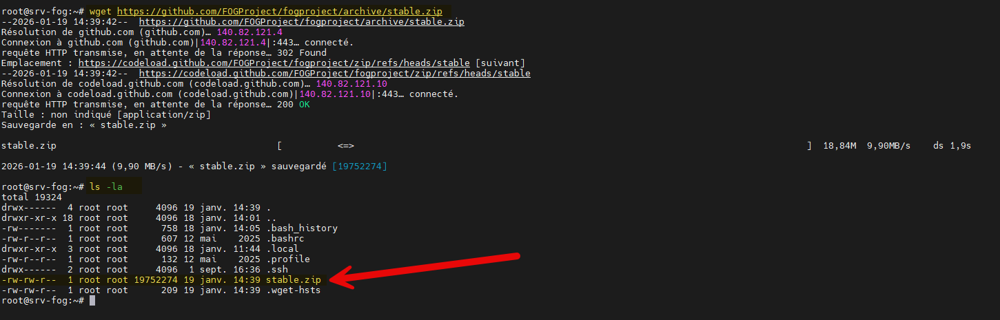

Décompression de l'archive :

Il faut installer unzip si ce n'est pas déjà fait, puis décompresser l'archive :

```bash
apt install unzip
unzip stable.zip
```

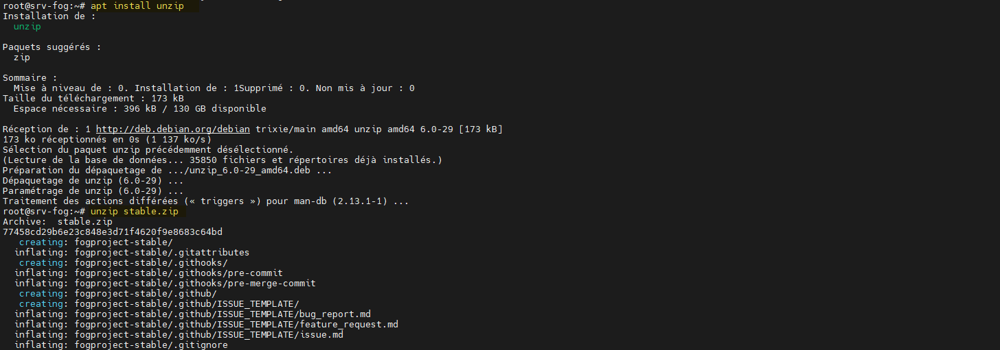

## Installation

Nous allons maintenant nous rendre dans le répertoire décompressé pour lancer l'installation :

```bash
root@srv-fog:~# cd fogproject-stable/bin/
root@srv-fog:~/fogproject-stable/bin# ./installfog.sh
```

::: note
Nous sommes dans un environnement de test, nous allons donc choisir de faire une installation avec une confdiguration simplidiée. Dans un environnement de production, il est recommandé de choisir des options d'installation plus adaptées.
:::

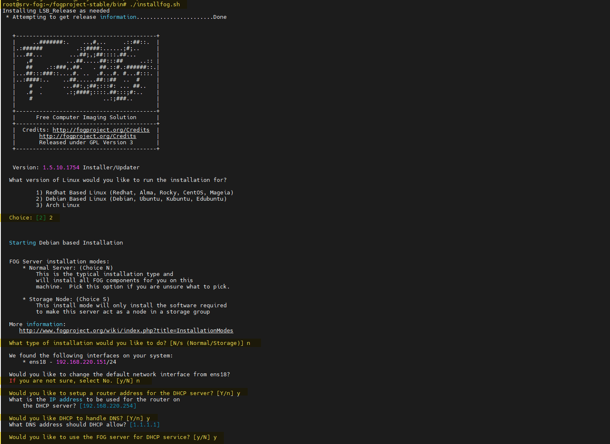

1. Choisir le type de système d'exploitation : Dans notre cas, nous choisissons "2" pour Debian.
2. Choisir ensuite une installation **Normal**
3. Valider l'interface réseau par défaut.
4. Préciser ensuite les options de serveur DHCP et activer le service DHCP intégré à FOG.

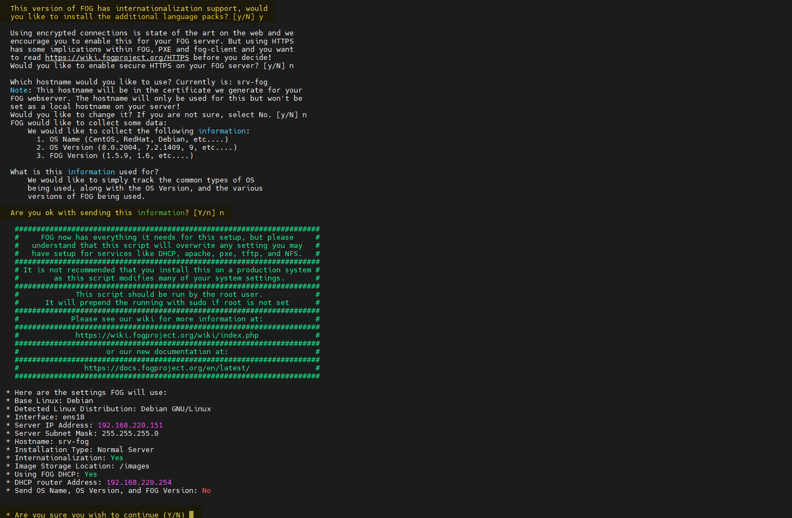

5. Choisir d'installer le pack de langue additionnel (français).
6. Ne pas partager les informations de l'installation avec FOG Project.
7. Valider les options d'installation.

L'installation se lance et peut prendre plusieurs minutes (il est préférable d'avoir une connexion Internet).

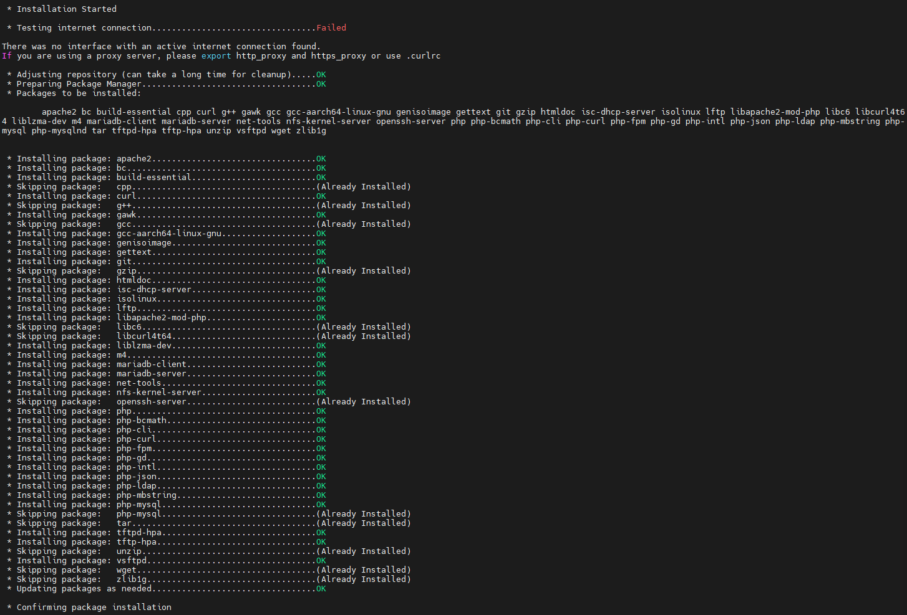

::: caution
Attetion, L'installation va vous demander de configurer une base de données MySQL/MariaDB avant de continuer.
:::

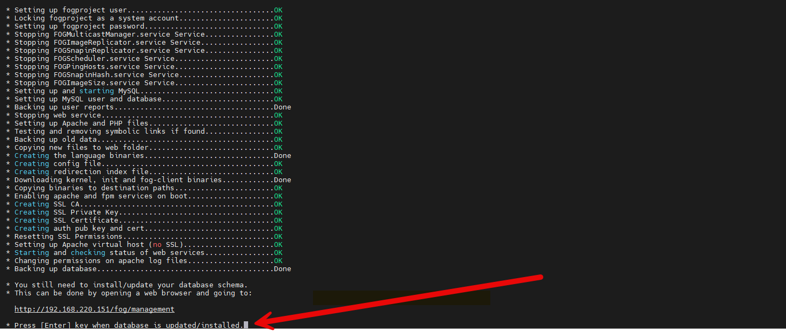

Rendez-vous simplement dans votre navigateur à l'adresse IP que FOG vous a indiqué.

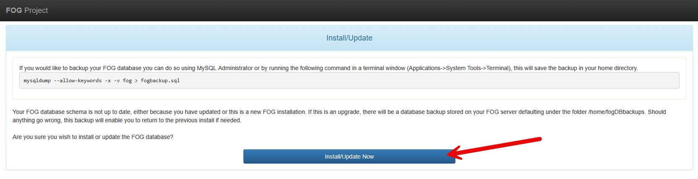

Une fois l'installation réussite, vous pouvez retourner dans le terminal pour finaliser l'installation.

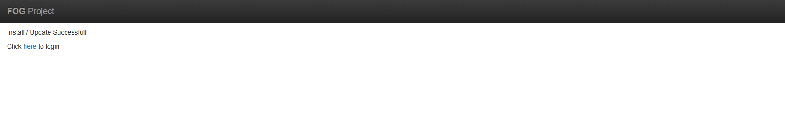

L'installation se termine.
Vous pouvez maintenant vous connecter à l'interface web de FOG Project avec les identifiants suivants :
- Utilisateur : fog
- Mot de passe : password

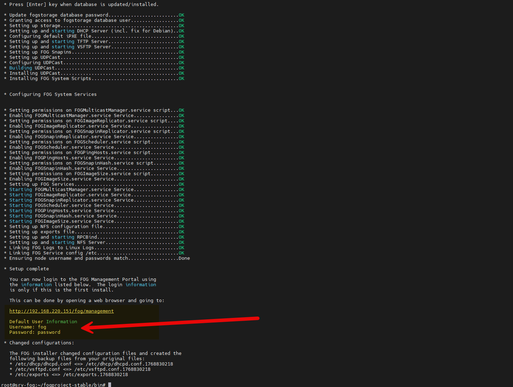

## Connexion à l'interface web

Nous pouvons nous connecter à l'interface web.

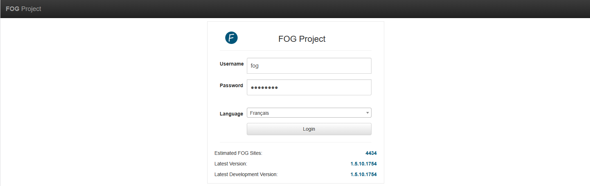

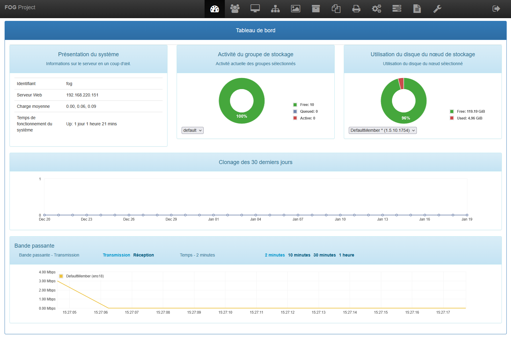