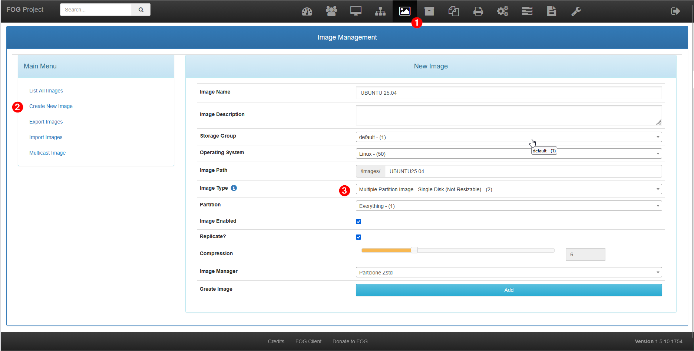

Dans FOG, une image correspond à une copie complète d’un système d’exploitation (Windows ou Linux) installée sur un poste de référence. Cette image est stockée sur le serveur FOG et peut ensuite être déployée automatiquement sur un ou plusieurs postes via le réseau. L’utilisation d’images permet de standardiser les configurations, de réduire le temps d’installation et de limiter les erreurs humaines lors de la mise en service ou de la réinstallation des postes.

Les images offrent plusieurs possibilités :

- Déploiement rapide d’un système prêt à l’emploi
- Restauration d’un poste défaillant
- Clonage en masse (unicast ou multicast)
- Homogénéisation du parc informatique

Ajouter une image.
- Pour **Windows**, choisir Single Disk – Resizable.
- Pour **Linux**, choisir Multiple Partition Image – Single Disk – Not Resizable

