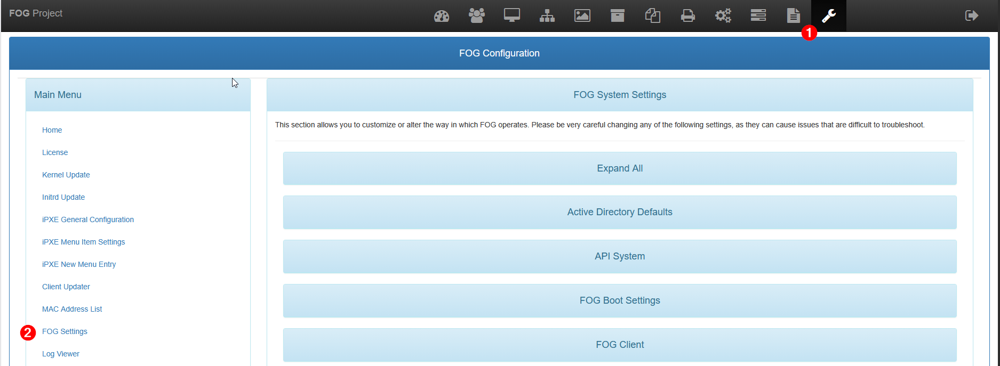
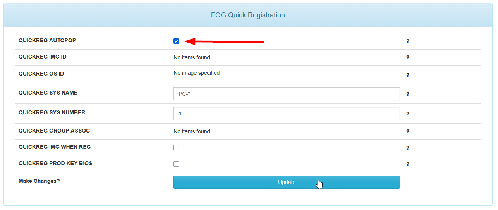
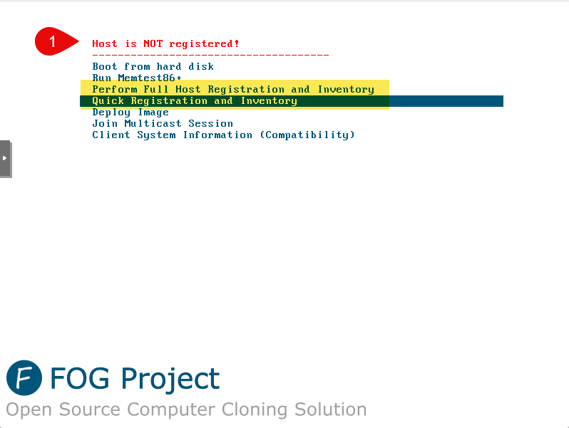
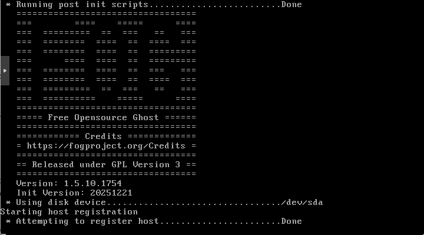
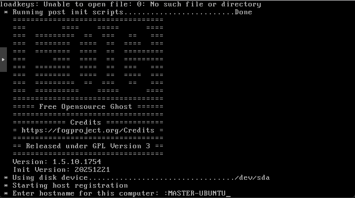
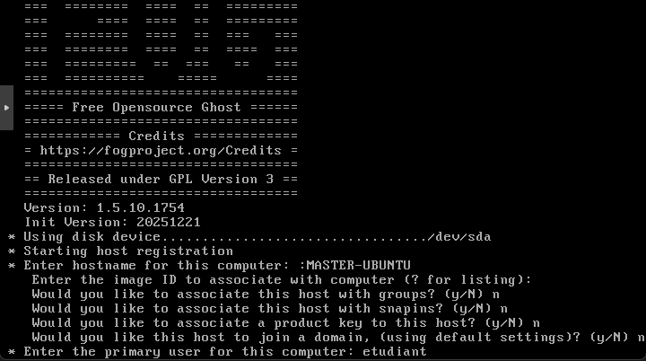
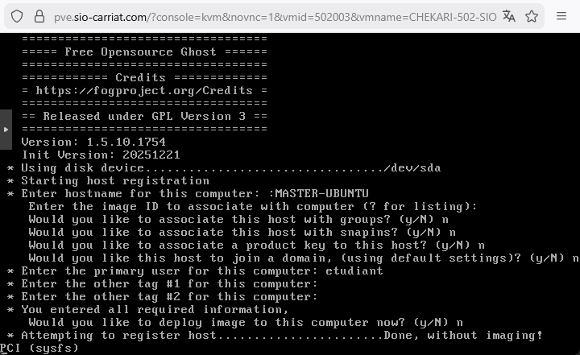
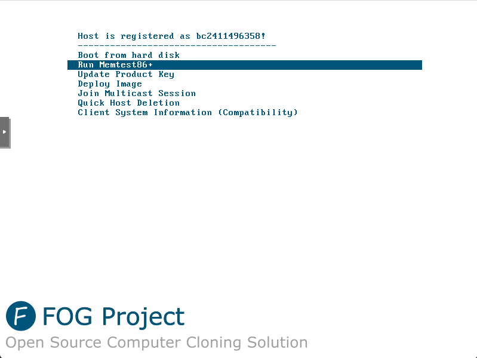
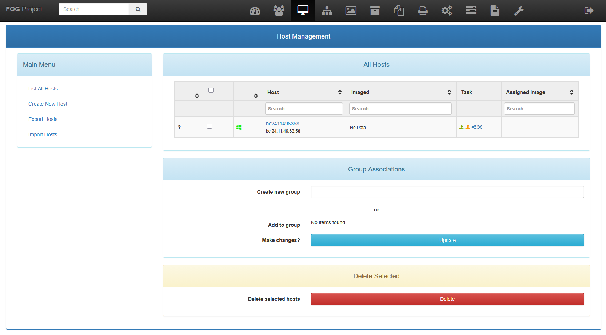

Pour pouvoir gérer les postes clients depuis l'interface web de FOG, il est nécessaire d'enregistrer ces postes. Cette étape permet à FOG de reconnaître et d'administrer les machines au sein du réseau.

Deux options sont disponibles, l'enregistrement rapide et l'enregistrement complet.
- L'enregistrement rapide permet d'ajouter rapidement un poste client en utilisant son adresse MAC. Cette méthode est idéale pour les environnements où la simplicité et la rapidité sont prioritaires.
- L'enregistrement complet offre une configuration plus détaillée, incluant des informations supplémentaires telles que le nom de l'hôte, le groupe d'appartenance, et d'autres paramètres spécifiques. Cette méthode est recommandée pour les environnements nécessitant une gestion plus fine des postes clients.

Quoi qu'il en soit, même avec un registrement rapide, il est toujours possible de modifier les paramètres du poste client ultérieurement via l'interface web de FOG.

:::note
Pour pouvoir faire un enregistrement rapide, il faut activer dans les options de Fog le **QUICKREG AUTOPOP**.

:::

On commence par démarrer sur le poste en PXE.

Nous voyons que l'hôte n'est pas enregistré. Nous allons faire un enregistrement rapide **Quick Registration ans Inventory**.

L'enregistrement se lance.

Pour un enregistrement complet, saisir le nom d'hôte.

Préciser l'image associée et le groupe si vous le souhaitez.

L'hote est bien enregistré.

Et apparait sur l'interface web de FOG.

:::caution
Pour renommer l'hôte ou modifier sa description, il faut au préalable lui avoir affecté une image
:::