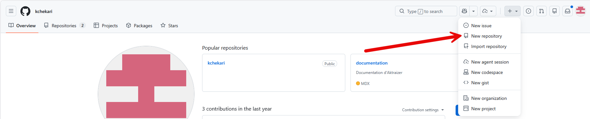
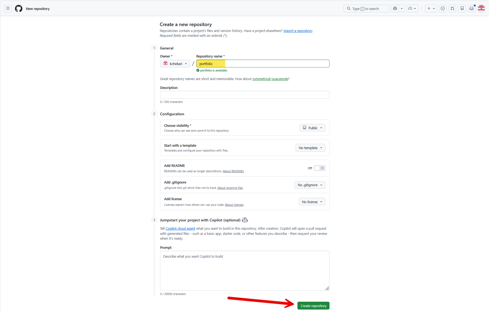
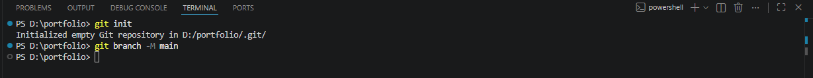
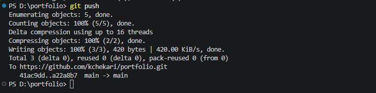
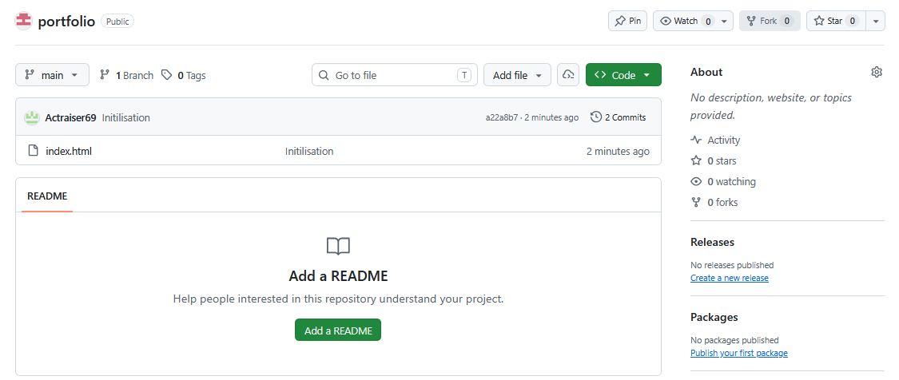
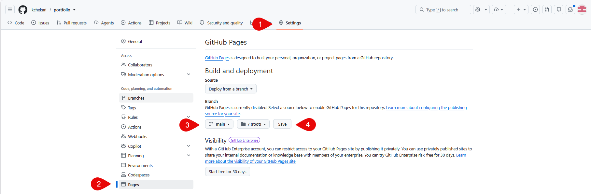
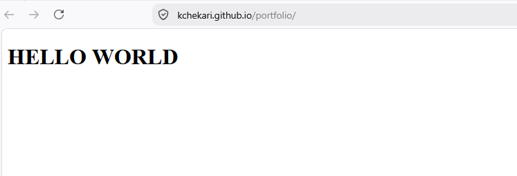

Pour les étudiants en BTS SIO, lors de l'épreuve E5, il est demandé de fournir un support type portfolio retraçant le parcours de professionnalisation  et décrivant les réalisations professionnelles de la personne candidate au cours de sa formation. Les réalisations professionnelles présentées doivent, dans leur ensemble, mobiliser toutes les compétences du bloc.

Il existe plusieurs solutions pour créer un portfolio en ligne, WordPress, Wix, Google Sites, etc. Cependant, pour les étudiants en BTS SIO, je recommande d'utiliser GitHub Pages pour créer un portfolio en ligne. Cette solution est gratuite et permet de mettre en avant les compétences techniques des étudiants.

Prérequis pour créer un portfolio sur GitHub Pages :
- Avoir un compte GitHub.
- Avoir des connaissances de base en HTML et CSS (vous pouvez vous aider de vos cours de première année ou d'une IA).
- Avoir installé GIT sur votre ordinateur.

## Création d'un dépôt GitHub pour le portfolio
1. Connectez-vous à votre compte GitHub.
2. Cliquez sur le bouton "New" pour créer un nouveau dépôt.



3. Donnez un nom à votre dépôt, par exemple "portfolio".




## Synchronisation du dépôt local avec le dépôt GitHub
Sur votre ordinateur, créez un dossier pour votre portfolio et ouvrez un terminal dans ce dossier. 
Ensuite, initialisez un dépôt Git local et synchronisez-le avec le dépôt GitHub que vous venez de créer.

```bash
git init
git branch -M main
```



Ensuite, ajoutez l'URL de votre dépôt GitHub comme origine distante et poussez vos modifications vers GitHub.

```bash
git remote add origin https://github.com/UTILISATEUR/portfolio.git
```

CRéer une page index.html dans le dossier de votre portfolio avec le contenu de votre choix. Par exemple, vous pouvez créer un fichier index.html avec le code suivant :

```html
<!DOCTYPE html>
<html lang="fr">
<head>
    <meta charset="UTF-8">
    <meta name="viewport" content="width=device-width, initial-scale=1.0">
    <title>Mon Portfolio</title>
</head>
<body>
    <h1>HELLO WORLD</h1>
</body>
</html>
```

Puis, on peut lancer la synchonisation avec la commande suivante :

```bash
git push -u origin main
git add .
git commit -m "Description des modifications"
git push
```



On peut voir le fichier sur GitHub, mais il n'est pas encore visible sur le web. Pour cela, il faut activer GitHub Pages dans les paramètres du dépôt.



## Activation de GitHub Pages
1. Allez dans les paramètres de votre dépôt.
2. Dans la section "Pages", sélectionnez la branche "main" et le dossier racine (root) pour publier votre site.



Le site est maintenant publié et accessible à l'adresse suivante : https://UTILISATEUR.github.io/portfolio/

