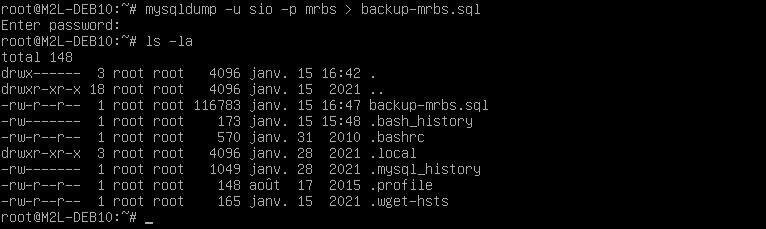
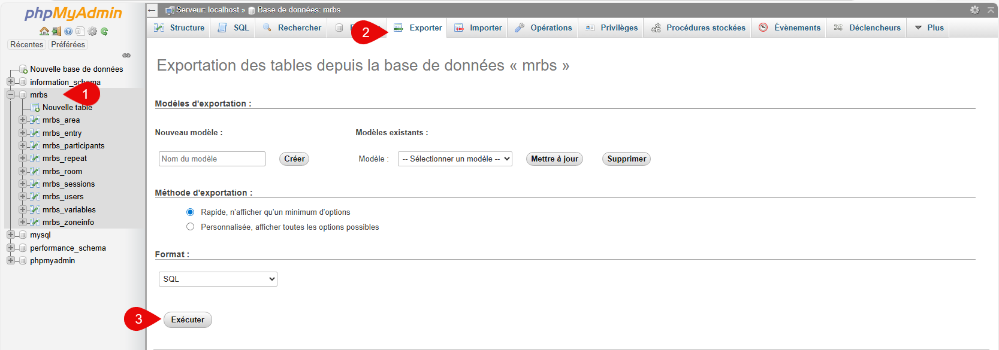
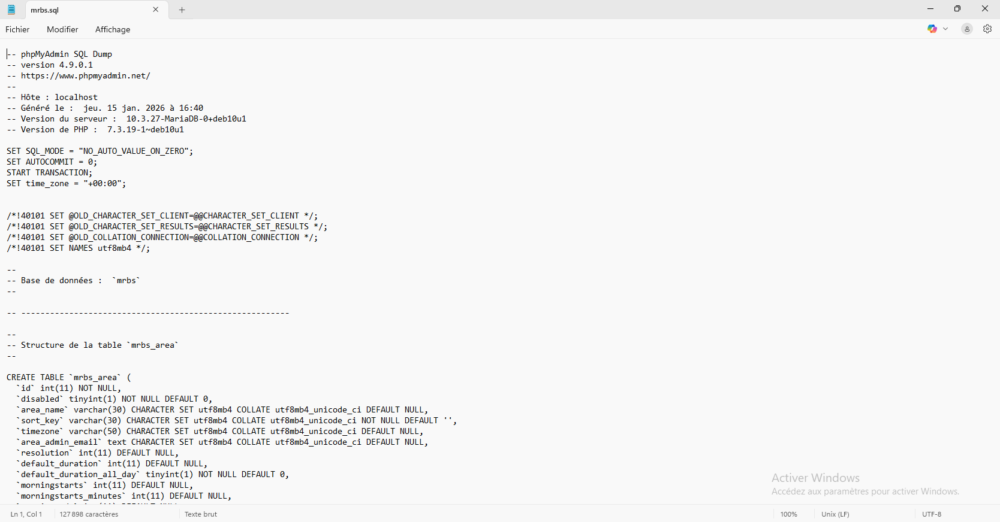

La sauvegarde d'une base de données est une opération cruciale pour garantir la sécurité et l'intégrité des données. De même, la restauration permet de récupérer les données en cas de perte ou de corruption.

Sauvegarder et restaurer une base de données MariaDB peut être réalisé de plusieurs façons, notamment via la ligne de commande ou en utilisant l'interface graphique phpMyAdmin. Ce document présente les deux méthodes.

## Sauvegarde

### Méthode 1 : Ligne de commande

Pour sauvegarder une base de données MariaDB en ligne de commande, vous pouvez utiliser l'outil `mysqldump`. Voici les étapes à suivre :
1. Ouvrez une session en mode console sur la machine Linux.
2. Exécutez la commande suivante pour sauvegarder la base de données `my_db` dans un fichier nommé `backup_my_db.sql` : 

```bash
mysqldump -u root -p my_db > backup_my_db.sql
```



3. Entrez le mot de passe de l'utilisateur root lorsque vous y êtes invité.

### Méthode 2 : PhpMyAdmin

1. Connectez-vous à l'interface phpMyAdmin.
2. Sélectionnez la base de données `my_db` dans le panneau de gauche.
3. Cliquez sur l'onglet "Exporter".
4. Choisissez le format d'exportation (généralement SQL) et cliquez sur "Exécuter" pour télécharger le fichier de sauvegarde.



Les fichiers peuvent être ouverts avec un éditeur de texte ou un IDE adapté pour visualiser le contenu SQL.



## Restauration
### Méthode 1 : Ligne de commande
Pour restaurer une base de données MariaDB à partir d'un fichier de sauvegarde, suivez ces étapes :
1. Ouvrez une session en mode console sur la machine Linux.
2. Exécutez la commande suivante pour restaurer la base de données `my_db` à partir du fichier `backup_my_db.sql` : 

```bash
mysql -u root -p my_db < backup_my_db.sql
```
3. Entrez le mot de passe de l'utilisateur root lorsque vous y êtes invité.

### Méthode 2 : PhpMyAdmin
1. Connectez-vous à l'interface phpMyAdmin.
2. Sélectionnez la base de données `my_db` dans le panneau de gauche.
3. Cliquez sur l'onglet "Importer".
4. Cliquez sur "Choisir un fichier" et sélectionnez le fichier `backup_my_db.sql`.
5. Cliquez sur "Exécuter" pour importer les données dans la base de données.

## Conclusion
La sauvegarde et la restauration des bases de données MariaDB sont des opérations essentielles pour la gestion des données. En utilisant soit la ligne de commande soit l'interface phpMyAdmin, vous pouvez facilement protéger et récupérer vos données en cas de besoin.
