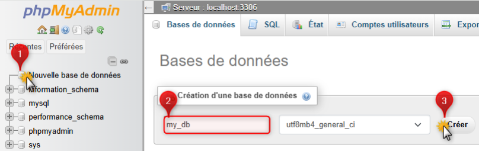
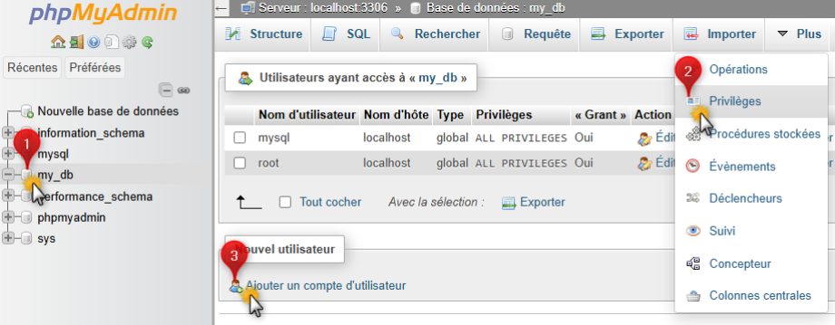
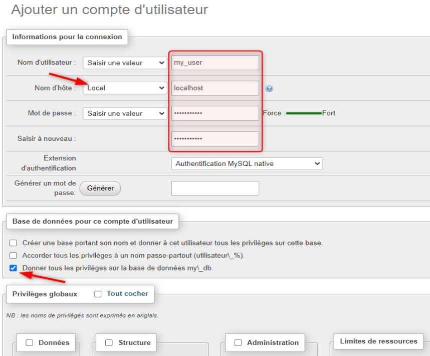
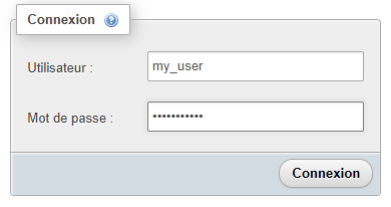
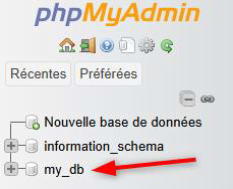

### Présentation de ce document

Cette procédure présente les étapes de création d’une base de données sous mysql ou mariadb en ligne de commande sous Linux. Deux méthodes sont proposées en ligne de commande avec des instructions sql ou via l’interface graphique de phpMyAdmin.

Dans l’exemple ci-dessous, nous allons créer une base de données nommée my_db ainsi qu’un utilisateur dédié nommé my_user dont le mot de passe est my_password. Cet utilisateur disposera de tous les privilèges d’administration uniquement sur cette base à condition qu’il s’authentifie depuis une session locale via localhost.

### Créer la base en ligne de commande

En ligne de commande :

- Ouvrir une session en mode console sur la machine Linux
- Se connecter en ligne de commande :

```bash
mariadb -u root -p
```

- Créer une nouvelle base de données nommée my_db :

```sql
create database my_db;
```

- Créer un utilisateur dans MariaDB :

```sql
create user my_user@localhost identified by "my_password";
```

- Accorder les privilèges d’administration sur toute la base de données my_db depuis localhost :

```sql
grant all on my_db.* to my_user@localhost; 
```

Mettre à jour les privilèges d’accès pour prendre en compte les modifications :

```sql
flush privileges;
```

Quitter la console MariaDB :

```sql
exit
```

#### Vérifier les accès en ligne de commande

Pour vérifier la présence de la base de données, se connecter avec le compte my_user

```bash
mariadb -u my_user -p
```

Afficher la liste des bases de données accessibles

```sql
show databases;
```


Puis quitter la console mariadb :

```sql
exit
```

### Créer la base avec phpMyAmdin

Se connecter au site phpMyAdmin (par exemple : http://192.168.1.1/phpmyadmin) :

- Ouvrir une session avec le compte root de MariaDB.
- Une fois connecté, cliquer sur “Nouvelle base de données”.
- Saisir le nom de la base et cliquer sur le bouton “Créer”.



- Une fois la base de données créée, phpMyAdmin vous propose de créer des tables dans la base.
- Cliquer sur la base de données my_db pour ignirer cette étape
- Puis cliquer sur le menu “Privilèges” et choisir l’option Créer un nouvel utilisateur”



- Configurer le login, le mode d’accès local via localhost et le mot de passe.
- Cocher la case “Donner tous les privilèges sur cette base de données”
- Et pour finir cliquer sur le bouton “Exécuter” en bas de la page.



:::caution
Attention ! Ne pas accorder de privilèges globaux sur MariaDB pour cet utilisateur dédié.
:::

#### Vérifier dans phpMyAdmin

Pour vérifier la présence de cette base de données avec phpMyAdmin :

- Se déconnecter de la session active dans phpMyAdmin
- S’authentifier à nouveau avec le compte my_user et sont mot de passe my_password.



- Une fois la session ouverte, la base de données est disponible dans le panneau latéral gauche :

