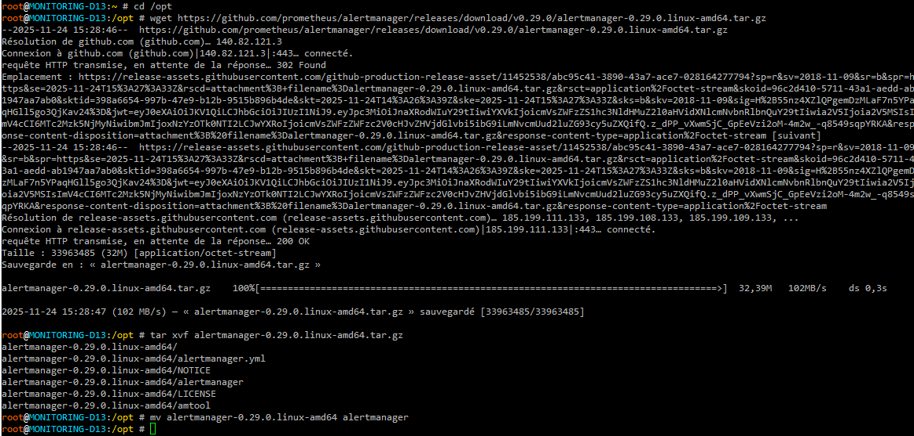

## Télécharger et installer Alertmanager
Téléchargez la dernière version d'Alertmanager depuis la [page des versions de Prometheus](https://prometheus.io/download/#alertmanager).
Décompressez l'archive téléchargée et placez le binaire `alertmanager` dans un répertoire de votre choix, par exemple `/usr/local/bin/`. Vous pouvez également créer un répertoire dédié pour Alertmanager, par exemple `/opt/alertmanager`.
```bash
root@MONITORING-D13:~ # cd /opt
root@MONITORING-D13:/opt # wget https://github.com/prometheus/alertmanager/releases/download/v0.29.0/alertmanager-0.29.0.linux-amd64.tar.gz
root@MONITORING-D13:/opt # tar xvf alertmanager-0.29.0.linux-amd64.tar.gz
root@MONITORING-D13:/opt # mv alertmanager-0.29.0.linux-amd64 alertmanager
```

## Configuration de l'envoi des alertes
Créez un fichier de configuration `alertmanager.yml` dans le répertoire d'Alertmanager (`/opt/alertmanager` dans notre exemple).
Voilà un exemple de configuration pour envoyer des alertes par email via un compte Gmail :
```yaml
global:
  smtp_smarthost: 'smtp.gmail.com:587'
  smtp_from: 'tonemail@gmail.com'
  smtp_auth_username: 'tonemail@gmail.com'
  smtp_auth_password: 'TON_MOT_DE_PASSE_APPLICATION'

route:
  receiver: 'gmail-alert'

receivers:
  - name: 'gmail-alert'
    email_configs:
      - to: 'destinataire@gmail.com'
        send_resolved: true
```
## Création d'un service systemd pour Alertmanager
Créez un fichier de service systemd pour gérer Alertmanager. Créez un fichier nommé `alertmanager.service` dans le répertoire `/etc/systemd/system/` avec le contenu suivant :
```ini
[Unit]
Description=Alertmanager Service
After=network.target

[Service]
User=root
ExecStart=/opt/alertmanager/alertmanager --config.file=/opt/alertmanager/alertmanager.yml --storage.path /var/lib/alertmanager/
Restart=always

[Install]
WantedBy=multi-user.target
```
Rechargez les fichiers de configuration systemd et démarrez le service Alertmanager :
```bash
root@MONITORING-D13:/opt # systemctl daemon-reload
root@MONITORING-D13:/opt # systemctl start alertmanager
root@MONITORING-D13:/opt # systemctl enable alertmanager
```
Vérifiez que le service fonctionne correctement :
```bash
root@MONITORING-D13:/opt # systemctl status alertmanager
```
## Configuration de Prometheus pour utiliser Alertmanager
Modifiez le fichier de configuration de Prometheus (`prometheus.yml`) pour ajouter la section `alerting` et spécifier l'adresse d'Alertmanager.
```yaml
alerting:
  alertmanagers:
    - static_configs:
        - targets: ['localhost:9093']

rule_files:
  - "/etc/prometheus/alert.rules.yml"

```
Redémarrez le service Prometheus pour appliquer les modifications :
```bash
root@MONITORING-D13:/opt # systemctl restart prometheus
```
## Vérification du fonctionnement
Pour vérifier qu'Alertmanager fonctionne correctement, vous pouvez accéder à l'interface web d'Alertmanager en ouvrant un navigateur et en allant à l'adresse `http://MONITORING-D13:9093`.
Vous pouvez également tester l'envoi d'alertes en créant une règle d'alerte dans Prometheus et en vérifiant que vous recevez bien les emails configurés.

### Création d'une règle d'alerte simple
Ajoutez une règle d'alerte dans le fichier `/etc/prometheus/alert.rules.yml` pour tester Alertmanager :
```yaml

groups:
  - name: blackbox
    rules:
      - alert: SiteDown
        expr: probe_success == 0
        for: 1m
        labels:
          severity: critical
        annotations:
          summary: "Site {{ $labels.instance }} is DOWN"
            description: "{{ $labels.instance }} has been down for more than 1 minute."
```
Redémarrez Prometheus pour appliquer la nouvelle règle :
```bash
root@MONITORING-D13:/opt # systemctl restart prometheus
```
### Test de l'alerte
Simulez une panne en arrêtant le service que vous surveillez avec Blackbox Exporter et vérifiez que vous recevez l'alerte par email.
Avec cette configuration, vous devriez être en mesure de recevoir des alertes par email via Alertmanager lorsque des conditions spécifiques sont remplies dans Prometheus.