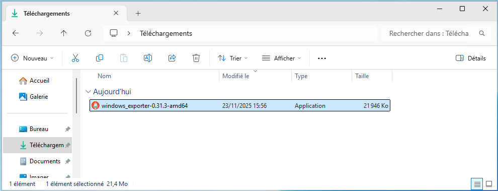
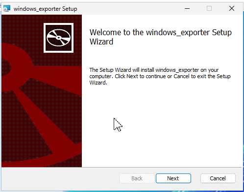
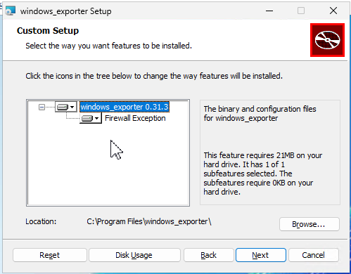
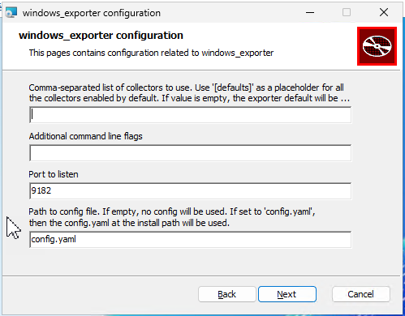
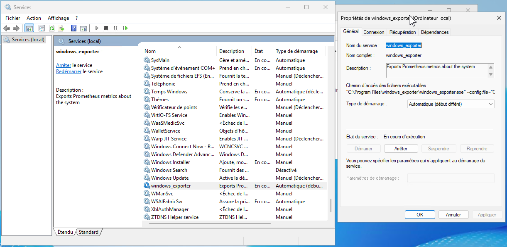
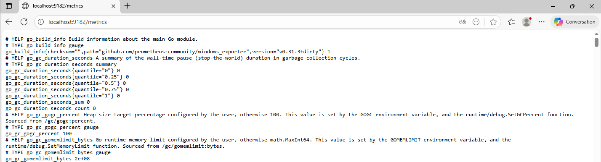
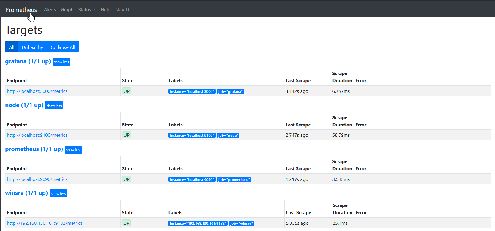

## Téléchargement du programme
[Releases · prometheus-community/windows_exporter](https://github.com/prometheus-community/windows_exporter/releases)
## Installation
Lancer le fichier windows_exporter-0.31.3-amd64.msi

Suivre le processus d'installation



Windows Exporter est installé comme un service

Nous pouvons voir les métriques à l'adresse http://localhost:9182/metrics

## Ajout de l'exporter dans Prometheus
Nous allons modifier le fichier
```bash
root@MONITORING-D13:~ # nano /etc/prometheus/prometheus.yml

  - job_name: winsrv
    static_configs:
      - targets: ['192.168.130.101:9182']

root@MONITORING-D13:~ # service prometheus restart
```


La target est bien configurée

