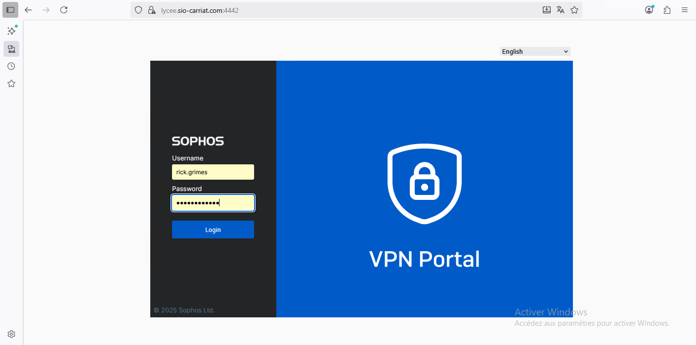
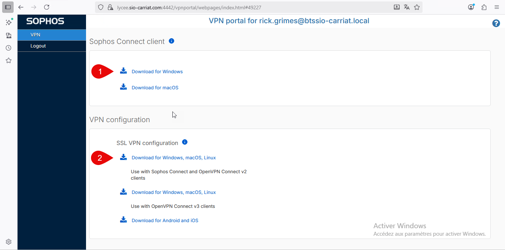
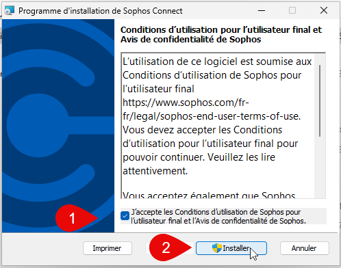
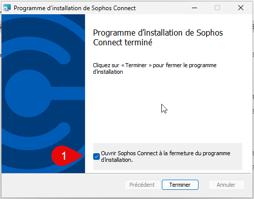
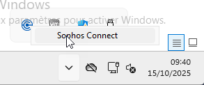
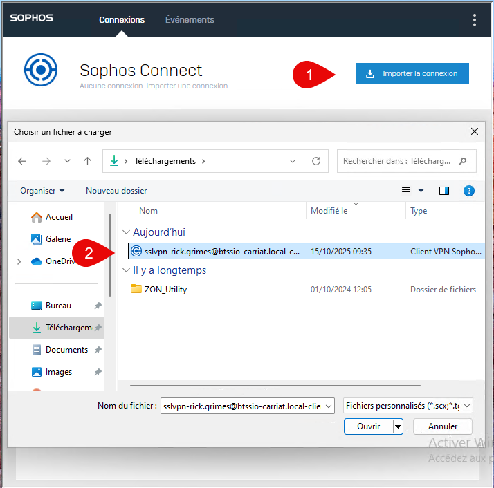
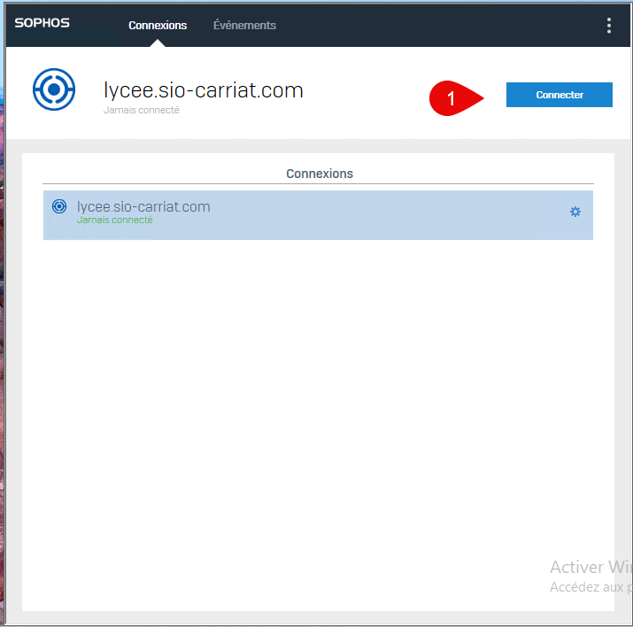
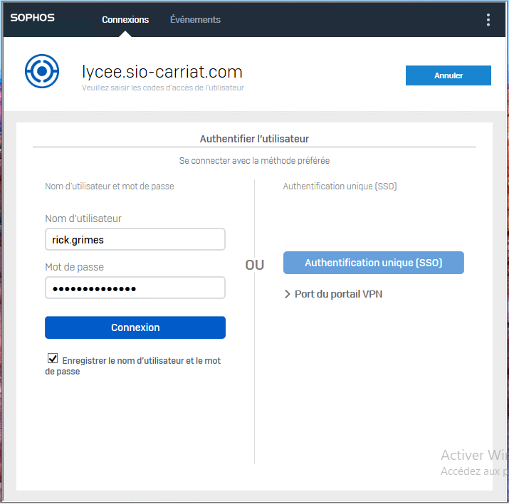
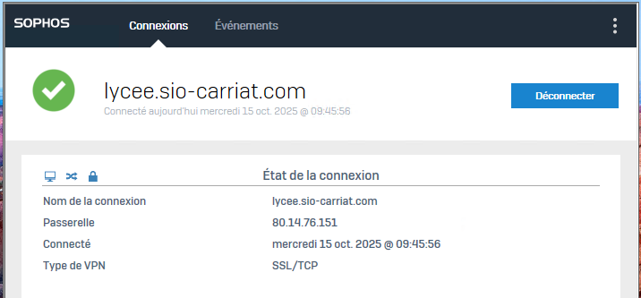
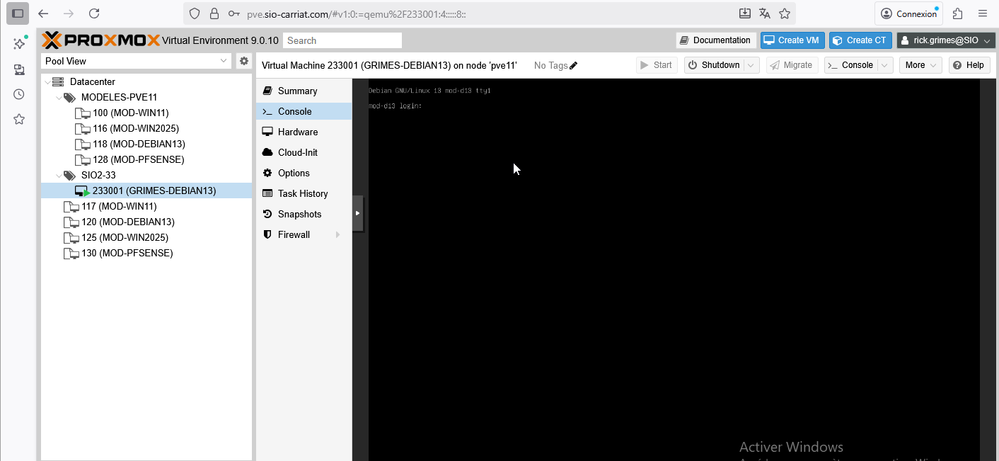

::: caution
Ce document a pour objectif de vous expliquer comment se connecter en VPN sur le réseau du lycée CARRIAT.
:::
## Préambule
La connexion VPN mise à disposition par le lycée doit être utilisée uniquement dans un cadre pédagogique. Elle permet d’accéder à distance aux ressources informatiques internes (serveurs, machines virtuelles, applications, etc.) dans le cadre des activités d’enseignement et des travaux pratiques.

Toute utilisation du VPN à des fins personnelles, non autorisées ou contraires aux règles de l’établissement est strictement interdite. Les connexions sont susceptibles d’être journalisées et contrôlées afin d’assurer la sécurité du réseau et le respect de la charte informatique du lycée.

En vous connectant au VPN, vous vous engagez à respecter ces règles et à adopter un comportement responsable et conforme à l’usage éducatif prévu.
## Accès au portail VPN

Se connecter à l’adresse https://vpn.sio-carriat.com et s’identifier avec son compte étudiant.

Vous arrivez sur une page permettant de télécharger le client VPN (1) ainsi que la configuration (2).

Si vous n’avez pas de client OpenVPN, télécharger le Windows Installer (1) sinon, télécharger uniquement les fichiers de configuration (2).

## Installation du client VPN Windows

Lancer le fichier que vous avez téléchargé
SophosConnect_2.5.0_GA(IPsec_and_SSLVPN).msi

## Configuration de la connexion

L’icône Sophos est disponible en bas à gauche.

Importer le fichier ovpn qui a été téléchargé.
sslvpn-[VOITRE_NOM]@btssio-carriat.local-client-config.ovpn

La connexion est disponible.

## Connexion

Dans le client Sophos, vous pouvez sélectionner la connexion lycee.sio-carriat.com puis Connecter

Saisir ensuite votre nom d’utilisateur et votre mot de passe, vous avez la possibilité de les sauvegarder.

La connexion est établie

On peut maintenant accéder aux ressources du lycée !
