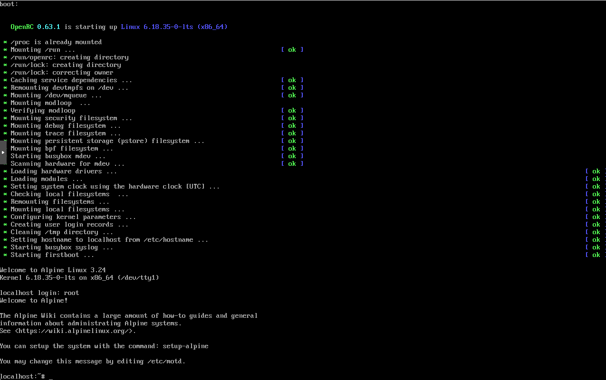
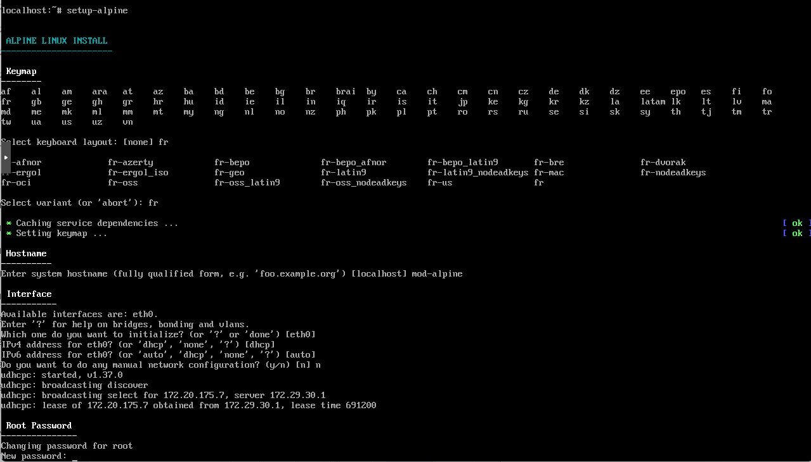
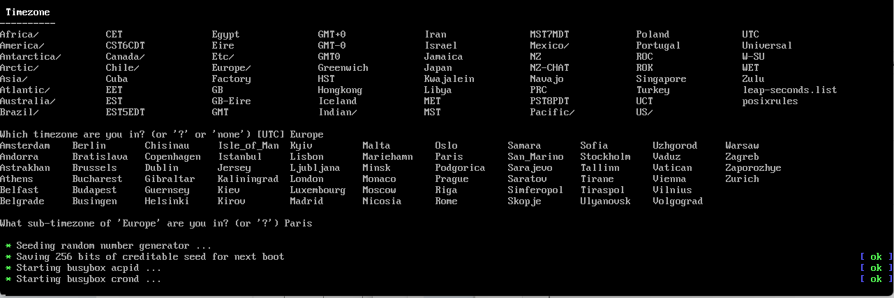
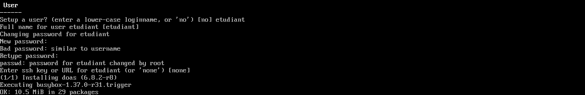
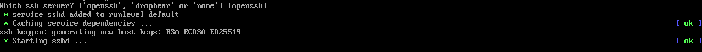
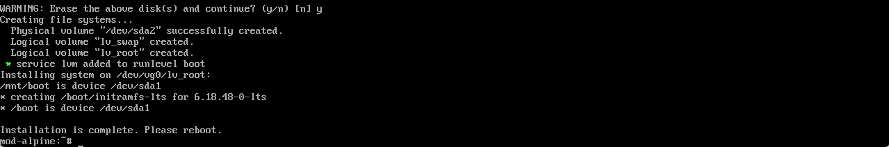
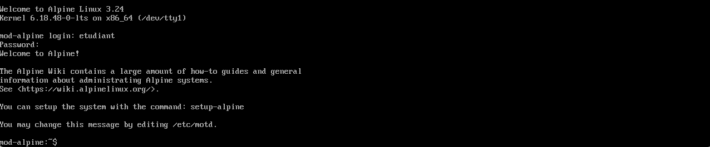

Alpine Linux est une distribution légère et sécurisée, idéale pour les serveurs et les environnements de conteneurs. Voici la procédure pour installer Alpine Linux 3.24 sur votre ordinateur.

:::note
Installation réalisée sur une machine virtuelle sous Proxmox
:::

Lors du démarrage sur le ficher iso d'installation, vous arrivez sur un écran de connexion.
Uniquement le login est demandé, le mot de passe n'est pas nécessaire. Le login par défaut est `root`.



Dans le prompt, tapez la commande suivante pour lancer l'installation `attention, clavier en qwerty` :

```bash
setup-alpine
```

On va ensuite choisir le layout du clavier correspondant à votre langue. Pour le français, tapez `fr` et appuyez sur `Entrée` puis sa variante.

Choisir le nom de l'hôte (hostname) pour votre machine Alpine Linux. Par exemple, vous pouvez entrer `alpine` et appuyer sur `Entrée`.

Nous allons ensuite configurer le réseau. Si vous utilisez DHCP, vous pouvez simplement appuyer sur `Entrée` pour accepter la configuration automatique. Sinon, vous pouvez entrer les paramètres réseau manuellement.

Puis, saisir le mot de passe root pour sécuriser votre installation. Tapez le mot de passe souhaité et appuyez sur `Entrée`. Vous serez invité à le confirmer en le retapant.



Selectionnez ensuite la Timezone correspondant à votre région. Vous pouvez taper le nom de votre ville ou région et appuyer sur `Entrée`.



Enfin, on va définir si il faut utiliser un proxy pour aller sur Internet. Si vous n'avez pas de proxy, appuyez simplement sur `Entrée` pour continuer.

On est ensuite amené à choisir un miroir pour installer les paquets :


On est amené à créer un utilisateur si on le souhaite (ici je créé l'utilisateur `etudiant`), puis on lui attribue un mot de passe : `Etudiant_1234`



On sélectionne ensuite le serveur SSH souhaité (ici `openssh`) :



Ensuite on passe au partitionnement, plusieurs types d'installation sont proposés :
- sys: Mode traditionnel avec /boot, / et swap (developement, stations de travail,
- data: Disque utilisé pour le stockage de données, le système est lancé en RAM (bases de données, serveur de log)
- crypt: Active le chiffrement et demande si on veut après sys ou data. Mot de passe demandé au boot du système
- cryptsys: Comme sys mais avec chiffrement
- lvm: Utilise LVM et demande si on veut après sys ou data
- lvmsys: Comme sys mais avec lvm pour le partitionnement
- lvmdata: Comme data mais avec lvm pour le partitionnement


L'installation se lance et il faut redémarrer à la fin.



On reboot et Alpine Linux est installée !

