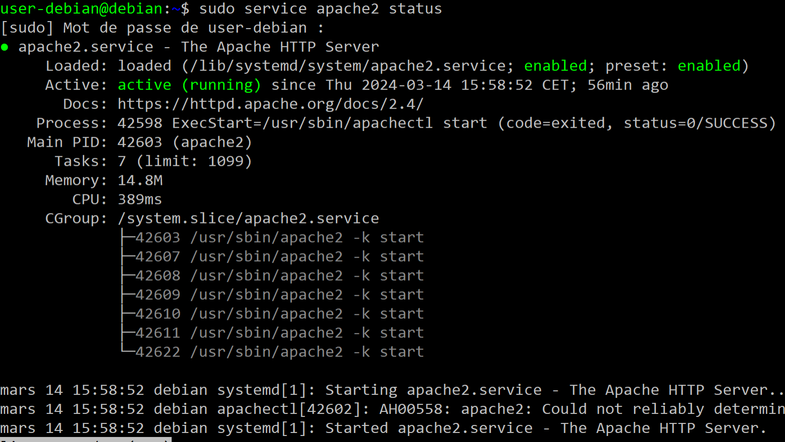
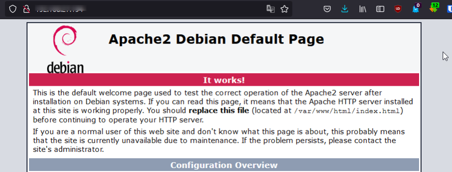
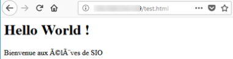
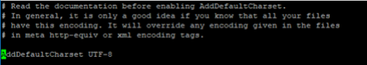
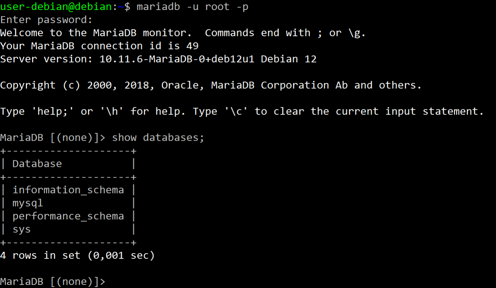
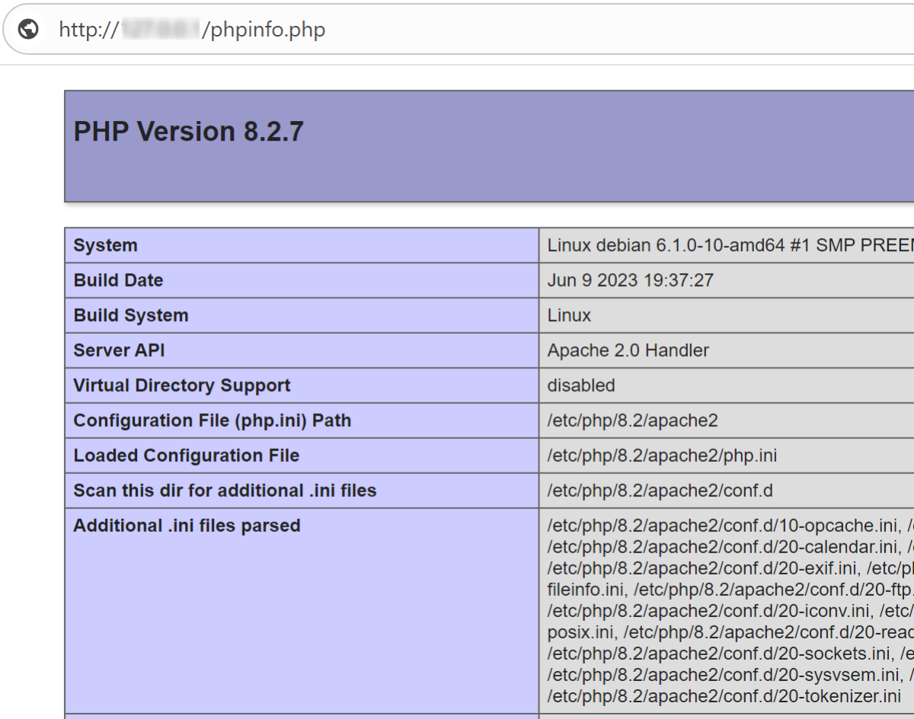
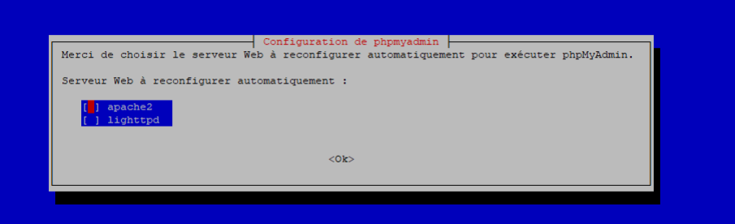
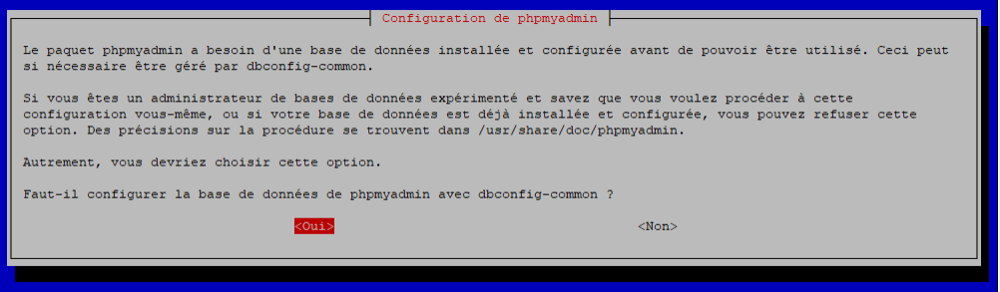

Ce KB (Knowledge Base) est une procédure simplifiée d’installation d’un serveur LAMP qui signifie : Linux Apache MariaDB (ou MySQL) et PHP.

:::caution
La procédure décrite ci-dessous est destinée à des fins de tests. Cette configuration doit être sécurisée avant d’envisager de mettre le serveur en production.
:::

Un serveur LAMP fournit des services d’hébergements de sites Web statiques ou dynamiques.
Dans ce KB, nous allons déployer les paquets suivants sur une distribution Debian 12.

- Apache est un serveur Web Open source.
- MariaDB va permettre de stocker les données du site dans une base de données relationnel.
- PHP est l’interpréteur de code permettant de rendre dynamique vos pages.
- Optionnellement : PhpMyAdmin pour l’administration simplifiée des bases de données.

### Prérequis

    Disposer d’une machine Debian 12 (idéalement sans environnement de bureau)
    Connaitre les commandes de bases de l’administration sous Debian.
    Disposer des compétences de base en administration système et réseau.

### Sommaire

Dans les prochaines étapes, nous réaliser les opérations suivantes :

- Installer Apache et vérifier son bon fonctionnement
- Installer MariaDB, sécuriser sa configuration et vérifier son fonctionnement.
- Installer PHP et vérifier son fonctionnement.
- Optionnel : Installer phpMyAdmin et vérifier son fonctionnement.

### Apache HTTP Server

Apache HTTP Server, communément appelé Apache, est un logiciel de serveur web open source largement utilisé dans le monde entier. Il est développé et maintenu par la Fondation Apache.

Apache est compatible avec de nombreux systèmes d’exploitation, il offre une grande flexibilité et une gamme étendue de fonctionnalités, ce qui lui permet de répondre à divers besoins en matière d’hébergement web.

#### Apache : Installation

Le service Apache utilise le paquet nommé apache2.

```bash
sudo apt install apache2
```

Vérification de l’installation et de la version d’Apache

```bash
sudo apache2 -v
```

Vérification du statut du service apache2 :

```bash
sudo service apache2 status
```

La sortie de commande service devrait afficher un message comme celui-ci :



Vérifiez le port utilisé par Apache avec la commande ss

```bash
netstat -ltpn | grep "80"
```

#### Apache : Vérifications et tests

Pour s’assurer du bon fonctionnement d’Apache, vous pouvez réaliser les opérations suivantes.
Tester depuis un navigateur en mode texte

À savoir ! Le paquet Lynx est un navigateur web en mode console. Il permet l’affichage de page web dans la console Shell de façon textuelle.

Installer le paquet lynx (navigateur web en mode shell) :

```bash
sudo apt install lynx
```

Dans la console Shell, utiliser la commande suivant pour ouvrir localement (127.0.0.1) la page par défaut du serveur Apache :

```bash
lynx http://127.0.0.1
```

#### Testez depuis un navigateur web :

Pour ce test, vous devez disposer d’un PC client connecté au même réseau local que votre serveur LAMP. Relever l’adresse IP de votre serveur LAMP :

```bash
ip a
```

Depuis un navigateur web sur le poste client, saisir l’adresse IP du serveur LAMP dans la barre d’adresse. La page d’accueil par défaut d’Apache s’affiche :



#### Créer une page de test

:::tip
À savoir ! Apache stocke son site par défaut dans le répertoire /var/www/html. Par défaut l’écriture dans ce dossier est réservée aux membres du groupe www-data
:::

Créer un fichier vide test.html dans le dossier html d’apache

```bash
sudo touch /var/www/html/test.html
```

Modifier le contenu avec l’éditeur de texte nano :

```bash
sudo nano /var/www/html/test.html
```

Ajouter le code html suivant et enregistrer les modifications :

```bash
<h1>Hello World !</h1> 
<p>Bienvenue aux étudiants</p>
```

Vérifiez l’affichage de la page avec lynx (navigateur en mode textuel) :

```bash
lynx http://127.0.0.1/test.html
```



Depuis un navigateur web sur le poste client, saisir l’adresse IP du serveur LAMP dans la barre d’adresse. Par exemple : http://192.168.1.1/test.html

Si l’affichage des caractères spéciaux n’est pas convenable, cela vient du jeu de caractère paramétré par défaut dans apache. Pour modifier cette configuration :

- Modifier le /etc/apache2/conf-available/charset.conf
- Décommenter la ligne AddDefaultCharset UTF-8, en supprimant le symbole # et enregistrer.



Recharger la configuration d’Apache :

```bash
sudo service apache2 reload
```

En actualisant la page, l’affichage est maintenant correct.

#### Apache : Configuration

:::caution
Attention ! Apache se configure à l’aide de plusieurs fichiers, toute modification nécessite un redémarrage du service ou un reload. Si vous commettez une erreur dans un fichier, Apache ne
fonctionnera plus. Pour éviter cela, il faut avant chaque rechargement vérifier la syntaxe des fichiers.
:::

Pour vérifier la syntaxe des fichiers de configuration, utiliser la commande suivante (avant un restart ou un reload) :

```bash
sudo apache2ctl configtest
```

Pour redémarrer le service :

```bash
sudo service apache2 restart
```

Pour recharger les configurations

```bash
sudo service apache2 reload
```

### MARIADB

#### MARIADB : Installation

:::note
À savoir ! MariaDB est un système de gestion de base de données relationnelle (SGBDR) sous licence open source. Il s’agit d’un fork (un dérivé) de MySQL, conçu comme une alternative compatible à MySQL.
:::

L’installation s’effectue avec la commande suivante :

```bash
sudo apt install mariadb-server
```

#### MARIADB : Sécurisation

:::note
À savoir ! MariaDB (comme MySQL) est accompagné d’un script qui permet une sécurisation initiale du SGBDR.
:::

La commande mariadb_secure_installation (hérité de MySQL) vous permet de :

- Modifier le mot de passe root MariaDB (vide par défaut).
- Désactiver l’accès via le compte root de MariaDB via le réseau (réduire la surface d’attaque)
- Supprimer la base de données test et les comptes anonymes créés par défaut à des fins de tests.

:::caution
Attention ! Le compte root de MariaDB est un utilisateur qui est créé et stocké dans le SGBDR, tandis que le compte root Debian est stocké dans la configuration de l’OS. Ce ne sont pas les mêmes utilisateurs, même s’ils ont le même login.
:::

Exécuter la commande suivante et presser la touche :

```bash
sudo mariadb-secure-installation
```

Lorsque le message suivant s’affiche, presser la touche n (pour no) :

```bash
Switch to unix_socket authentication [Y/n] n
```

Pour toutes les questions suivantes, presser la touche Y afin d’accepter toutes les modifications proposées par le script :

- Changer le mot de passe root de MariaDB.
- Supprimer les comptes anonymes.
- Désactiver l’accès root à distance.
- Supprimer les bases de données de tests.
- Rechercher les privilèges des utilisateurs MariaDB.

Vous devriez obtenir le message final suivant

```bash
All done! If you've completed all of the above steps, your MariaDB installation should now be secure.
 
Thanks for using MariaDB!
```

#### MARIADB : Vérifications et connexion

Vérifier la version de MariaDB avec l’option -V (en majuscule)

```bash
sudo mariadb -V
```

Vérifier que vous pouvez vous connecter à votre instance MariaDB avec la commande :

```bash
sudo mariadb -u root -p
```

Une fois connecté grâce au mot de passe root de MariaDB, saisir la requête sql suivante pour lister les bases de données de votre instance :

```bash
show databases;
```

Voici un exemple de sortie proposé par la commande :



Utiliser la commande suivante pour quitter l’instance MariaDB :

```bash
exit
```

### PHP

:::tip
À savoir ! PHP (Hypertext Preprocessor) est un langage de programmation libre utilisé pour créer des sites web dynamiques. Il s’intègre facilement avec HTML et il offre une large prise en charge des bases de données. PHP est multiplateforme et largement utilisé dans l’industrie pour son efficacité et sa simplicité.
:::

#### Installation de PHP

Installer le paquet php :

```bash
sudo apt install php
```

Vérifier quelle version de PHP vous venez d’installer. Exécutez la commande suivante :

```bash
sudo php -v
```

Vérifier que le moteur de script PHP est actif. Pour cela créer un fichier “phpinfo.php” à la racine de notre site Web par défaut d’apache :

```bash
sudo nano /var/www/html/phpinfo.php
```

Dans ce fichier, indiquez le code suivant :

```bash
<?php
 
phpinfo();
 
?>
```

Depuis un navigateur web sur le poste client, saisir l’adresse IP du serveur LAMP dans la barre d’adresse et ajouter le chemin d’accès au fichier phpinfo.ini. Par exemple :

http://192.168.1.1/phpinfo.p.html



Supprimer le fichier phpinfo.php

```bash
sudo rm /var/www/html/phpinfo.php
```

:::caution
Attention ! Penser à supprimer ce fichier pour limiter les risques de cyberattaque car il contient énormément d’informations sensibles au sujet de votre configuration apache et php.
:::

### Optionnel : Installation de phpMyAdmin

phpMyAdmin est une application Web pour l’administration des SGBDR MySQL et MariaDB, réalisée principalement en PHP et distribuée sous licence GNU GPL.

Remarque ! Dans le cadre de vos tests vous pouvez envisager l’installation de cet outil sur le serveur LAMP, mais cela n’est pas préconisé dans un environnement de production. Cela
augmente la surface d’attaque et rend le serveur plus vulnérable en cas de cyberattaque.

Installer le paquet phpMyAdmin :

```bash
sudo apt-get install phpmyadmin
```

Choisir le serveur Web à reconfigurer automatiquement apache2 :

- Sélectionner apache2
- Presser la touche [ESPACE] puis [ENTER]



Choisir l’option pour confirmer la configuration de phpMyAdmin avec dbconfig-common :



Depuis un navigateur web sur le poste client :

- Saisir l’adresse IP du serveur LAMP dans la barre d’adresse et ajouter le dossier phpMyAdmin. Par exemple : http://192.168.1.1/phpmyadmin
- Utiliser le compte root de MariaDB pour s’authentifier.
