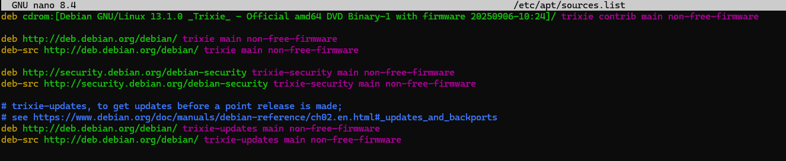

:::note
testé sur Debian 13
:::
Voilà le sources.list de Debian 13 – Trixie
```bash
deb http://deb.debian.org/debian/ trixie main non-free-firmware
deb-src http://deb.debian.org/debian/ trixie main non-free-firmware
 
deb http://security.debian.org/debian-security trixie-security main non-free-firmware
deb-src http://security.debian.org/debian-security trixie-security main non-free-firmware
 
# trixie-updates, to get updates before a point release is made;
# see https://www.debian.org/doc/manuals/debian-reference/ch02.en.html#_updates_and_backports
deb http://deb.debian.org/debian/ trixie-updates main non-free-firmware
deb-src http://deb.debian.org/debian/ trixie-updates main non-free-firmware
```



Pour éditer le fichier sources.list
```bash
nano /etc/apt/sources.list
```
Puis mettre à jour la liste des paquets
```bash
apt update
```
Pour mettre à jour le système
```bash
apt upgrade
```

