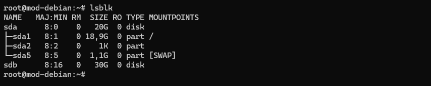
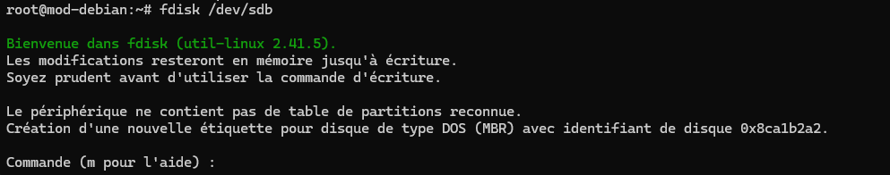
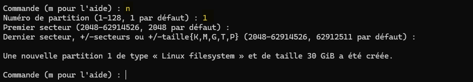
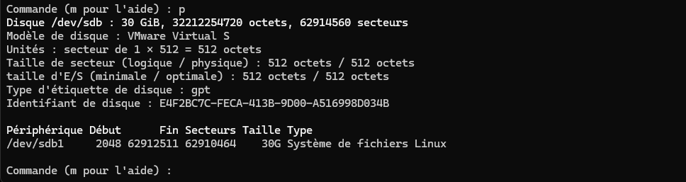
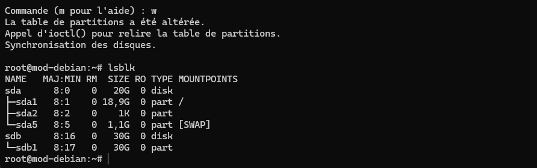
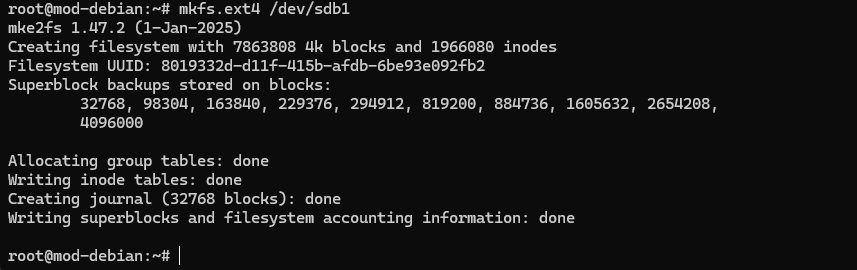
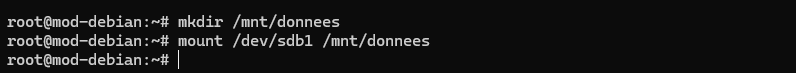
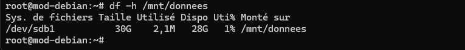

Voici la procédure pour ajouter un disque dur à un serveur Debian.

:::note
Dans mon exemple, je vais rajouer un disque de 30 Go sur un serveur debian 13 virtualisé sous VMWare workstation.
:::

### Identifier le nouveau disque

Affichez les disques et partitions présents :

```bash
fdisk
```



Mon disque sera sdb, il est donc nécessaire de le formater et de le monter.

### Créer une partition sur le disque

Pour créer une partition sur le disque, utilisez la commande suivante :

```bash
fdisk /dev/sdb
```



Utiliser la commande `g` pour créer une nouvelle table de partitions GPT.
Il faut définir un numéro de partition puis renseigner le premier et le dernier secteur.



Il est possible de vérifier les modifications qui ont été faite pavec la commande `p`.



On enregistre ensuite les changements avec la commande w.



### Formater la partition

Pour formater la partition, utilisez la commande suivante :

```bash
mkfs.ext4 /dev/sdb1
```



### Monter la partition

Sous linux, il est nécessaire de créer un point de montage pour la partition. Pour cela, utilisez la commande suivante :

```bash 
mkdir /mnt/donnees
```

Montez /dev/sdb1 dans /mnt/donnees :

```bash
mount /dev/sdb1 /mnt/donnees
```



### Vérification

Pour voir la capacité disponible :

```bash
df -h /mnt/donnees
```

