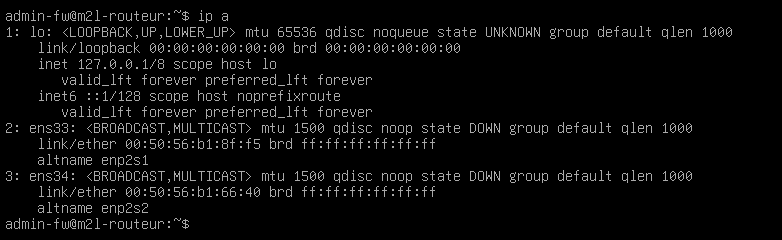
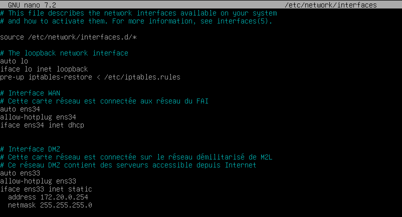

:::note
testé sur Debian 12/13
:::
# Configuration IP sur Debian

Pour configurer une adresse IP, il faut éditer le fichier /etc/network/interfaces

```bash
nano /etc/network/interfaces

# Exemple de configuration DHCP
allow-hotplug ensXX
iface ensXX inet dhcp
 
# Exemple de configuration fixe
allow-hotplug ensXX
iface ensXX inet static
address IP/CIDR
gateway IP_GATEWAY
```
Puis redémarrer le service réseau

```bash
systemctl restart networking
```

# Vérification

Vérifier la configuration avec la commande ip address

```bash
ip address show ens33
ip address
```


Dans la copie d’écran, on voit l’interface ens34 en DHCP et l’interface ens33 en IP fixe.


# Activation de l’interface

Si l’interface est éteinte (down) vous pouvez l’activer avec la commande

```bash
ifup [nom_interface]
```
