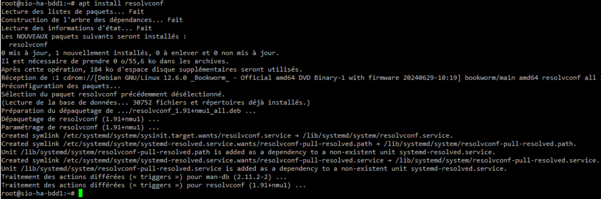
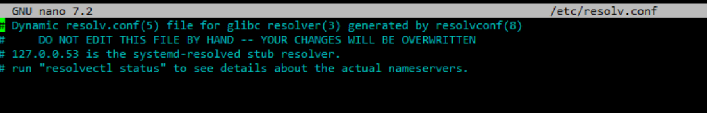
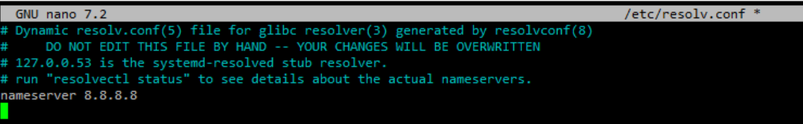
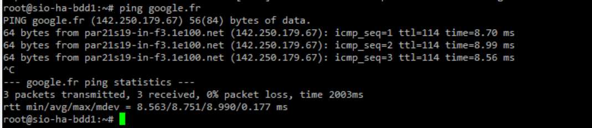

Si vous avez installé votre Debian 12 et que vous n’aviez pas de réseau, le paquet relatif au DNS ne s’est pas installé.


Le problème se repère rapidement quand vous voyez que vous n’avez pas de fichier resolv.conf.

Maintenance que vous avez du réseau (sinon ça ne sert à rien). Insérer à nouveau le DVD dans Debian dans le lecteur.

Lancer la commande :

```bash
# apt install resolvconf
```



Votre fichier resolv.conf existe bien dorénavant.



Ajouter les lignes avec vos serveurs DNS

```bash
nameserver 8.8.8.8
```



On sauvegarde le fichier et la résolution DNS fonctionne 😀.

