Sur une machine Linux Debian 13, configuré dans un hyperviseur Proxmox VE, j'ai besoin d'étendre la taille du disque dur sda.

Voici les étapes que j'ai suivies pour y parvenir :

## Augmenter la taille du disque dur dans Proxmox VE

Dans les paramètres materiels de la machine virtuelle, séléctionner le disque et faire **Disk Action** > **Resize**.

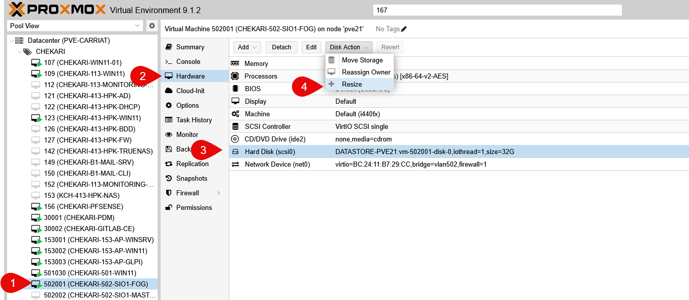

Dans le popup, entrer la quantité à ajouter (en Go) et valider.

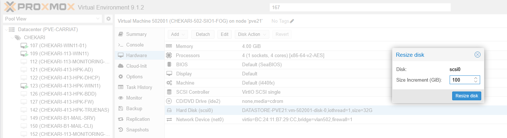

Une fois appliqué, la taille du disque dur est mise à jour.

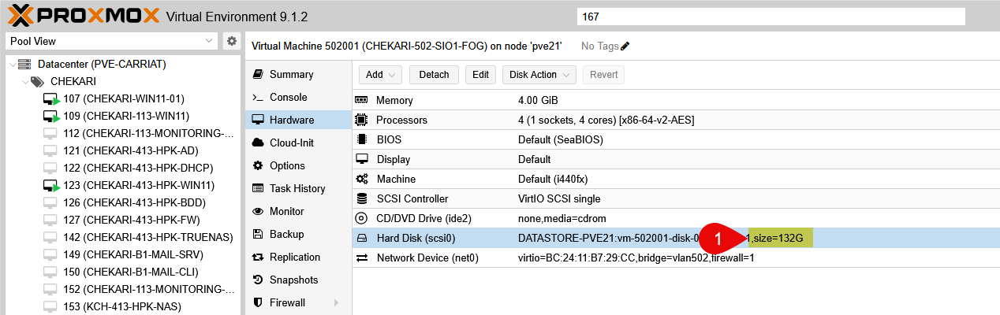

Le paramètre est maintenant prêt à être pris en compte par le système d'exploitation invité.

## Étendre la partition dans Debian

Se connecter à la machine Debian via SSH ou la console Proxmox VE.
Utiliser la commande `lsblk` pour vérifier la taille actuelle du disque dur et des partitions.

```bash
lsblk
```

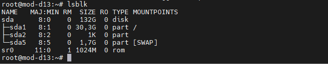

Pour une modification à chaud, utiliser la commande `parted` pour redimensionner la partition principale (généralement sda1).

Installer `parted` si ce n'est pas déjà fait :

```bash
apt update
apt install parted
```

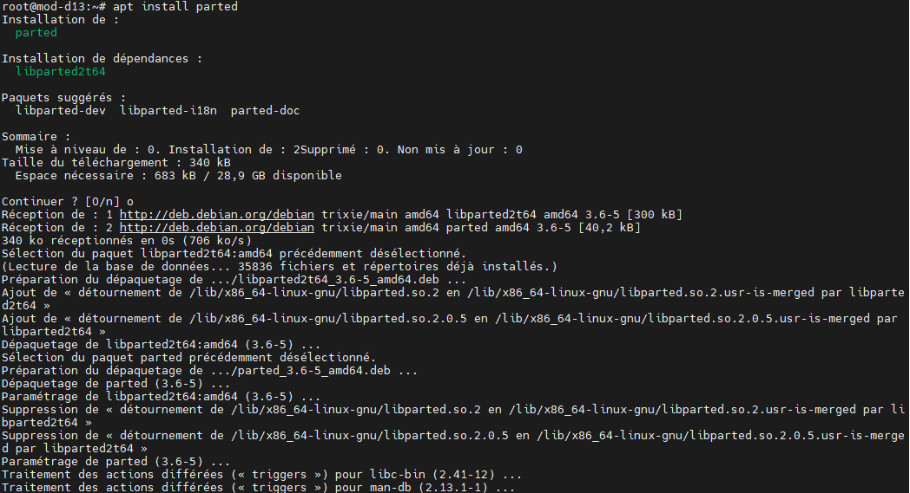

Désactiver la partition du swapavant de la redimensionner :

```bash
swapoff -a
```

Commenter la ligne de swap dans `/etc/fstab` pour éviter qu'elle ne soit réactivée au redémarrage.

```bash
nano /etc/fstab
```

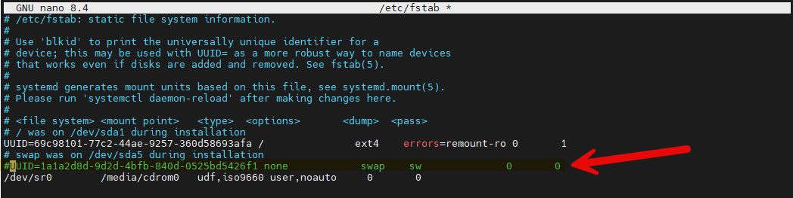

On peut voir que la partition sda1 est celle à redimensionner.

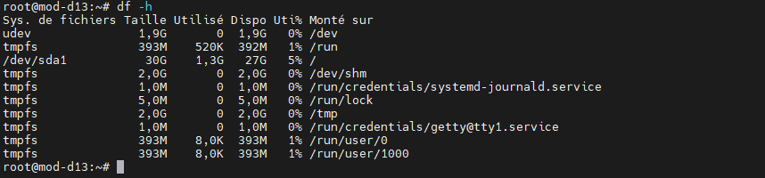

Nous allons manipuler la table de partition GPT avec `parted` :

```bash
parted /dev/sda
print
rm 5
rm 2
resizepart 1
yes
100%
print
quit
```

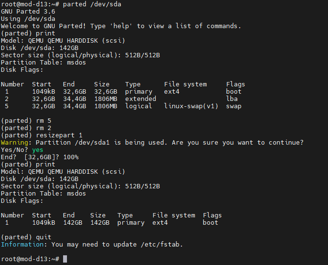

Ensuite, utiliser `resize2fs` pour étendre le système de fichiers à la nouvelle taille de la partition :

```bash
resize2fs /dev/sda1
```

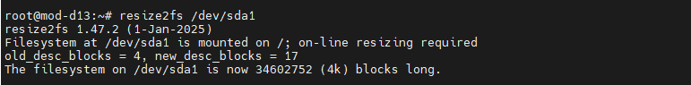

Il faut maintenant réactiver le swap mais nous allons le faire sur un swapfile plutotôt qu'une partition dédiée.

```bash
root@mod-d13:~# swapon --show
root@mod-d13:~# fallocate -l 2G /swapfile
root@mod-d13:~# chmod 600 /swapfile
root@mod-d13:~# mkswap /swapfile
Configure l'espace d'échange (swap) en version 1, taille = 2 GiB (2147479552 octets)
pas d'étiquette, UUID=c8487893-1d8a-4139-bc48-bec8e223b260
root@mod-d13:~# swapon /swapfile
root@mod-d13:~# swapon --show
NAME      TYPE SIZE USED PRIO
/swapfile file   2G   0B   -2
root@mod-d13:~#
```

Ajouter la ligne suivante dans `/etc/fstab` pour activer le swapfile au démarrage :

```bash
/swapfile none swap sw 0 0
``` 

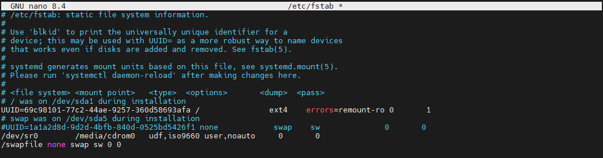

Nous pouvons voir que la taille de la partition sda1 a été étendue avec succès.

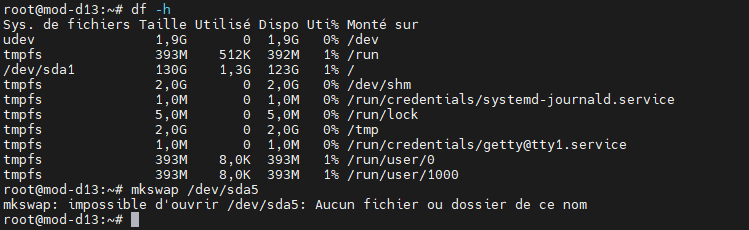