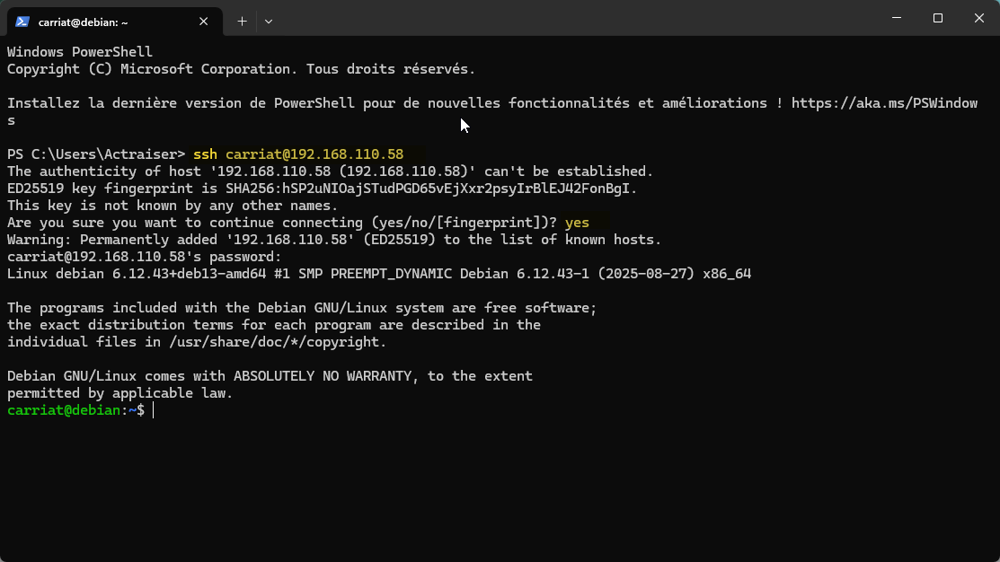
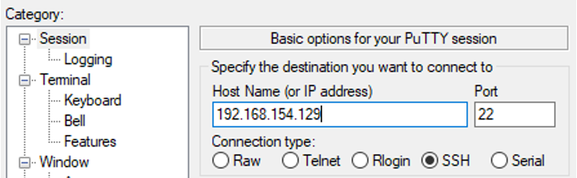
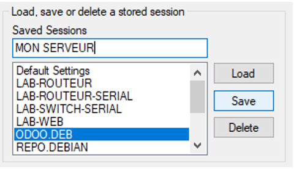
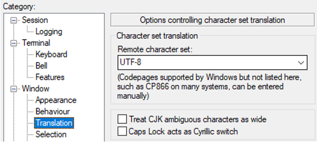
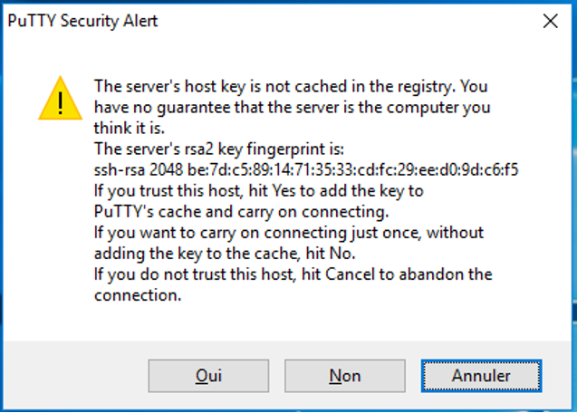

:::note
testé sur Debian 12/13
:::
:::caution
L’installation de SSH est un incontournable de l’administration Linux à distance, à connaître et à maîtriser.
SSH, acronyme de Secure Shell, est un protocole de communication sécurisé utilisé pour l’accès au Shell de l’OS à distance. Son utilisation est recommandée pour la gestion à distance de serveurs, le transfert de fichiers sécurisé (SFTP, ou SCP), l’exécution de commandes à distance, et d’autres
d’administration à distance.
:::
:::tip{icon="heart"}
SSH est un protocole client-serveur qui fournit un canal sécurisé sur une connexion non sécurisée. Le serveur utilise le port TCP 22 par défaut et il faut utiliser un client de connexion tel que openssh-client ou PuTTY.
:::
## Installation et configuration de SSH sur Debian
Lancer votre Debian et ouvrir une session non-root.

Le service sshd (ssh deamon) s’installe avec le paquet openssh-server.
```bash
apt install openssh-server
```
Pour vérifier le statut du service sshd (openssh-server) on utilise la commande :
```bash
service sshd status
```
Vérifier le port utilisé par SSH avec la commande suivant (nécessite l’installation du paquet net-tools), sinon, utiliser l’outil ss :
```bash
netstat -ltpn | grep "22"
 
ss -ltpn | grep "22"
```
Pour se connecter à distance sur ce serveur en SSH il faudra connaître son adresse ip avec la commande :
```bash
ip a
```
## Connexion à distance
:::tip{icon="heart"}
openssh-client est installé par défaut sur les versions récentes de Linux, de Windows 10 et sur Windows 11. On peut donc utiliser la commande ssh en PowerShell ou dans une invite de commande.
:::
:::caution
Par défaut et pour des raisons de sécurité, le compte utilisateur root n’a pas les autorisations pour se connecter à distance. Il faut utiliser un compte non-root et faire une élévation de privilèges avec la commande sudo ou su.
:::
- Assurez-vous de connecter cette machine au même réseau que la Debian
- Ouvrir un terminal et lancer la commande suivante pour vous connecter de façon sécurisée en SSH sur la console à distance de votre Debian (remplacer le nom d’utilisateur et l’adresse ip en fonction de votre serveur SSH) :
```bash
ssh username@ip-serveur-sshd 
```
Dans l’exemple ci-dessous, on peut voir que le client s’est connecté en tant qu’utilisateur « carriat » sur le serveur « debian (192.168.110.58) » avec un compte non-root, car le prompt Linux affiche un « $ ».

Une fois l’authentification réussie, vous avez accès au Shell à distance avec des communications réseaux chiffrées et sécurisées.
## PUTTY : CLIENT SSH SOUS WINDOWS
:::tip{icon="heart"}
PuTTY est un programme permettant de se connecter à distance à des serveurs en utilisant les protocoles SSH, Telnet ou Rlogin.
:::
- Télécharger PuTTY sur le site officiel : https://www.putty.org/
- Choisir la version MSI 64 bit (Windows Installer) et l’installer
- Lancer PuTTY et saisir :
    - l’IP de la machine Serveur SSH
    - le port 22 (port par défaut de SSH)


Il est possible de sauvegarder la configuration de la session pour la rouvrir facilement.

Si vous avez un problème d’affichage des caractères spéciaux, il faut modifier le jeu de caractères dans l’onglet « Translation ».

Lors de la première connexion sur le serveur, PuTTY vous affiche la clé de cryptage du serveur et vous demande si vous souhaitez vous connecter sur le serveur. Cliquez Oui !

<iframe width="720" height="576" src="https://www.youtube.com/embed/qbJ_ijOqQww?si=cJf3z8ajXAtLOZ2g" title="YouTube video player" frameborder="0" allow="accelerometer; autoplay; clipboard-write; encrypted-media; gyroscope; picture-in-picture; web-share" referrerpolicy="strict-origin-when-cross-origin" allowfullscreen></iframe>