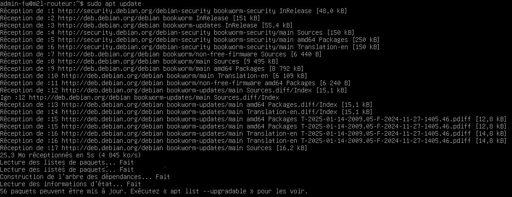
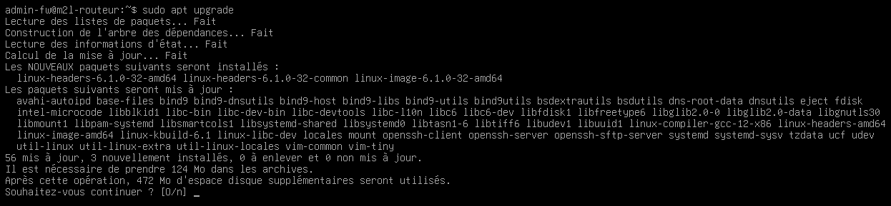

:::note
testé sur Debian 12/13
:::
## Introduction
Debian utilise le système de mise à jour aptitude (apt).

Comme sous Windows, il faut mettre à jour son système d’exploitation. Sous Linux, les logiciels se composent d’un ou plusieurs paquets. L’outil apt (Advanced Packaging Tool) est un système complet de gestion de paquets permettant d’installer/mettre à jour un logiciel et toutes ses dépendances. Il cherche sur des serveurs web spécifiques les derniers paquetages téléchargeables.

Pour utiliser l’outil apt, il vous faut :
- Une connexion Internet.
- Avoir un accès super utilisateur (login root ou utilisateur sudoers).
## Mise à jour de la liste des paquets
Pour faire une mise à jour, on commence par mettre à jour la liste des paquets disponibles.
```bash
$ apt update
```

## Lancement de la mise à jour du système
Une fois la mise à jour des paquets, il faut lancer la mise à jour.
```bash
$ apt upgrade
```
