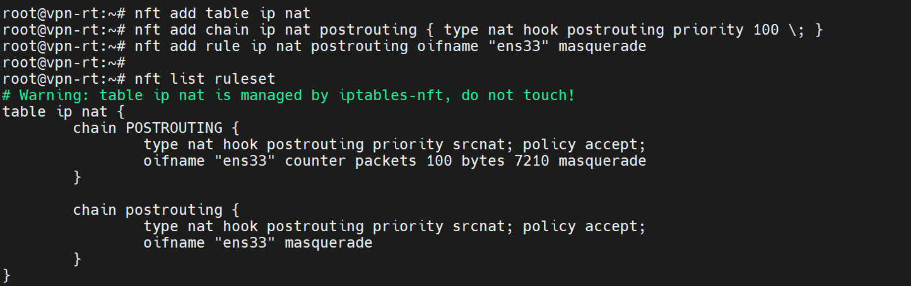

iptables est l’ancien système de gestion du pare-feu et du NAT sous Linux. Il permet de filtrer les paquets réseau, de contrôler les flux et de mettre en place des mécanismes comme le NAT (Network Address Translation). Cependant, iptables possède plusieurs limitations : il utilise différents outils selon les protocoles (iptables pour IPv4, ip6tables pour IPv6, arptables, ebtables), la syntaxe est parfois complexe et les règles sont traitées de manière séquentielle, ce qui peut réduire les performances lorsque le nombre de règles devient important.

Pour répondre à ces limites, Linux a introduit **nftables**, qui est aujourd’hui le système moderne de gestion du pare-feu dans le noyau Linux. nftables remplace progressivement iptables et unifie la gestion du filtrage réseau dans un seul outil et une seule syntaxe. Il permet de gérer IPv4, IPv6, ARP et le filtrage de trames dans un même framework. nftables est également plus performant, car il utilise des structures de données plus efficaces et évite la duplication de règles. De plus, sa syntaxe est plus cohérente et plus flexible, ce qui facilite l’écriture et la maintenance des règles de sécurité. Pour ces raisons, les distributions Linux récentes comme Debian 12 et Debian 13 utilisent nftables comme solution par défaut, même si iptables reste encore disponible pour des raisons de compatibilité.

## Activer le NAT-PAT avec nftables

Pour activer le NAT-PAT (Port Address Translation) avec nftables, vous devez créer une règle de redirection de port dans la table `nat`. Voici les étapes pour configurer cela :

1. **Créer une table `nat`** (si elle n’existe pas déjà) :

   ```bash
   nft add table ip nat
   ```

2. **Ajouter une chaîne `prerouting`** pour gérer les paquets entrants :

   ```bash
   nft add chain ip nat postrouting { type nat hook postrouting priority 100 \; }
   ```

3. **Ajouter une règle de redirection de port** pour rediriger le trafic vers une adresse IP et un port spécifiques :

   ```bash
   nft add rule ip nat postrouting oifname "[INTERFACE_WAN]" masquerade
    ```

    Remplacez `[INTERFACE_WAN]` par le nom de votre interface réseau connectée à Internet (par exemple, `eth0`).


