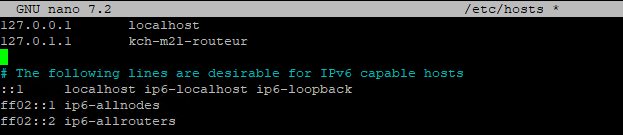
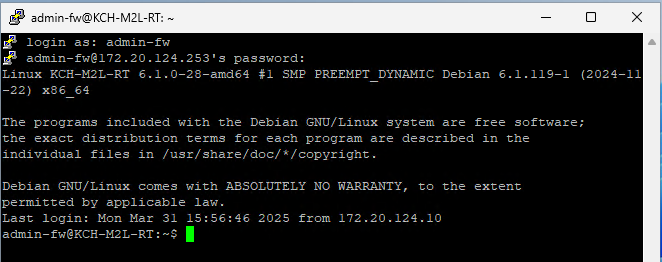

:::tip
Testé sur Debian 12/13
:::

Pour voir son hostname, utiliser la commande :

```bash
admin-fw@m2l-routeur:~$ hostnamectl
```


Pour changer le nom d’une machine linux Debian, il faut modifier deux fichiers :

- /etc/hostname
- /etc/hosts

```bash
nano /etc/hosts
nano /etc/hostname
```




On peut également le changer en ligne de commande

```bash
sudo hostnamectl set-hostname KCH-M2L-RT
```

Redémarrez le script shell hostname.sh pour les modifications à prendre en vigueur :

```bash
invoke-rc.d hostname.sh restart
```

Après une déconnexion, l’hostname est à jour.

