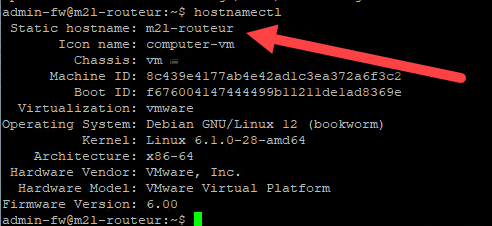
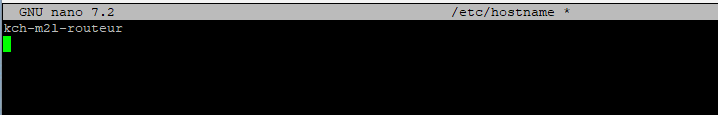

:::note
testé sur Debian 12/13
:::

## Introduction

Renommer un serveur Debian peut être nécessaire pour diverses raisons, telles que la gestion des réseaux ou la clarté administrative. Ce guide vous expliquera comment renommer votre serveur Debian en modifiant les fichiers de configuration appropriés.
Pour voir son hostname, utiliser la commande :

```bash     
hostnamectl
```



## Étapes pour renommer le serveur Debian

1. **Modifier le fichier /etc/hostname**

Ouvrez le fichier `/etc/hostname` avec un éditeur de texte en utilisant les privilèges super utilisateur. Par exemple, avec nano :
```bash
nano /etc/hostname
```
Remplacez l'ancien nom par le nouveau nom souhaité. Enregistrez et fermez le fichier.



2. **Modifier le fichier /etc/hosts**

Ouvrez le fichier `/etc/hosts` avec un éditeur de texte en utilisant les privilèges super utilisateur. Par exemple, avec nano :

```bash
nano /etc/hosts
```


   Remplacez l'ancien nom par le nouveau nom souhaité. Enregistrez et fermez le fichier.

3. **Appliquer les changements**

Pour appliquer les changements, redémarrez le service hostname ou redémarrez le serveur :

```bash
systemctl restart systemd-hostnamed
ou
invoke-rc.d hostname.sh restart
```

Sinon, il est recommandé de redémarrer le serveur pour s'assurer que tous les services prennent en compte le nouveau nom :

```bash
reboot
``` 

