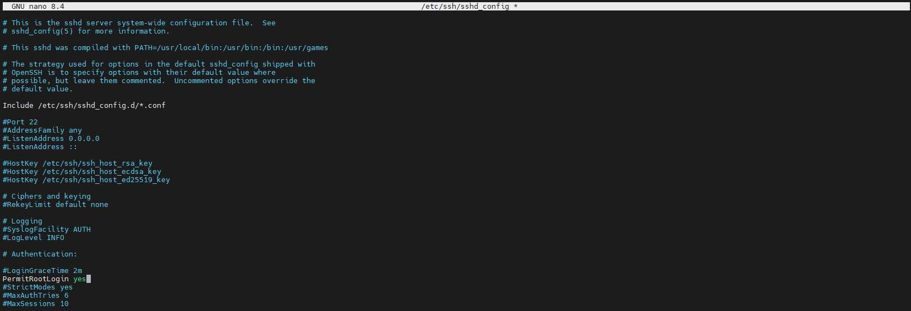

:::tip
Testé sur Debian 12 et 13
:::

Pour autoriser l’accès SSH à l’utilisateur root, il faut modifier le fichier de configuration SSH.

```bash
nano /etc/ssh/sshd_config
``` 

Repérer la ligne suivante et la modifier pour qu’elle soit comme ci-dessous :

```bash 
PermitRootLogin yes
```



Une fois la modification effectuée, il faut redémarrer le service SSH pour que les changements soient pris en compte.

```bash
systemctl restart ssh
```
