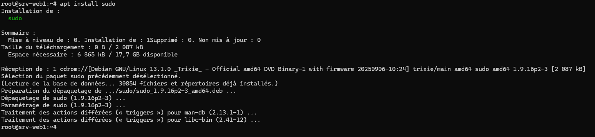

:::tip
Testé sur Debian 12 et 13
:::

Sudo est un utilitaire qui permet d’exécuter des commandes en tant que « root » sur un serveur Linux.

En SSH, la connexion est possible pour l’utilisateur « standard » (par défaut, le super utilisateur root n’a pas d’accès à distance, c’est une faille de sécurité !). Pour pouvoir effectuer les tâches d’administration, il faut donner les droits sudo à un utilisateur (abréviation de substitute user do, en français : « faire en se substituant à l’utilisateur »). Il faut devancer la commande de sudo.

S’il n’est pas déjà installé, il faut installer le paquet sudo avec la commmande

```bash
apt install sudo
```



Ensuite, nous allons ajouter l’utilisateur au groupe sudo.

- -aG permet l’ajout à un groupe

```bash
usermod -aG sudo nomutilisateur
```

Pour basculer ensuite sur le nouvel utilisateur, executer la commande su – nomutilisateur


Pour personnaliser les droits sudo, il faut modifier le fichier /etc/sudoers