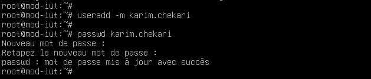

## Ajout d'un utilisateur

La commande useradd permet de créer un nouvel utilisateur.
Pour le faire, les droits root sont nécessaires.

```bash
useradd -m <user>
```

L’option -m permet de créer son repertoire personnel.

Pour définir son mot de passe, il faut ensuite utiliser la commande passwd



## Supprimer un utilisateur

Pour supprimer un utilisateur, on utilise la commande userdel

```bash
sudo deluser nom_utilisateur
```
