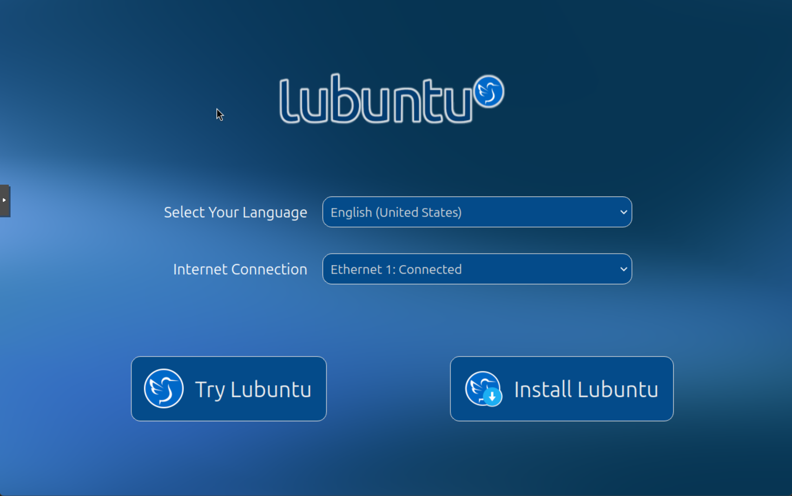
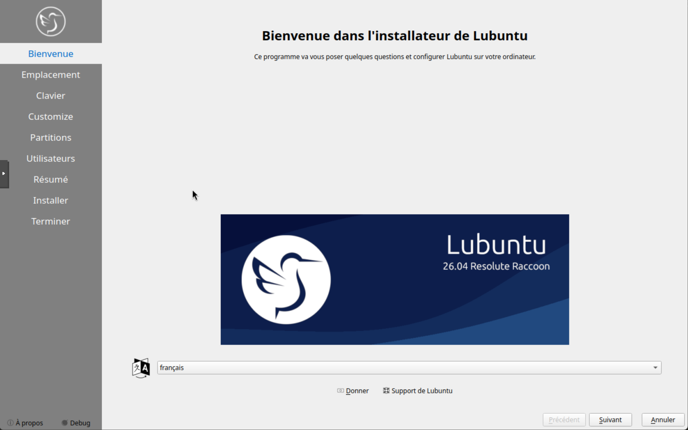
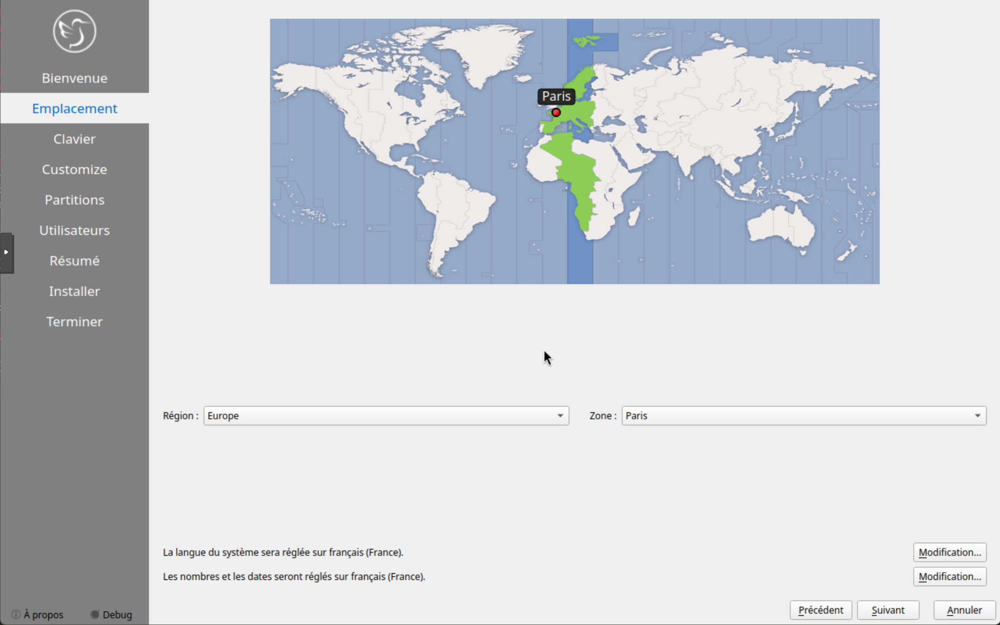
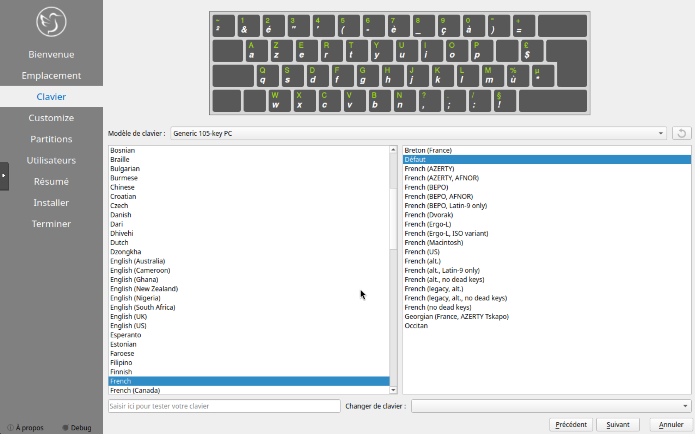
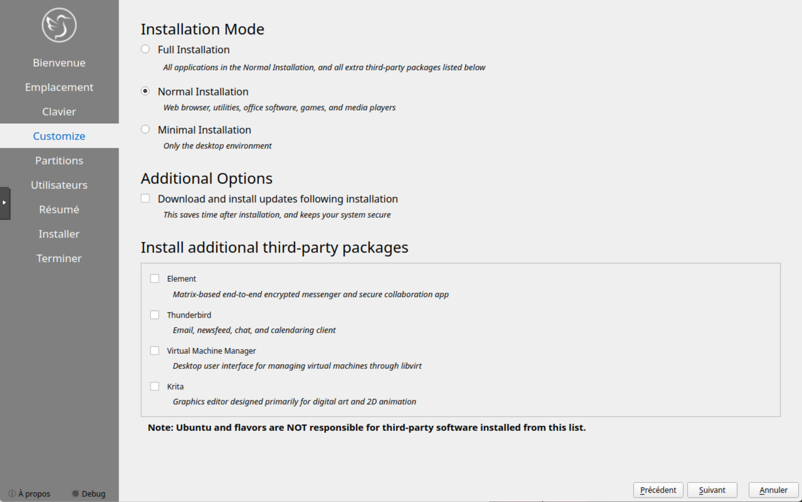
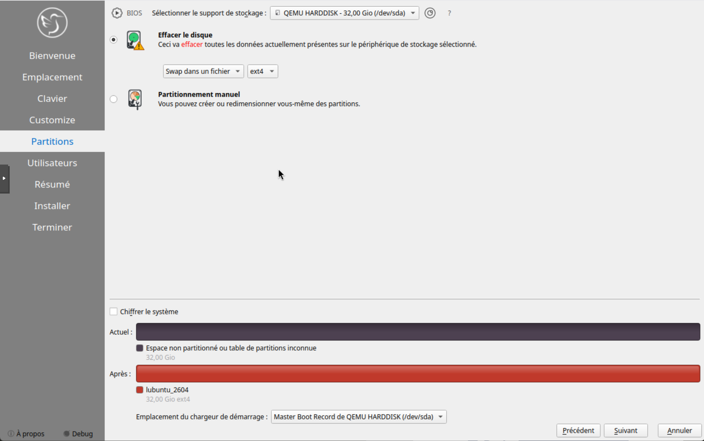
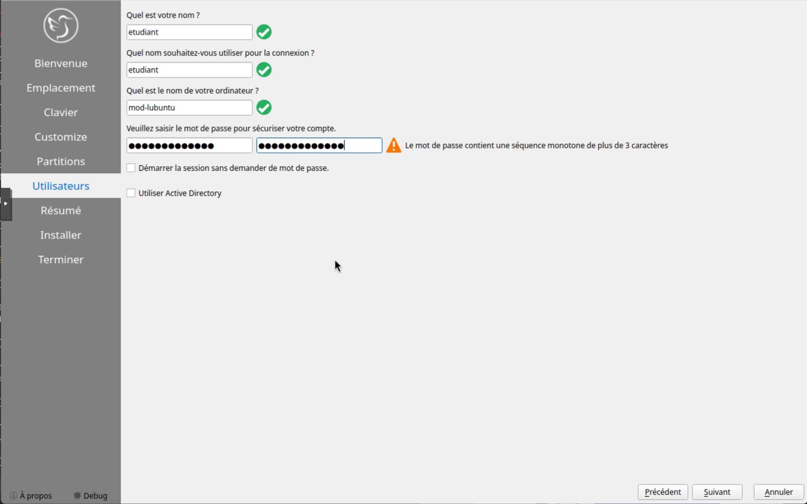
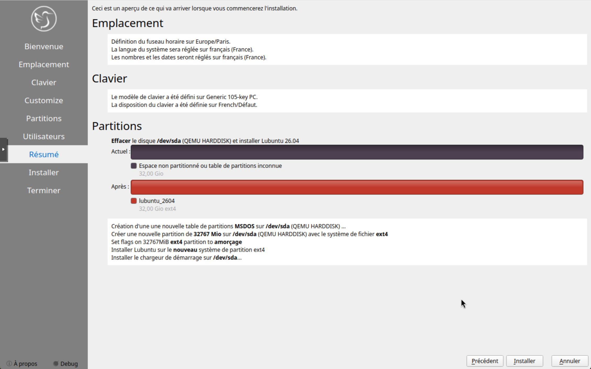
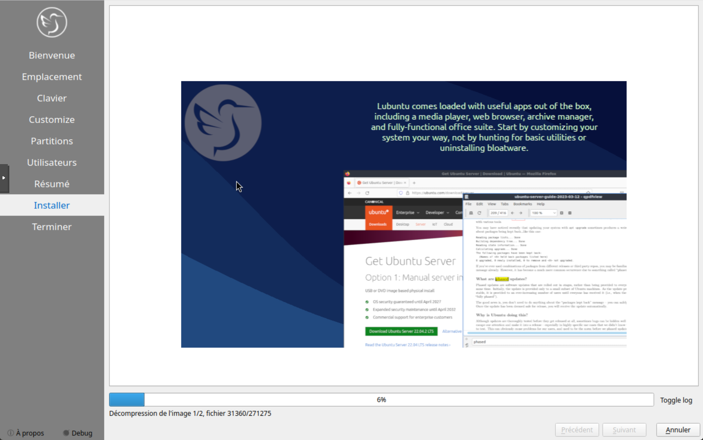
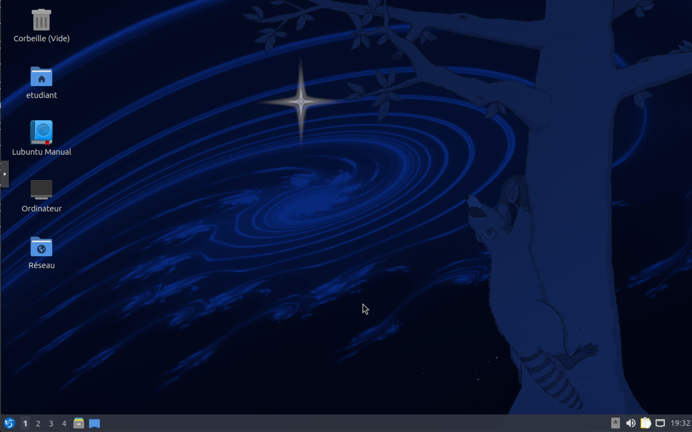

Voici la procédure pour installer Lubuntu 26.04 sur votre ordinateur. Lubuntu est une distribution légère basée sur Ubuntu, idéale pour les machines avec des ressources limitées.

Choisir la langue d'installation et cliquer sur `Installer Lubuntu`.

L'installateur vous guidera à travers les étapes nécessaires pour configurer votre système, y compris le partitionnement du disque, la sélection du fuseau horaire et la création d'un compte utilisateur.

Cliquez sur `Suivant` pour continuer avec l'installation.

Choisir le fuseau horaire approprié pour votre région et cliquer sur `Suivant`.

Séléctionner le layout du clavier correspondant à votre langue et cliquer sur `Suivant`.

On peut ensuite choisir le type d'installation ainsi que l'installation des mises à jour après installation.

On choisit d'effacer le disque et d'installer Lubuntu, puis on clique sur `Suivant`.

Il faut ensuite nommer le PC, créer un nom d'utilisateur et un mot de passe pour l'utilisateur principal. Cliquer sur `Suivant` pour continuer.

On valide le résumé de l'installation et on clique sur `Installer` pour lancer le processus d'installation.

L'installation se lance.

On arrive sur le bureau de Lubuntu 26.04 après le redémarrage du système.

