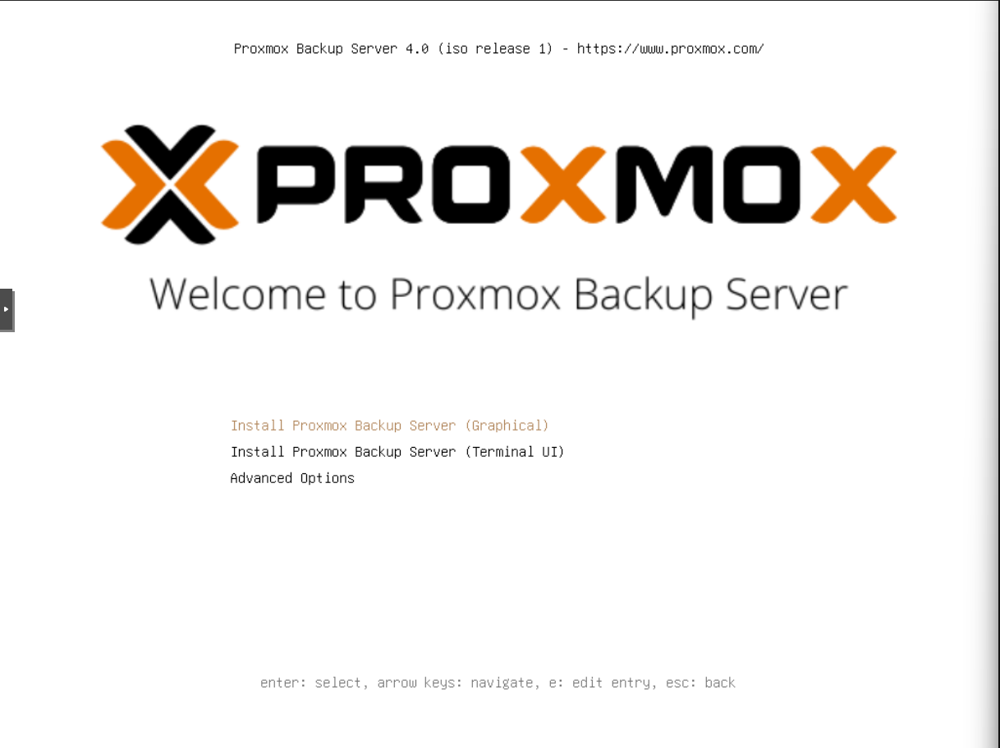
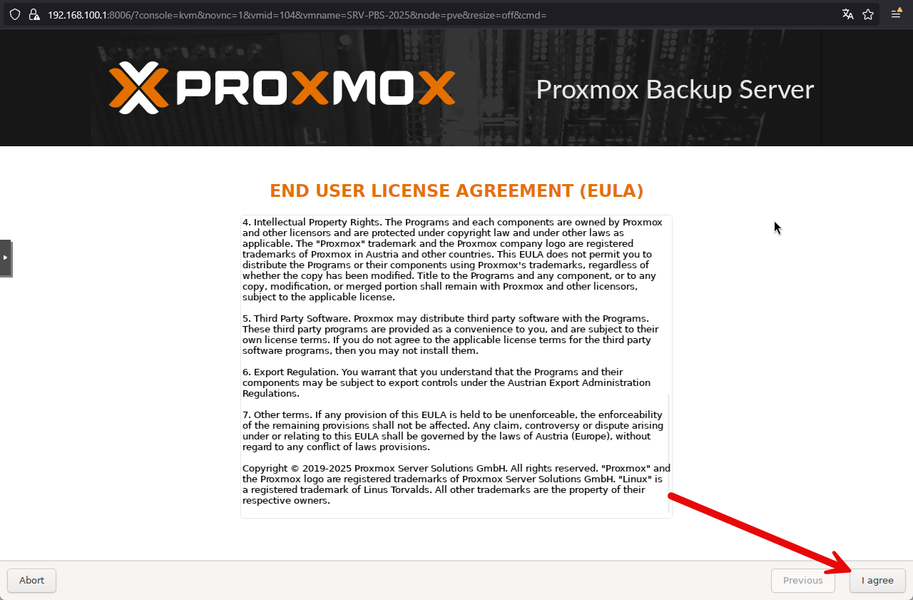
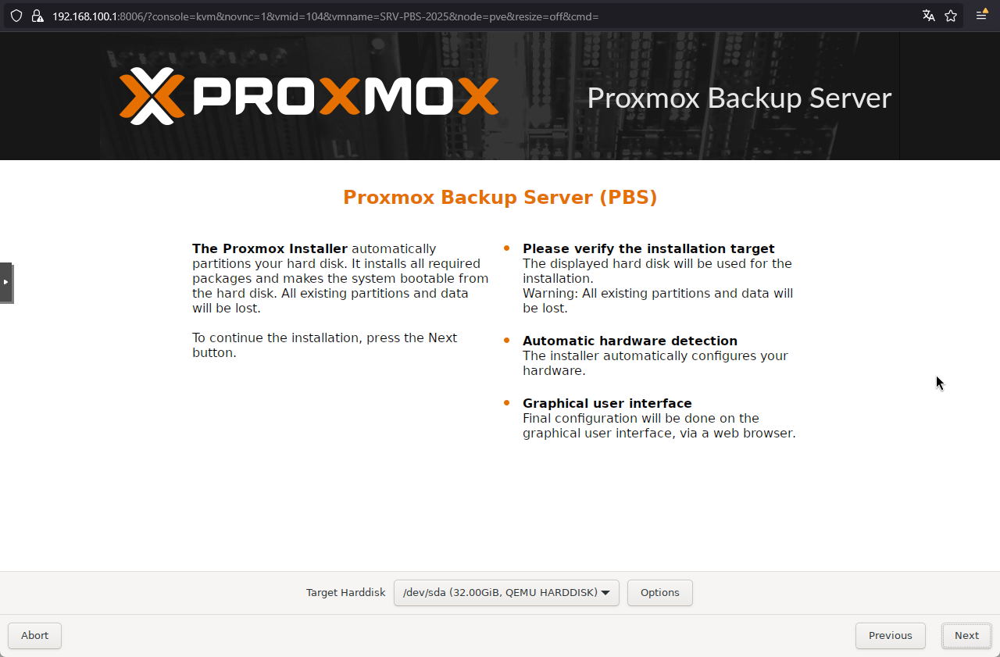
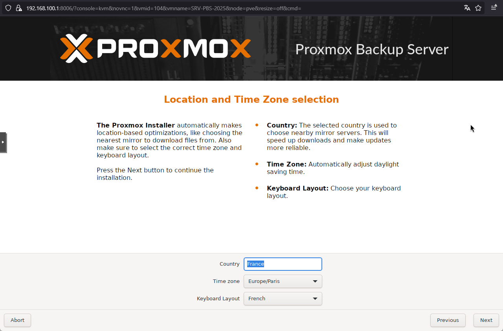
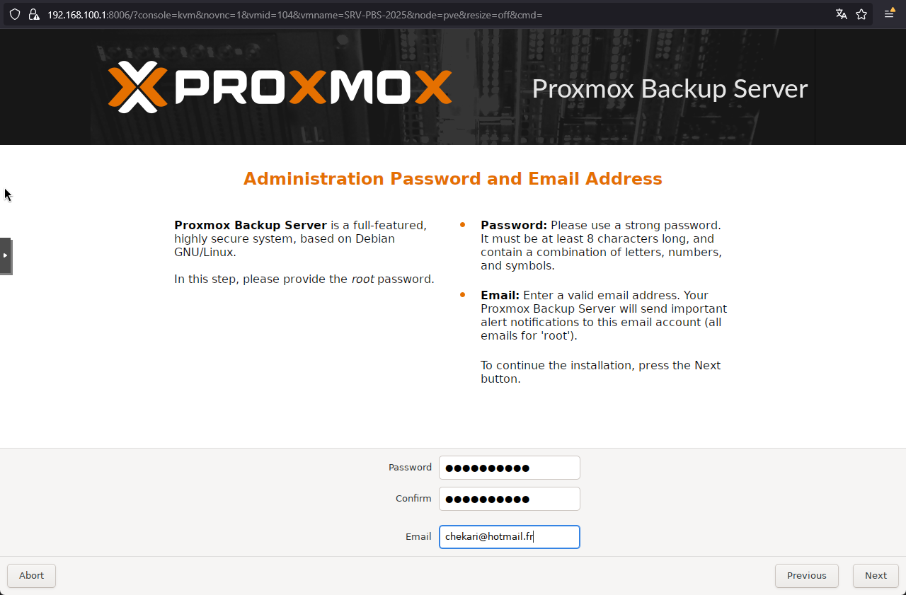
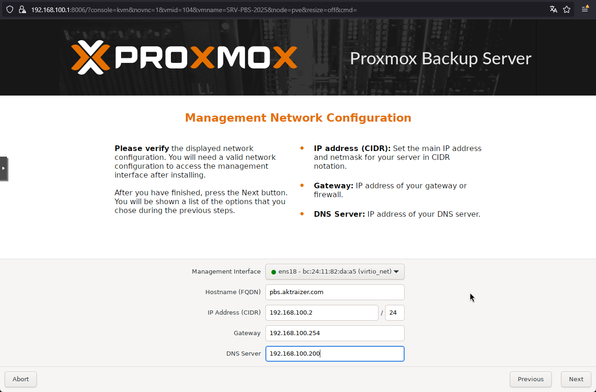
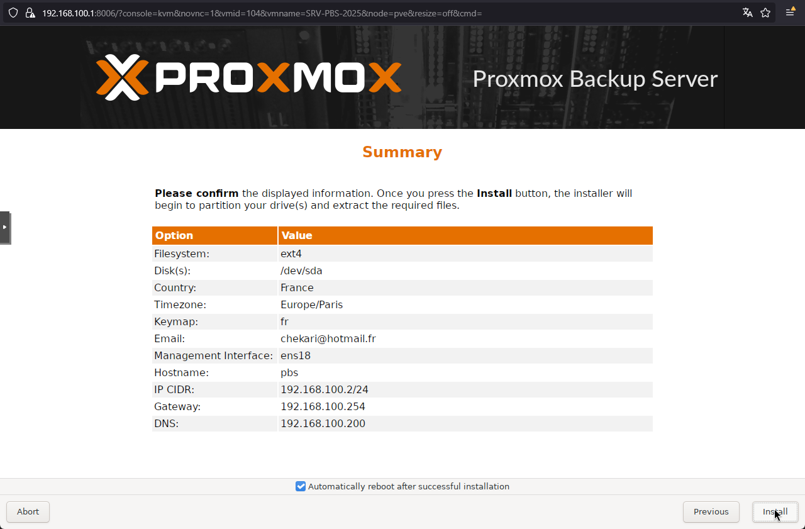
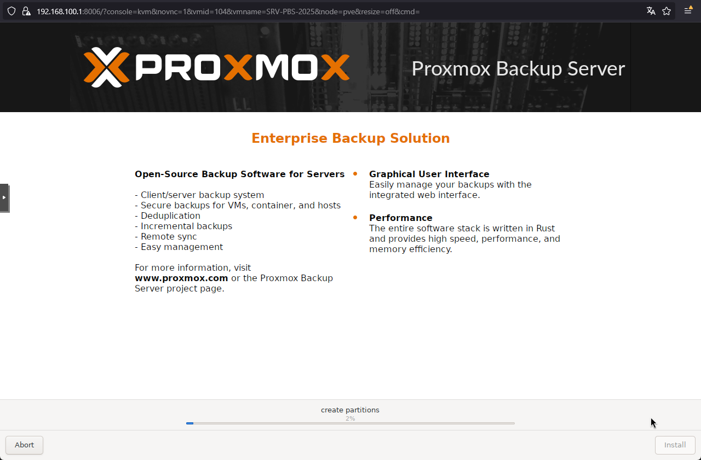
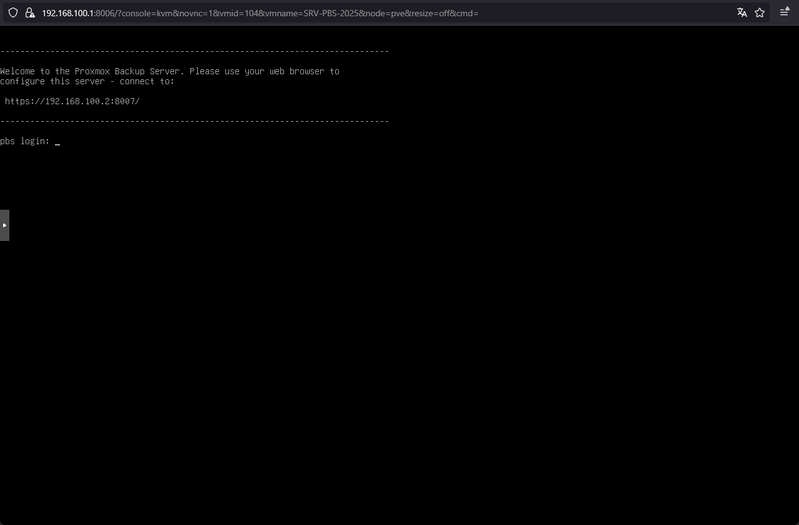

:::note
Installation version 4.0.1
:::
Création de la VM et démarrage sur le fichier iso.
# Installation

On accepte l’EULA

On sélectionne le stockage

On va ensuite choisir la disposition du clavier et la zone géographique 

Indiquer le mot de passe root ainsi que le mail de l’administrateur

Définir la configuration IP

Il faut ensuite valider le récapitulatif

L’installation est en cours

Le serveur est installé.
