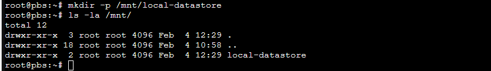
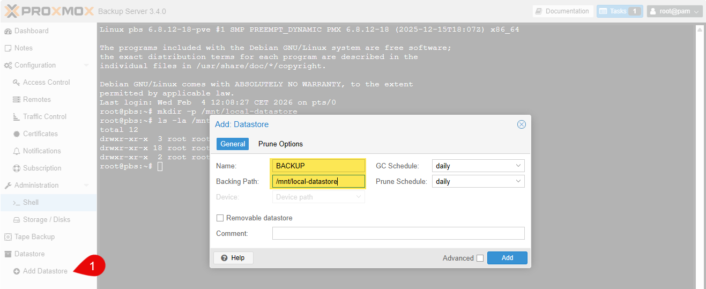
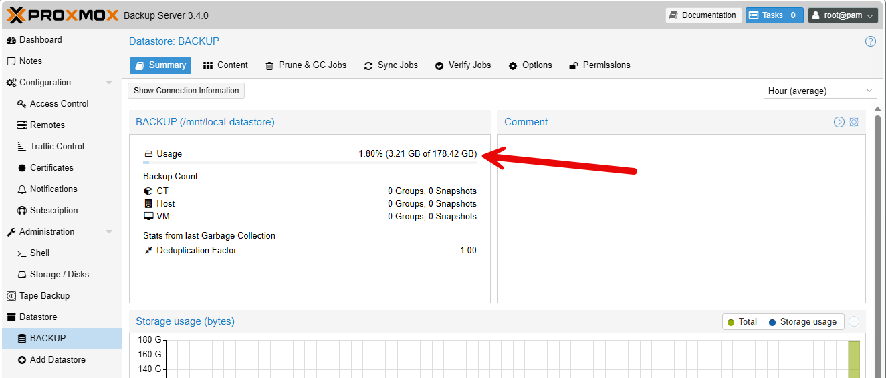

Le Datastore sera l'endroit où Proxmox Backup Server stockera les sauvegardes. Un datastore local utilise le système de fichiers local du serveur PBS pour stocker les données de sauvegarde.

:::caution
Nous sommes en test, ainsi, il est plus rapide d'utiliser un stockage local. En production, il est recommandé d'utiliser un stockage en réseau (NFS, CIFS, etc.) pour une meilleure résilience et évolutivité.
:::

## 1. Création du répertoire local

Connectez-vous à votre serveur Proxmox Backup Server via SSH ou utilisez la console web.
Créez un répertoire pour le datastore local. Par exemple, vous pouvez créer un répertoire nommé `local-datastore` dans `/mnt` :

```bash
mkdir -p /mnt/local-datastore
```



Assurez-vous que le répertoire a les permissions appropriées pour que Proxmox Backup Server puisse y accéder.

## 2. Ajout du Datastore dans Proxmox Backup Server

Dans le menu de gauche, cliquez sur **Datastore** > **Add**.






