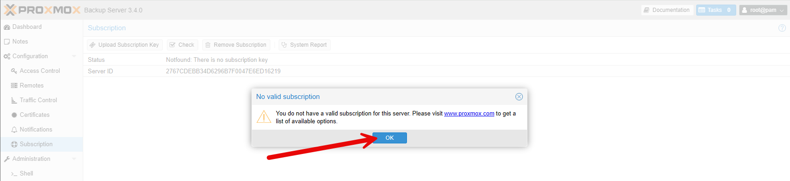
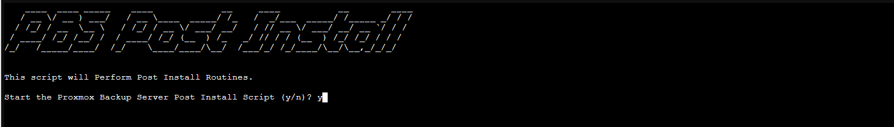
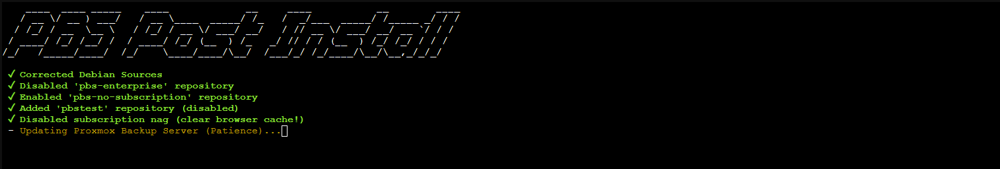

Proxmox Backup Server (PBS) est un logiciel de sauvegarde open-source développé par Proxmox. Il est conçu pour fournir une solution de sauvegarde efficace et fiable pour les environnements virtualisés, en particulier ceux utilisant Proxmox VE. PBS offre des fonctionnalités avancées telles que la déduplication des données, la compression, le chiffrement, et la gestion centralisée des sauvegardes.

L'installation de Proxmox Backup Server sans licence est possible, mais certaines fonctionnalités avancées et le support officiel de Proxmox ne seront pas disponibles. Voici les étapes pour installer PBS sans licence :



Il existe différentes méthodes pour basculer le dépôt officiel vers le dépôt sans licence. 

Nous pouvons utiliser le script disponible sur le Github de la communauté Proxmox [https://community-scripts.github.io/ProxmoxVE/scripts?id=post-pbs-install&ref=belginux.com](https://community-scripts.github.io/ProxmoxVE/scripts?id=post-pbs-install&ref=belginux.com)

Lancer la commande :

```
bash -c "$(curl -fsSL https://raw.githubusercontent.com/community-scripts/ProxmoxVE/main/tools/pve/post-pbs-install.sh)"
```



Il faut répondre **Yes** à toutes les questions.



A la fin du script, il est demandé de redémarrer le serveur.