:::note
Fonctionnalité testé avec Proxmox 9.1.2 et Proxmox Datacenter Manager 1.0
:::
Proxmox Datacenter Manager est une solution de gestion centralisée conçue pour administrer plusieurs environnements Proxmox VE depuis une interface unique. Elle permet aux administrateurs de superviser, organiser et piloter des clusters Proxmox répartis sur un ou plusieurs sites, sans avoir à se connecter individuellement à chaque plateforme. L’objectif principal est de simplifier l’exploitation quotidienne des infrastructures virtualisées, d’améliorer la visibilité globale du système d’information et de renforcer la cohérence des pratiques d’administration.

Parmi ses fonctionnalités clés, Proxmox Datacenter Manager propose l’inventaire centralisé des nœuds, clusters, machines virtuelles et conteneurs, une vue consolidée de l’état des ressources (CPU, mémoire, stockage, disponibilité), ainsi qu’une gestion unifiée des accès via l’API et les droits utilisateurs. Il facilite également le suivi des événements, des alertes et de l’état de santé des infrastructures, tout en offrant une base solide pour la supervision multi-sites et la standardisation des opérations. Cette approche centralisée est particulièrement adaptée aux environnements en croissance, aux infrastructures distribuées et aux contextes pédagogiques ou professionnels nécessitant une vision globale et structurée des ressources Proxmox.

## CREATION DE LA VM
Configurer une VM dans Proxmox avec les caractéristiques suivantes :
 - ISO Image : proxmox-datacenter-manager_1.0-1.iso
 - Type : Linux
 - Version : 6.x - 2.6 Kernel
 - Machine : q35
 - BIOS : OVMF (UEFI)
 - QEMU Agent : Yes
 - Disque dur : 100 Go
 - CPU : 4 vCPU
 - RAM : 8192 Mo

## INSTALLATION
L'installation ressemble à une installation Proxmox / Debian
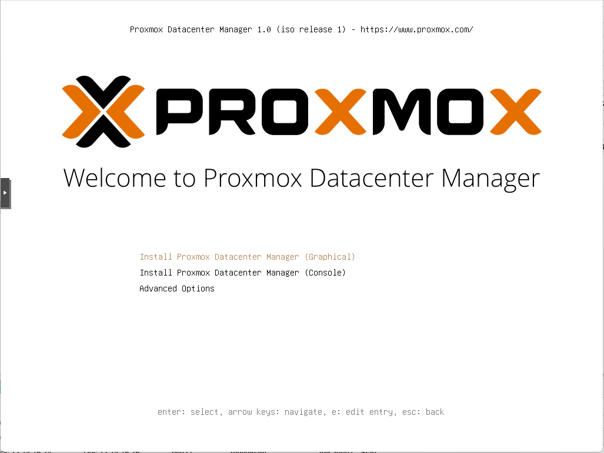
Il faut accepter la licence ** I agree**
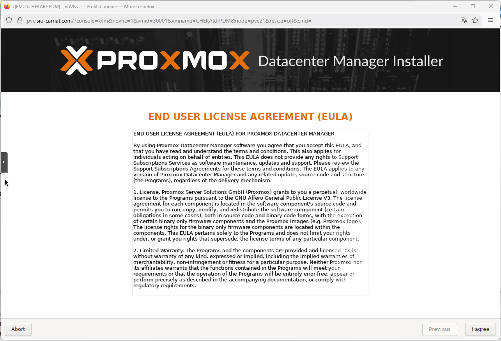
Choisir le disque qui va contenir le système d'exploitation.
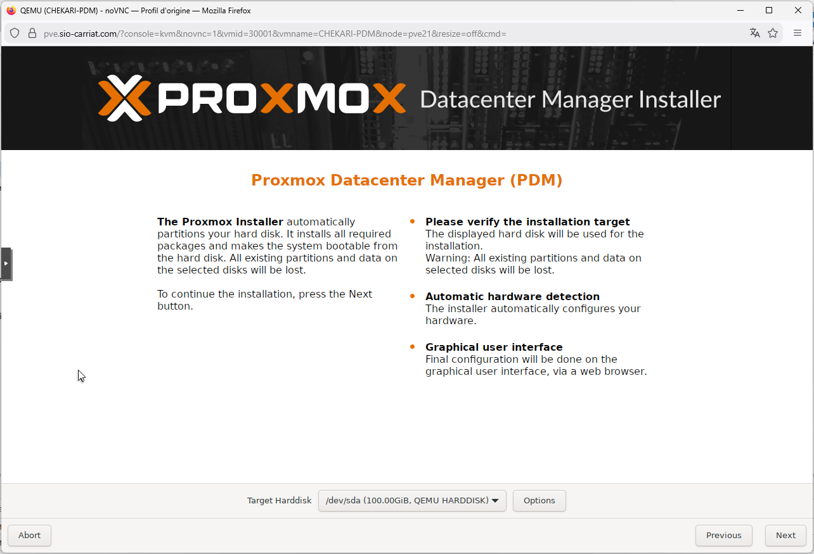
Sélection du pays et du clavier.
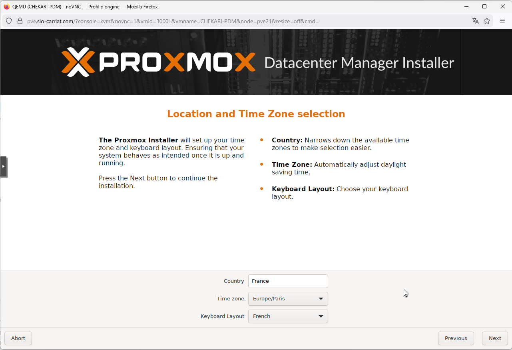
Puis le mot de passe
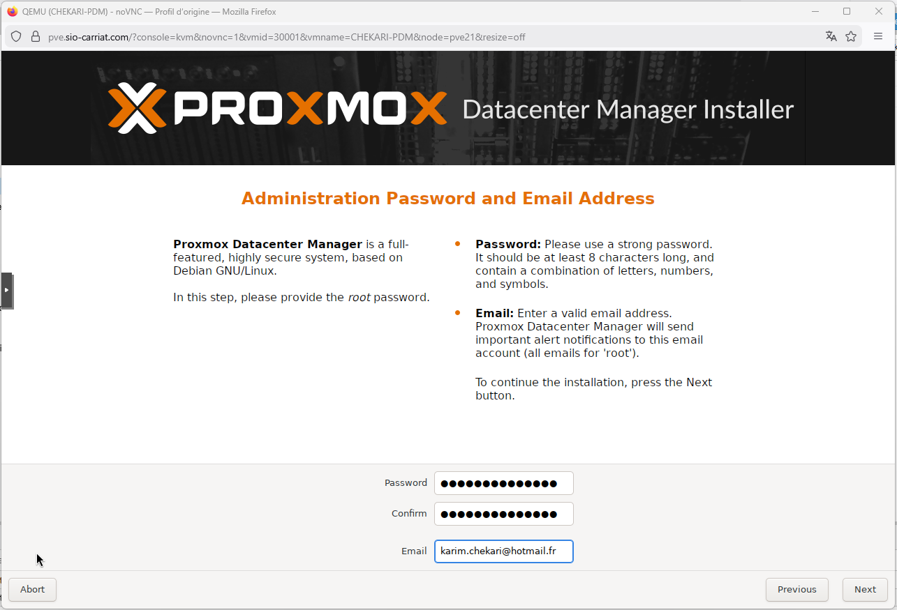
Réaliser ensuite la configuration IP
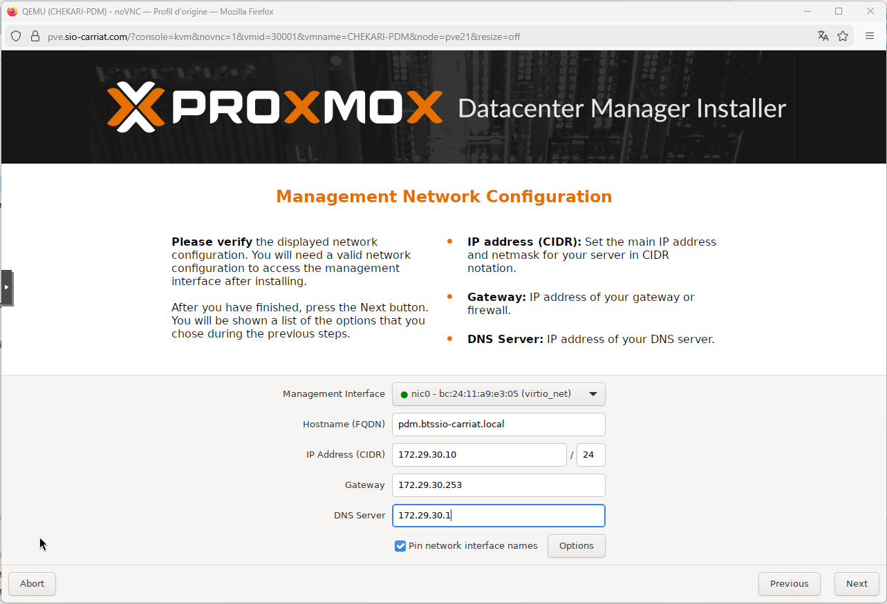
Tout est pret pour lancer l'installation !
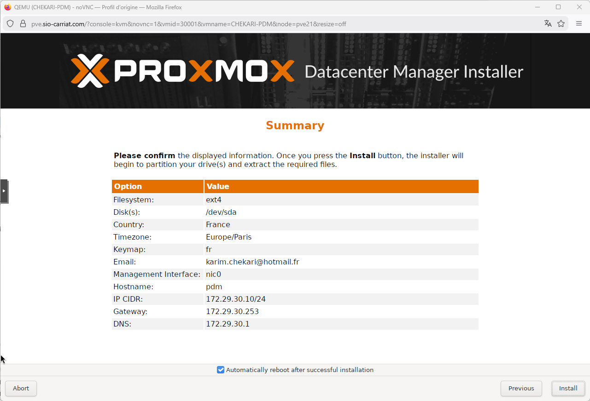
Le serveur est installé et accessible.
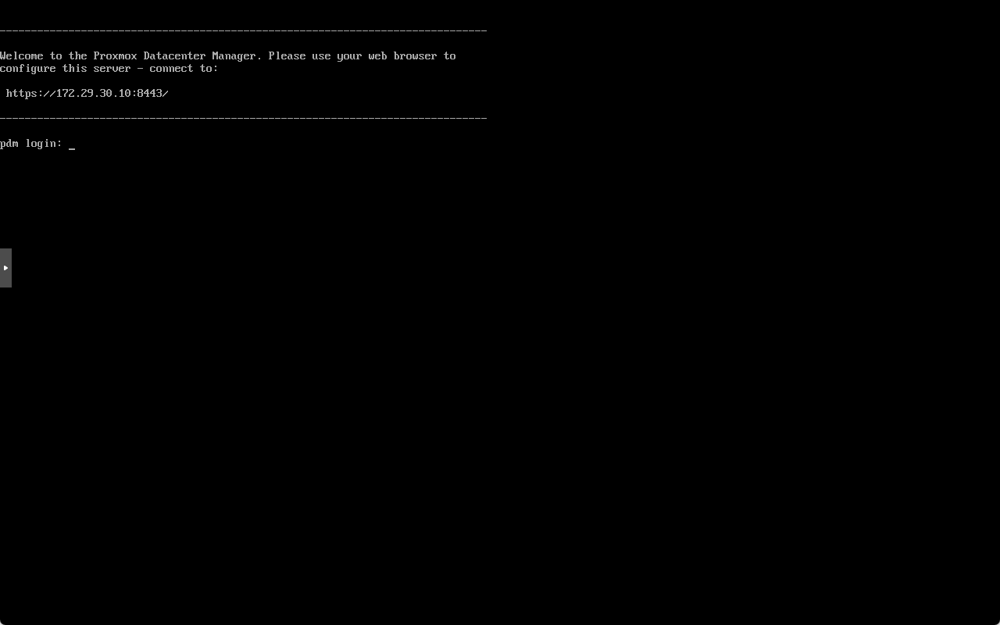
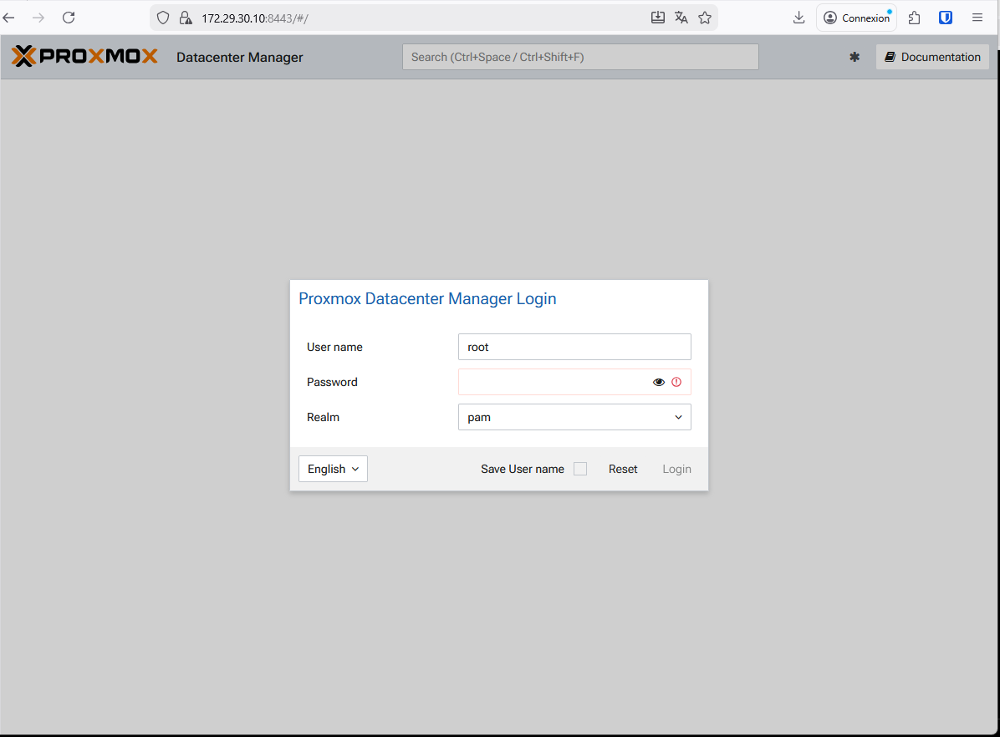
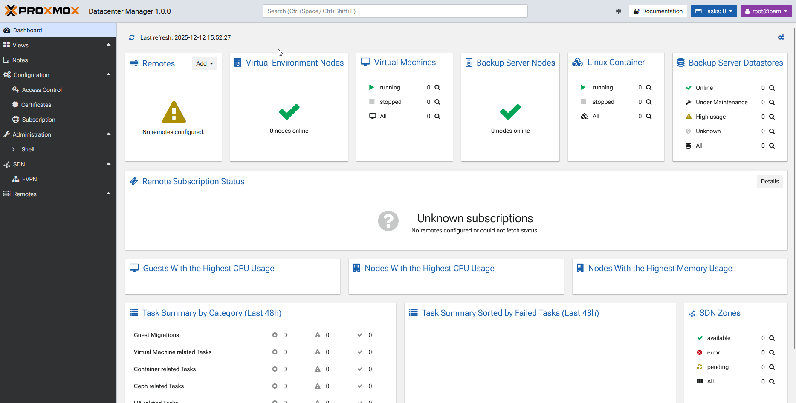

## Ajout d'un hôte
Dans le menu Remotes > Add > Proxmox VE
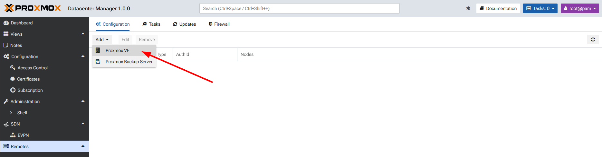
Renseigner l'adresse distante
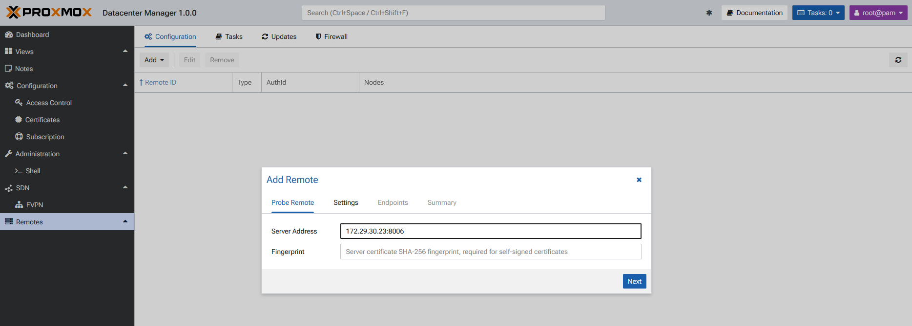
Puis valider le certificat de connexion
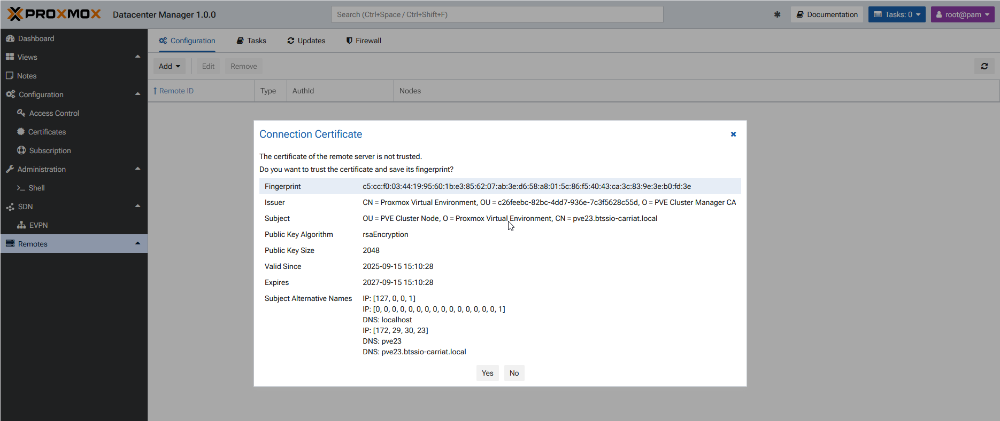
Renseigner ensuite les champs afin de s'authentifier sur le serveur
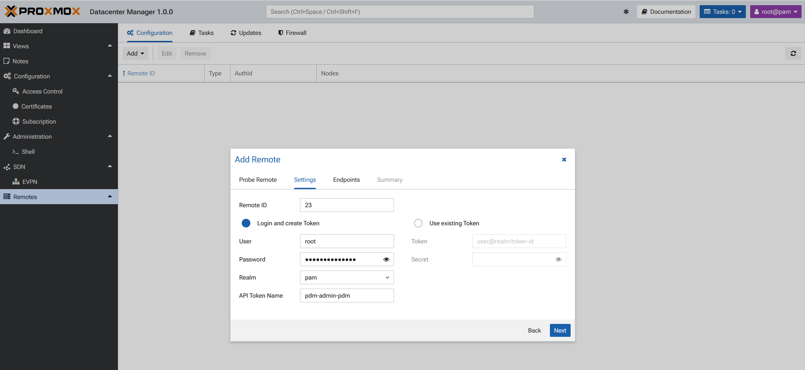
Le serveur faisant partie d'un cluster, PDM me propose de rajouter tous les noeuds.
Il ne reste plus qu'à valider
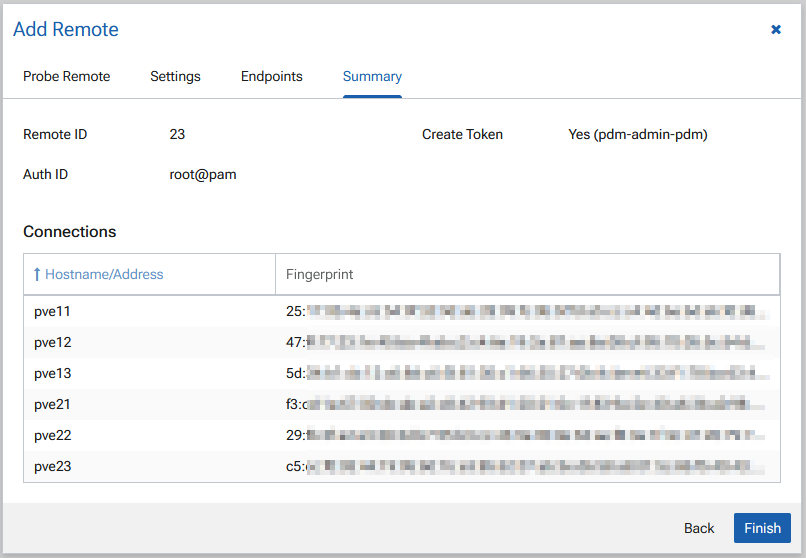
Les serveurs sont rajoutés et nous avons une vision globale des noeuds.
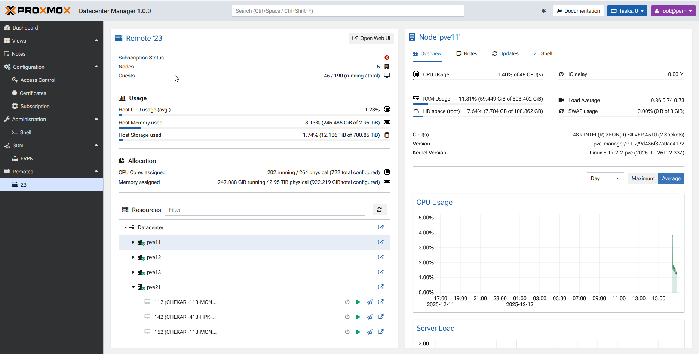
