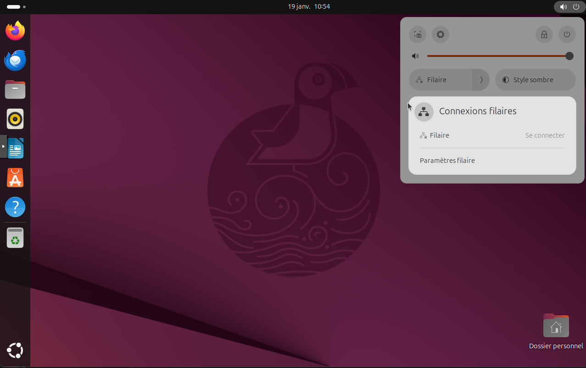
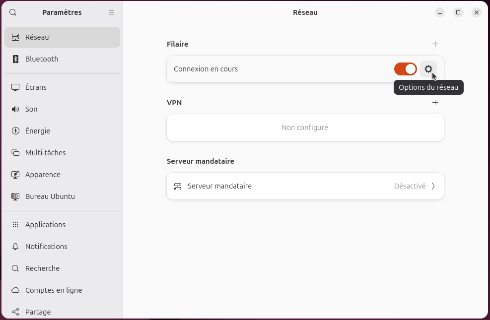
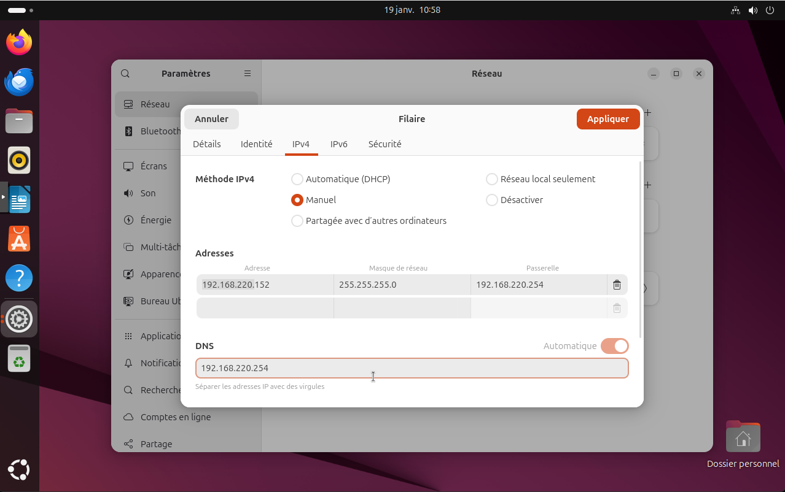
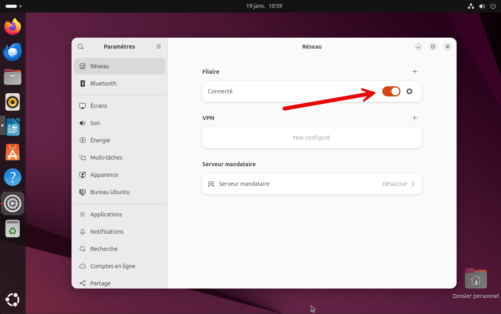
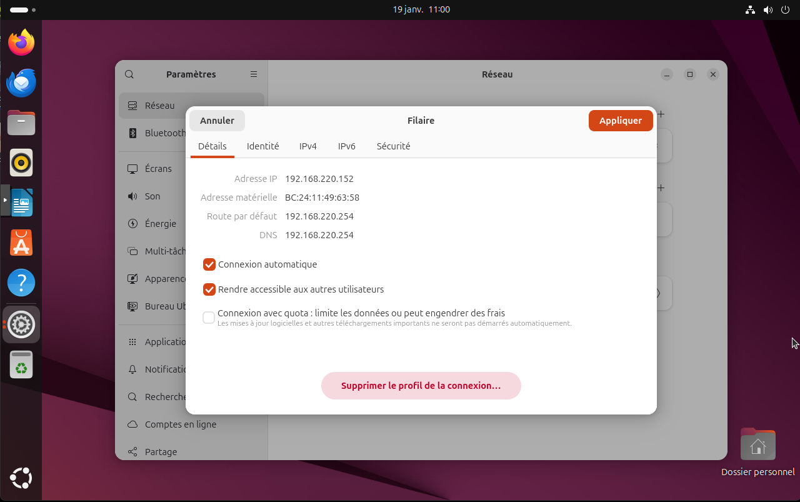

Cette documentation explique comment configurer une adresse IP statique sur un système Ubuntu. La configuration d'une adresse IP statique est essentielle pour les serveurs et les dispositifs qui nécessitent une adresse IP fixe pour assurer une connectivité réseau stable.

Aller dans le menu "Paramètres" d'Ubuntu en haut à droite de l'écran. **Filaire** vers la section "Réseau" puis **Paramètres filaires**.

Aller dans les options réseaux

Dans l'onglet "IPv4", sélectionner "Manuel" dans le menu déroulant "Méthode". Ensuite, entrer l'adresse IP souhaitée, le masque de sous-réseau et la passerelle.

Il est possible d'activer/désactiver la carte réseau pour que les changements soient pris en compte.

Si on retourne sur les paramètres réseau, on peut voir que l'adresse IP a bien été modifiée.

