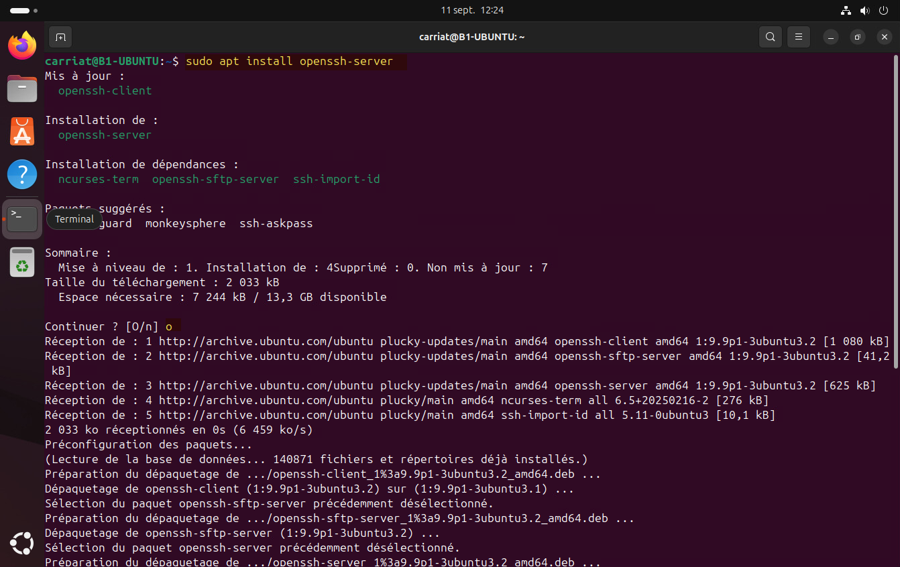
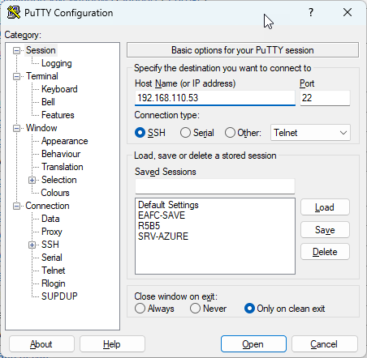
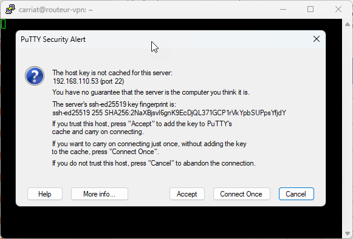
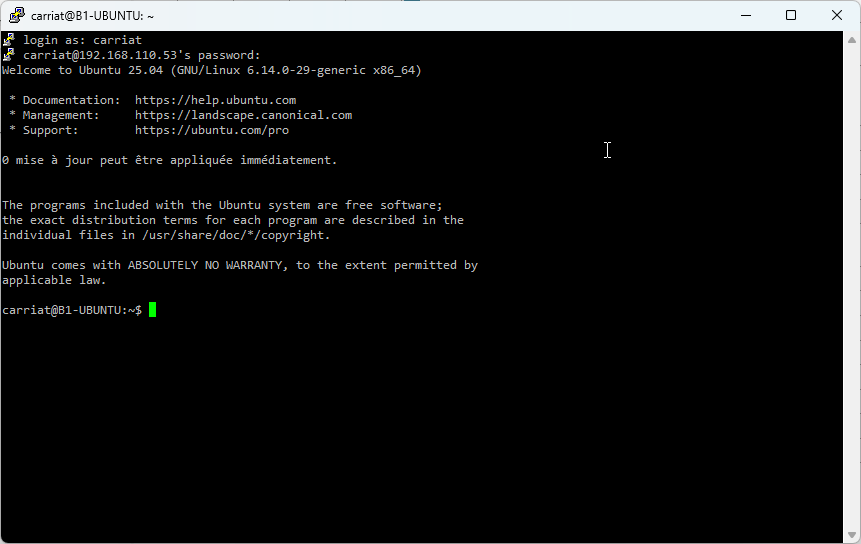

Comme pour Windows, il est possible d’activer l’accès à distance à la console.

Il faut installer le paquet openssh-server avec la commande :
```bash
carriat@B1-UBUNTU2:~$ sudo apt install openssh-server
```
Il faut ensuite ouvrir le logiciel PuTTy et saisir l’IP de la machine distante.

Lancer ensuite le logiciel PuTTy sur le PC hôte .
Saisir l’IP de votre machine virtuelle

Accepter la clé SSH

Vous pouvez vous identifier avec le compte créé précédemment.
