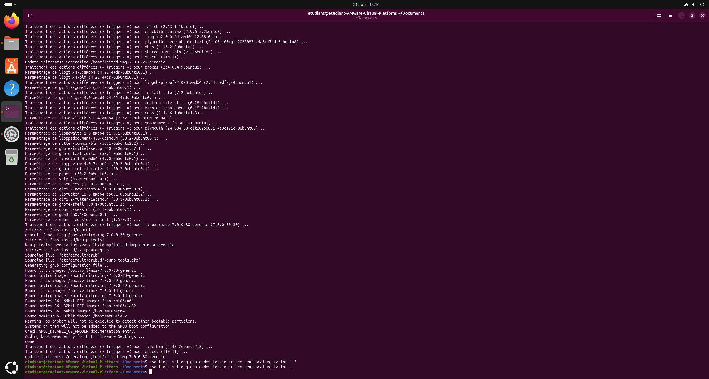
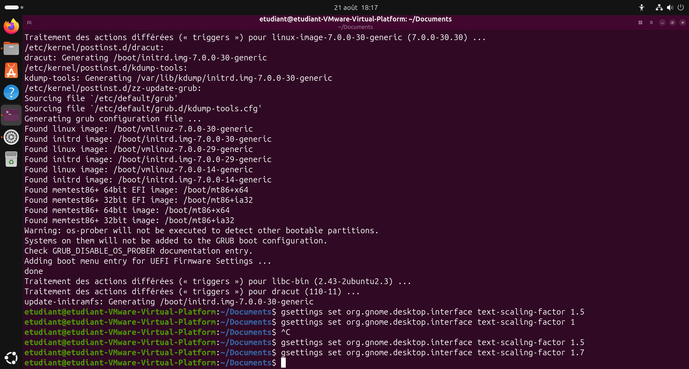

Quand on est dans une VM Ubuntu, il est possible que l'affichage ne soit pas optimal et que l'on ait besoin de faire un zoom avant ou arrière pour avoir un affichage correct. C'est le cas de mon écran 4K où l'affichage est trop petit par défaut.



Pour corriger cela, le plus simple est d'utiliser la commande suivante dans un terminal :

```bash
gsettings set org.gnome.desktop.interface text-scaling-factor 1.5
```

1.5 est le facteur de zoom, vous pouvez le modifier selon vos besoins. Pour revenir à l'affichage par défaut, il suffit de mettre 1 à la place de 1.5.

