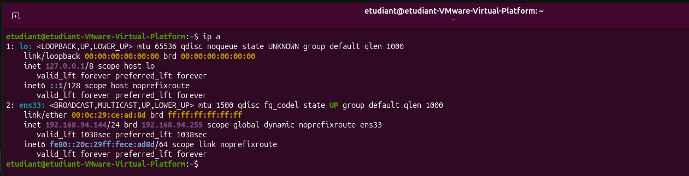
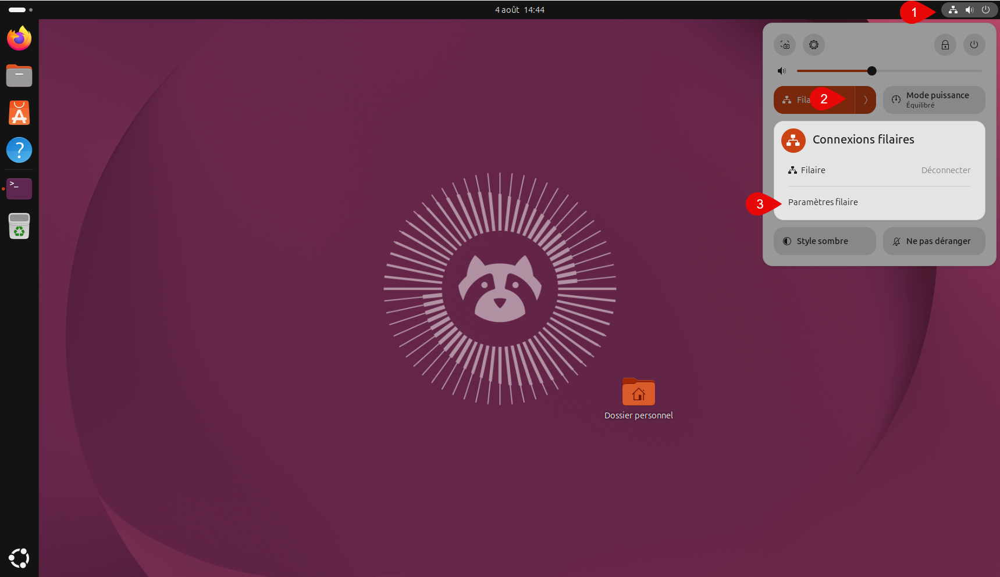
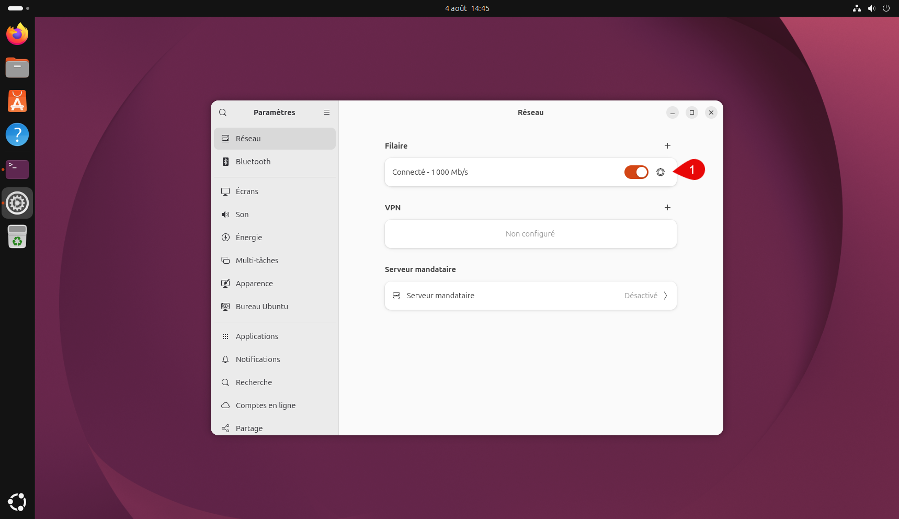
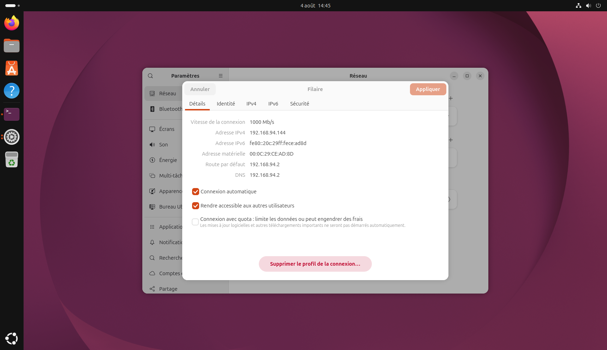

### Depuis un terminal

Lancer la commande :

```bash
ip a
```



### Depuis l’interface graphique

Aller dans les paramètres filaire de votre carte réseau.



On clique ensuite sur la roue



Et les informations IP s’affiche.

