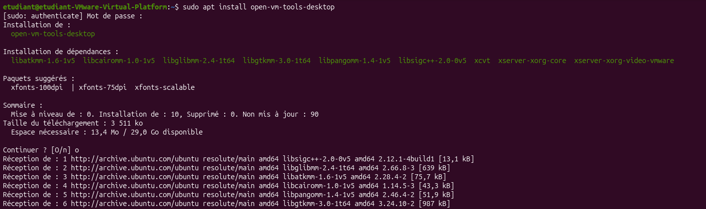

Par défaut, une VM Ubuntu à les VM Tools installés pour la gestion des drivers.
Pour autant, il n'est pas possible de faire un copier/coller depuis l'hôte vers la VM.
Il faut installer en plus le paquet `open-vm-tools-desktop` pour activer cette fonctionnalité.

```bash
sudo apt install open-vm-tools-desktop
```



Il faut ensuite redémarrer la VM pour que le copier/coller fonctionne.