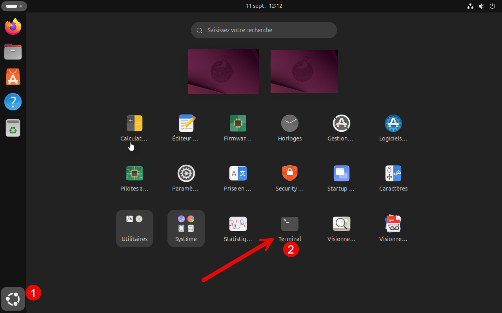
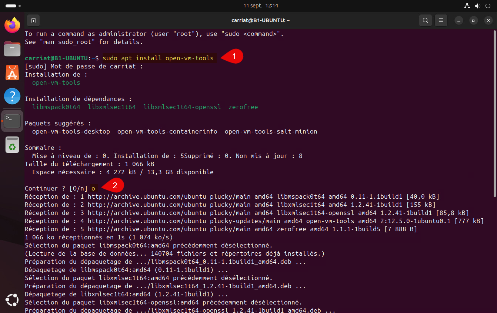

Les VMware Tools (ou VM Tools) sont un ensemble d’utilitaires fournis par VMware qui améliorent les performances et l’intégration d’une machine virtuelle avec son environnement hôte. Leur installation apporte plusieurs avantages : un affichage plus fluide avec une meilleure résolution de l’écran, la possibilité de redimensionner automatiquement la fenêtre de la VM, un partage simplifié du presse-papiers entre l’hôte et la machine virtuelle (copier-coller de texte ou de fichiers), ainsi qu’une meilleure gestion du réseau et des périphériques. Dans un cadre pédagogique, installer les VM Tools facilite l’utilisation quotidienne des machines virtuelles, rend l’expérience plus confortable pour les étudiants et reflète les bonnes pratiques professionnelles en environnement virtualisé.

Lancer un terminal

Dans le terminal, lancer la commande :
```bash
sudo apt install open-vm-tools
```
