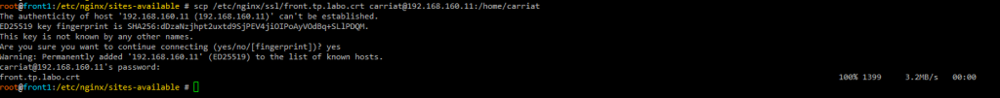
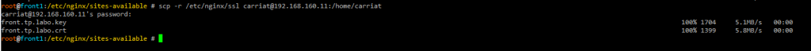
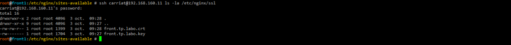

scp (secure copy) est la commande classique pour copier un fichier entre deux serveurs Linux via SSH.
Elle permet de transférer des fichiers de manière sécurisée en utilisant le protocole SSH pour l'authentification et le chiffrement des données.

## Copier un fichier local vers un serveur distant
Pour copier un fichier depuis votre machine locale vers un serveur distant, utilisez la commande suivante :
```bash
scp /chemin/vers/fichier.txt utilisateur@serveur_distant:/chemin/de/destination/
```
Remplacez `/chemin/vers/fichier.txt` par le chemin du fichier que vous souhaitez copier, `utilisateur` par votre nom d'utilisateur sur le serveur distant, `serveur_distant` par l'adresse IP ou le nom de domaine du serveur distant, et `/chemin/de/destination/` par le répertoire de destination sur le serveur distant.



## Copier un dossier local vers un serveur distant
Pour copier un dossier entier, utilisez l'option `-r` (récursif) :
```bash
scp -r /chemin/vers/dossier utilisateur@serveur_distant:/chemin/de/destination/
```


## Copier un fichier depuis un serveur distant vers la machine locale
Pour copier un fichier depuis un serveur distant vers votre machine locale, utilisez la commande suivante :
```bash
scp utilisateur@serveur_distant:/chemin/vers/fichier.txt /chemin/de/destination/
```

## Copier un dossier depuis un serveur distant vers la machine locale
De même, pour copier un dossier entier depuis un serveur distant vers votre machine locale, utilisez l'option `-r` :
```bash
scp -r utilisateur@serveur_distant:/chemin/vers/dossier /chemin/de/destination/
```

## Options utiles
- `-P port` : Spécifie le port SSH à utiliser (par défaut, c'est le port 22).
- `-i chemin/vers/clé_privée` : Utilise une clé privée spécifique pour l'authentification.
- `-C` : Active la compression des données pendant le transfert.
- `-v` : Mode verbose, affiche des informations détaillées sur le processus de transfert.

## Vérrification du transfert
Après le transfert, vous pouvez vérifier que le fichier ou le dossier a bien été copié en utilisant la commande `ls` sur le serveur distant ou local, selon le cas.
```bash
ssh utilisateur@serveur_distant 'ls /chemin/de/destination/'
```


## Conclusion
SCP est un outil puissant et simple pour transférer des fichiers entre machines Linux de manière sécurisée.
Il est largement utilisé pour les tâches d'administration système et le déploiement d'applications.