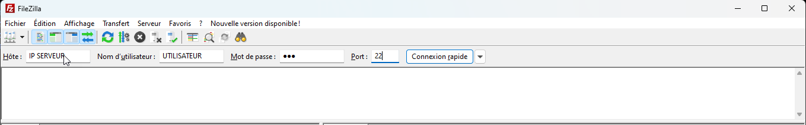
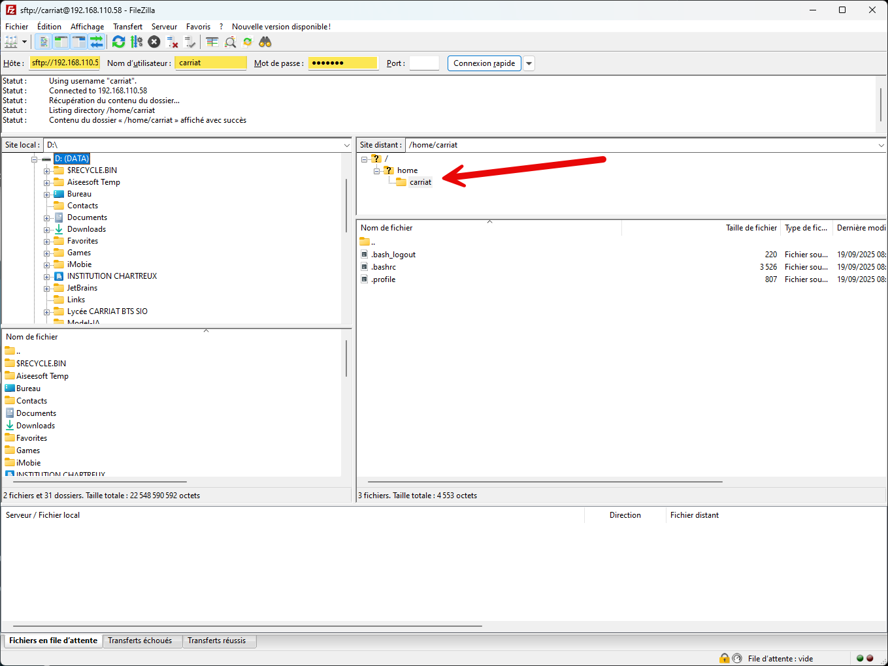
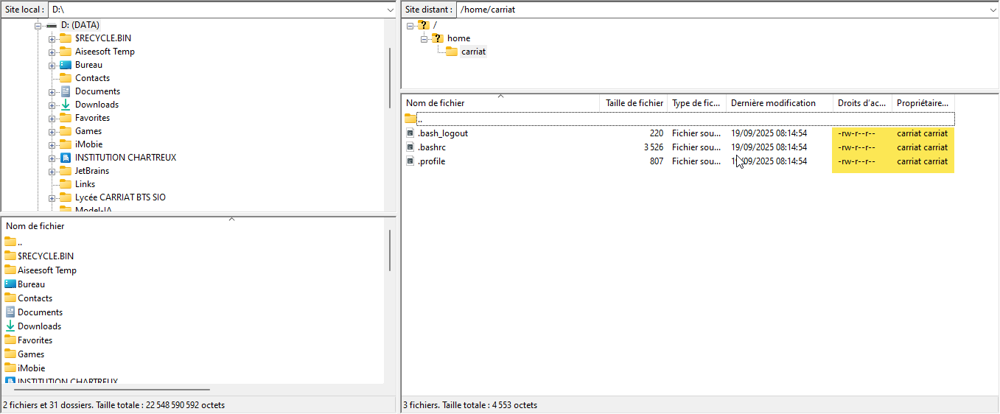

Le SFTP (SSH File Transfer Protocol) est un protocole de transfert de fichiers sécurisé qui fonctionne sur le protocole SSH. Il permet de transférer des fichiers entre un client et un serveur de manière sécurisée.
## Prérequis
- Un serveur SSH en cours d'exécution sur la machine distante.
- Un client SFTP installé sur la machine locale (la plupart des distributions Linux incluent un client SFTP par défaut).
- Accès au serveur SSH avec un nom d'utilisateur et un mot de passe ou une clé SSH.
## Connexion au serveur SFTP
Pour se connecter à un serveur SFTP, utilisez la commande suivante dans votre terminal :
```bash 
sftp utilisateur@serveur
```
Remplacez `utilisateur` par votre nom d'utilisateur sur le serveur distant et `serveur` par l'adresse IP ou le nom de domaine du serveur.
## Commandes de base SFTP
Une fois connecté, vous pouvez utiliser les commandes suivantes pour transférer des fichiers :
- `ls` : Liste les fichiers et répertoires dans le répertoire distant.
- `cd répertoire` : Change le répertoire distant.
- `lcd répertoire` : Change le répertoire local.
- `get fichier` : Télécharge un fichier du serveur distant vers la machine locale.
- `put fichier` : Télécharge un fichier de la machine locale vers le serveur distant.
- `mget fichiers` : Télécharge plusieurs fichiers du serveur distant vers la machine locale.
- `mput fichiers` : Télécharge plusieurs fichiers de la machine locale vers le serveur distant.
- `mkdir répertoire` : Crée un nouveau répertoire sur le serveur distant.
- `rmdir répertoire` : Supprime un répertoire vide sur le serveur distant.
- `rm fichier` : Supprime un fichier sur le serveur distant.
- `exit` ou `bye` : Quitte la session SFTP.
## Exemple de transfert de fichiers
1. Connectez-vous au serveur SFTP :     
   ```bash
   sftp utilisateur@serveur
   ```
2. Changez le répertoire local si nécessaire :     
   ```bash
   lcd /chemin/vers/repertoire/local
   ```
3. Changez le répertoire distant si nécessaire :     
   ```bash
   cd /chemin/vers/repertoire/distant
   ```
4. Téléchargez un fichier du serveur distant :     
   ```bash
   get fichier_distant.txt
   ```
5. Téléchargez un fichier vers le serveur distant :    
   ```bash      
   put fichier_local.txt
   ``` 
6. Quittez la session SFTP :     
   ```bash
   exit
   ```
FileZilla permet d’utiliser le protocole SFTP. Le SFTP (Secure File Transfert Protocol) permet de transférer des fichiers par une connexion sécurisée utilisant le protocole SSH et il effectue les mêmes opérations que le FTP, mais en plus, de manière cryptée.

Les informations de connexion sont les mêmes que dans PuTTY ou un client SSH.



Si la connexion SSH est possible, la connexion SFTP l’ai forcement aussi et comme pour la connexion SSH, l’utilisateur arrive dans son répertoire personnel :



Dans la fenêtre de navigation, Il est possible de voir le propriétaire, le groupe ainsi que les droits d’accès.

::: caution
Attention, comme sur le serveur, vous ne pouvez manipuler les fichiers que si vous avez les droits.
:::



## Conclusion
Le SFTP est un outil puissant pour le transfert sécurisé de fichiers entre une machine locale et un serveur distant. En utilisant les commandes de base décrites ci-dessus, vous pouvez facilement gérer vos fichiers à distance. N'oubliez pas de toujours sécuriser vos connexions SSH pour protéger vos données.